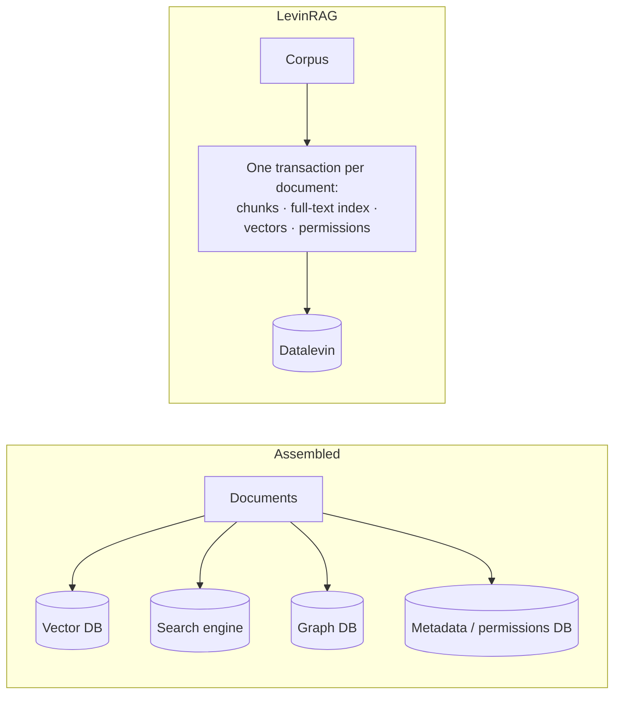

# LevinRAG

English | [繁體中文](README.zh-TW.md)

> The web UI is currently in Traditional Chinese (UI localization is on the backlog).

An enterprise RAG MVP in a single JVM with embedded Datalevin: Markdown / plain-text corpus → multi-channel recall (lexical + semantic + link graph) → RRF fusion → cross-encoder rerank → context expansion → an answer with `[n]` citations. Built-in ACL, a per-query trace and an evaluation framework. All models (embedding, rerank, chat) are called through OpenAI-compatible APIs.

## Design rationale

A typical RAG system is assembled from a vector database, a full-text search engine, a graph database, a metadata database and a framework. Each component is mature; the cost lies in the seams:

- the same document is copied into several systems, and adds and deletes have no transaction protection;
- permissions must be implemented separately in every store, and missing one is a leak;
- system behavior is scattered across config files, framework internals and external services, and end-to-end verification means starting a whole stack of services first. This is even more true for AI coding agents.

LevinRAG designs retrieval as a **data system**: the corpus directory is the single source of truth, and chunks, the full-text index, vectors, permissions and the link graph are all derived data. This is not a new idea; it takes established practice from databases, information retrieval and data engineering and brings it together into one consistent RAG architecture.

- **Each document's derived data is produced in one transaction**; the index is only derived data and can be thrown away and rebuilt at any time.
- **Permissions are an invariant of retrieval**: computed at write time and filtered inside the retrieval layer, not enforced by the UI; the security tests derive a "document × unauthorized user" matrix from the index and verify every cell. The rules are in the [Administrator guide](docs/howto/admin.md#document-permissions).
- **Retrieval is explainable**: the rank and score of every candidate at every stage are recorded in the trace, so you can answer "why this document, and why not that one".
- **Runs fully on a local machine**: one JVM plus three model endpoints; tests use stub models.

These claims do not depend on Datalevin; most of them would still hold with PostgreSQL plus pgvector. Datalevin was chosen because it puts full-text, vectors and Datalog in one embedded engine, with no separate service to run, and its schema can evolve step by step.

The costs are just as clear: a scale ceiling of about 100,000 chunks, no horizontal scaling; dependence on a database with a concentrated set of maintainers; less feature breadth than general-purpose frameworks. Within this scale, simplicity and verifiability are worth more than maximum throughput.

The full argument (comparison with the frameworks, why Datalevin, scope of applicability, open questions) is in [docs/design/rationale.md](docs/design/rationale.md).

## Where to start

| You want to… | Read |
|---|---|
| Evaluate LevinRAG on your own corpus and check its claims, without knowing Clojure | [Quick start](docs/howto/quick-start.md) — **start here** |
| Ask questions in the web UI | [User guide](docs/howto/user.md) |
| Manage users, groups, document permissions and ingests | [Administrator guide](docs/howto/admin.md) |
| Deploy, monitor, back up | [Operations guide](docs/howto/ops.md) |
| Set up the three model endpoints (vLLM on a GPU, or llama.cpp on a laptop) | [VLLM_SETUP.md](VLLM_SETUP.md) |
| Develop LevinRAG | [Developer guide](docs/howto/dev.md); AI coding agents also read [CLAUDE.md](CLAUDE.md) |

## Reference

- [SPEC.md](SPEC.md): the current spec, including remaining work (§21).
- [docs/decisions.md](docs/decisions.md): the reason for every design change.
- [docs/design/rationale.md](docs/design/rationale.md): the full design argument.
- [docs/design/2026-09-22-initial-spec.md](docs/design/2026-09-22-initial-spec.md): the initial spec (Chinese, frozen).
