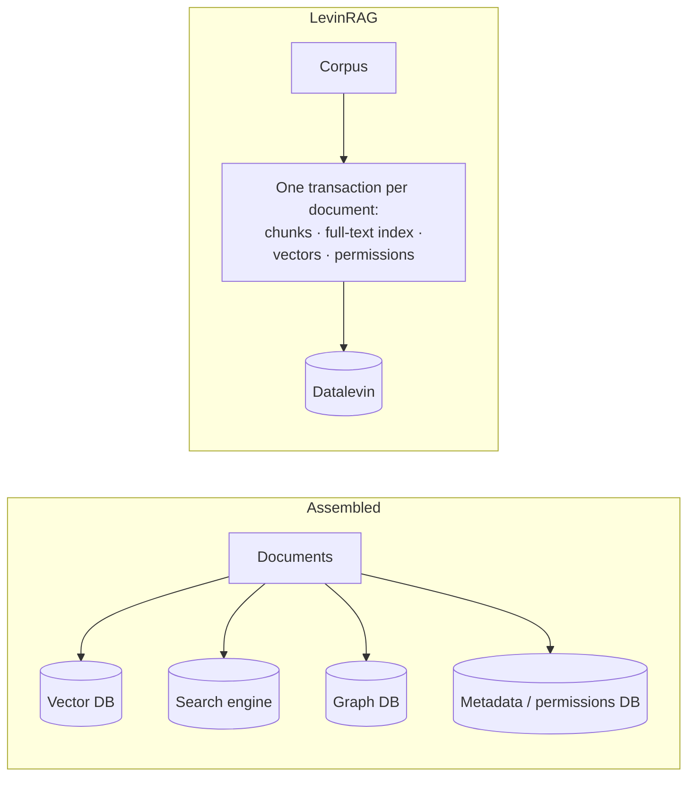

# LevinRAG

English | [繁體中文](README.zh-TW.md)

> The web UI is currently in Traditional Chinese (UI localization is on the backlog).

An enterprise RAG MVP in a single JVM with embedded Datalevin: Markdown / plain-text corpus → multi-channel recall (lexical + semantic + link graph) → RRF fusion → cross-encoder rerank → context expansion → an answer with `[n]` citations. Built-in ACL, a per-query trace and an evaluation framework. All models (embedding, rerank, chat) are called through OpenAI-compatible APIs. The current spec is [SPEC.md](SPEC.md) (including remaining work, §21; Traditional Chinese translation: [SPEC.zh-TW.md](SPEC.zh-TW.md)); the initial spec is kept in [docs/design/2026-09-22-initial-spec.md](docs/design/2026-09-22-initial-spec.md); the reason for every design change is in [docs/decisions.md](docs/decisions.md).

## Design rationale

A typical RAG system is assembled from a vector database, a full-text search engine, a graph database, a metadata database and a framework. Each component is mature; the cost lies in the seams:

- the same document is copied into several systems, and adds and deletes have no transaction protection;
- permissions must be implemented separately in every store, and missing one is a leak;
- system behavior is scattered across config files, framework internals and external services, and end-to-end verification means starting a whole stack of services first. This is even more true for AI coding agents.

LevinRAG designs retrieval as a **data system**: the corpus directory is the single source of truth, and chunks, the full-text index, vectors, permissions and the link graph are all derived data. This is not a new idea; it takes established practice from databases, information retrieval and data engineering and brings it together into one consistent RAG architecture.



- **Each document's derived data is produced in one transaction**; the index is only derived data and can be thrown away and rebuilt at any time.
- **Permissions are an invariant of retrieval**: computed at write time and filtered inside the retrieval layer, not enforced by the UI; the security tests derive a "document × unauthorized user" matrix from the index and verify every cell.
- **Retrieval is explainable**: the rank and score of every candidate at every stage are recorded in the trace, so you can answer "why this document, and why not that one".
- **Runs fully on a local machine**: one JVM plus three model endpoints; tests use stub models.

These claims do not depend on Datalevin; most of them would still hold with PostgreSQL plus pgvector. Datalevin was chosen because it puts full-text, vectors and Datalog in one embedded engine, with no separate service to run, and its schema can evolve step by step.

The costs are just as clear: a scale ceiling of about 100,000 chunks, no horizontal scaling; dependence on a database with a concentrated set of maintainers; less feature breadth than general-purpose frameworks. Within this scale, simplicity and verifiability are worth more than maximum throughput.

The full argument (comparison with the frameworks, why Datalevin, scope of applicability, open questions) is in [docs/design/rationale.md](docs/design/rationale.md).

## Guides

- [Operations guide](docs/howto/ops.md): deployment, environment variables, health, backups, evaluation.
- [Administrator guide](docs/howto/admin.md): users and groups, document permissions, ingest, trace.
- [User guide](docs/howto/user.md): login, asking questions, citations, document viewer, Debug panel.

## Quick start (local)

1. Set the environment variables in one shell; every later step (including the server) needs them. The full list is in the [Operations guide](docs/howto/ops.md#environment-variables).
   ```bash
   export DATA_DIR=./data CORPUS_DIR=corpus-sample VLLM_API_KEY=...
   export VLLM_EMBED_BASE_URL=... VLLM_RERANK_BASE_URL=... VLLM_CHAT_BASE_URL=... VLLM_CHAT_MODEL=...
   ```
2. Start the three model endpoints as described in [VLLM_SETUP.md](VLLM_SETUP.md), then check: `bb vllm:check` (continue only when everything is `[OK]`).
3. Ingest the corpus: `bb ingest`.
4. Create a user: `bb user:create alice --groups all,hr`, then set the password with `bb user:passwd alice` (add `--admin` for an administrator).
5. Start the server in the same shell (command in the [Operations guide](docs/howto/ops.md#starting-the-server)), open http://localhost:8000 and log in. The server needs the same `CORPUS_DIR` to show the original text in the document viewer.

## Document permission rules (ACL)

Permissions are computed at ingest time and written into the index; queries only compare groups:

1. **Directory**: walk up to the nearest `_collection.edn` (including the directory itself) that declares `:read-groups`; if there is none, use `ROOT_READ_GROUPS`.
2. **Document**: when the frontmatter has `read_groups`, **only that is used: it overrides, it is not a union**. For example, if the directory is `["hr"]` and the document says `read_groups: ["all"]`, only `all` can read it; `hr` is not added back.
3. An empty group list `[]` means nobody except admins can read it.
4. A document you cannot see always returns 404 (never 403), so its existence is not revealed.

How to set this up is in the [Administrator guide](docs/howto/admin.md#document-permissions).

## Development

- nREPL, test loop: see [CLAUDE.md](CLAUDE.md).
- Full test run (clean JVM + coverage): `clojure -X:jvm-opts:test`; lint: `clj-kondo --lint src test`.
- Tests that need real models are tagged `:vllm` and are skipped automatically when `VLLM_*` is not set.
- `bb docs:check`: the English and Traditional Chinese docs have matching headings, language switches, and working links and anchors (also part of `bb check`).
- `bb tasks` lists all Babashka commands.

### Browser check (no JS errors)

`bb browser-check` builds the CSS, starts a throwaway server on port 8765
(`dev/browser_server.clj`: sample corpus with a stub embedder, stub
rerank and chat, users `alice`/`alice-pw` and `admin`/`admin-pw`) and
drives the UI in the locally installed Google Chrome with Playwright
(`dev/browser/check.mjs`): login, ask with Debug on, open a citation and
its document, run an ingest from the admin page, open a trace. Any
console error, uncaught page error or failed asset request fails the
run. Needs Node.js; `playwright-core` is installed on first run (it uses
the local Chrome and downloads no browser). Not part of `bb test`.

## Update assets

The idea is to vendor all js-files in the project repo eliminating build step for js part.

Once you want to update the version of AlpineJS, HTMX or add a new asset, edit version in bb.edn file at `fetch-assets` and run:

```shell
bb fetch-assets
```

Your assets will be updated in `resources/public` folder.

## Deployment

See the [Operations guide](docs/howto/ops.md#deployment-kamal).
