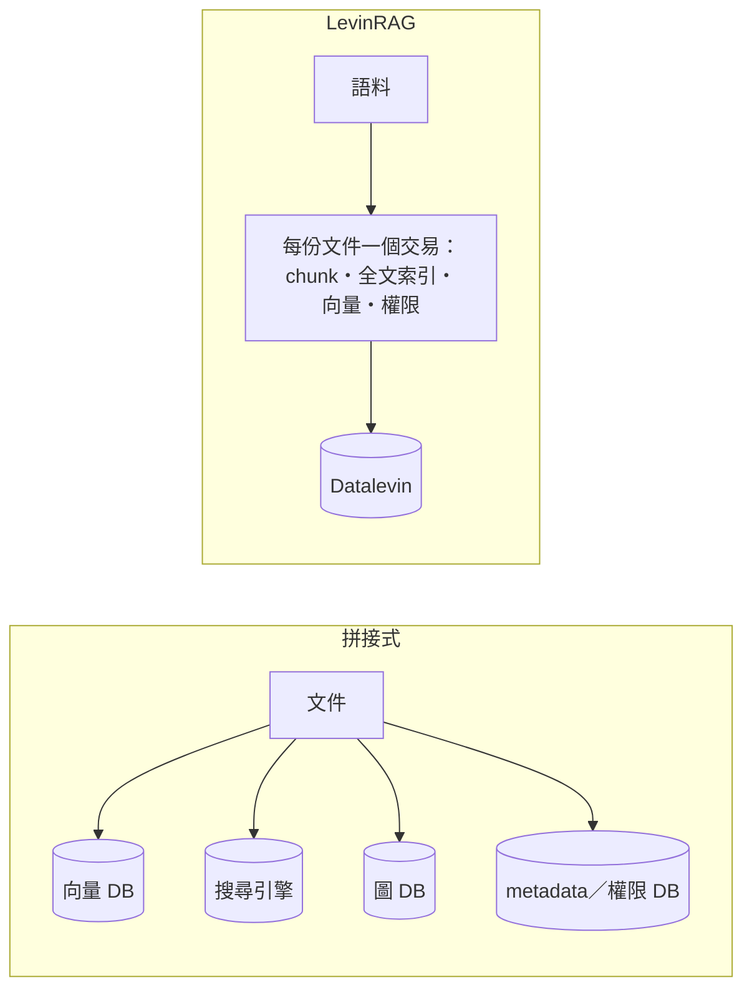

# LevinRAG

[English](README.md) | 繁體中文

> 本文為英文版的翻譯；內容不一致時，以英文版為準。

單一 JVM、嵌入式 Datalevin 的企業 RAG MVP：Markdown／純文字語料 → 詞彙＋語意＋連結圖多路召回 → RRF 融合 → cross-encoder rerank → 脈絡擴展 → 帶引用 `[n]` 的回答。內建 ACL、每次查詢的 trace 與評估框架。模型（embedding、rerank、chat）一律透過 OpenAI 相容 API 呼叫。

## 設計理念

常見的 RAG 系統由向量資料庫、全文搜尋引擎、圖資料庫、metadata 資料庫與框架拼接而成。每個元件都成熟，代價出在接縫：

- 同一份文件被複製到多個系統，新增與刪除沒有交易保護；
- 權限要在每個儲存各自實作，漏掉一處就是洩漏；
- 系統行為散落在設定檔、框架內部與外部服務之間，端到端驗證得先啟動一整排服務。對 AI coding agent 而言更是如此。

LevinRAG 把檢索當成一個**資料系統**來設計：語料目錄是唯一來源，chunk、全文索引、向量、權限與連結圖都是它的衍生資料。這不是新想法，而是把資料庫、資訊檢索與資料工程的既有做法，收斂成一個一致的 RAG 架構。

- **一份文件的衍生資料在同一個交易中產生**；索引只是衍生資料，隨時可以丟掉重建。
- **權限是檢索的不變式**：寫入時算好，在檢索層內過濾，不靠介面把關；安全測試由索引推導出「文件 × 無權限使用者」矩陣，逐一驗證。規則見[管理者手冊](docs/howto/admin.zh-TW.md#文件權限)。
- **檢索可以解釋**：每個候選在每個階段的名次與分數都記入 trace，能回答「為什麼是這份、為什麼不是那份」。
- **本機即可完整執行**：一個 JVM 加三個模型端點；測試用 stub 模型。

這些主張不依賴 Datalevin，換成 PostgreSQL 加 pgvector 大多仍然成立。選 Datalevin，是因為它把全文、向量與 Datalog 放進同一個嵌入式引擎，不必另外架設服務，schema 也可以逐步演進。

代價同樣明確：規模上限約十萬個 chunk，不做水平擴展；依賴一個維護者集中的資料庫；功能廣度不及通用框架。在這個規模內，簡單與可驗證比極致的吞吐量更值得。

完整的論證（與各框架的比較、為什麼選 Datalevin、適用範圍、待驗證的問題）見 [docs/design/rationale.zh-TW.md](docs/design/rationale.zh-TW.md)。

## 從哪裡開始

| 你想要… | 閱讀 |
|---|---|
| 用自己的語料評估 LevinRAG、檢驗它的主張，不需要懂 Clojure | [快速上手](docs/howto/quick-start.zh-TW.md)——**從這裡開始** |
| 在網頁上提問 | [使用者手冊](docs/howto/user.zh-TW.md) |
| 管理使用者、群組、文件權限與匯入 | [管理者手冊](docs/howto/admin.zh-TW.md) |
| 部署、監控、備份 | [維運手冊](docs/howto/ops.zh-TW.md) |
| 架設三個模型端點（GPU 上的 vLLM，或筆電上的 llama.cpp） | [VLLM_SETUP.zh-TW.md](VLLM_SETUP.zh-TW.md) |
| 開發 LevinRAG | [開發者指南](docs/howto/dev.zh-TW.md)；AI coding agent 另讀 [CLAUDE.md](CLAUDE.md) |

## 參考資料

- [SPEC.zh-TW.md](SPEC.zh-TW.md)：現行規格，含尚未完成的工作（§21）。
- [docs/decisions.md](docs/decisions.md)：每一處設計調整的理由（英文）。
- [docs/design/rationale.zh-TW.md](docs/design/rationale.zh-TW.md)：完整的設計論證。
- [docs/design/2026-09-22-initial-spec.md](docs/design/2026-09-22-initial-spec.md)：初版規格（凍結）。
