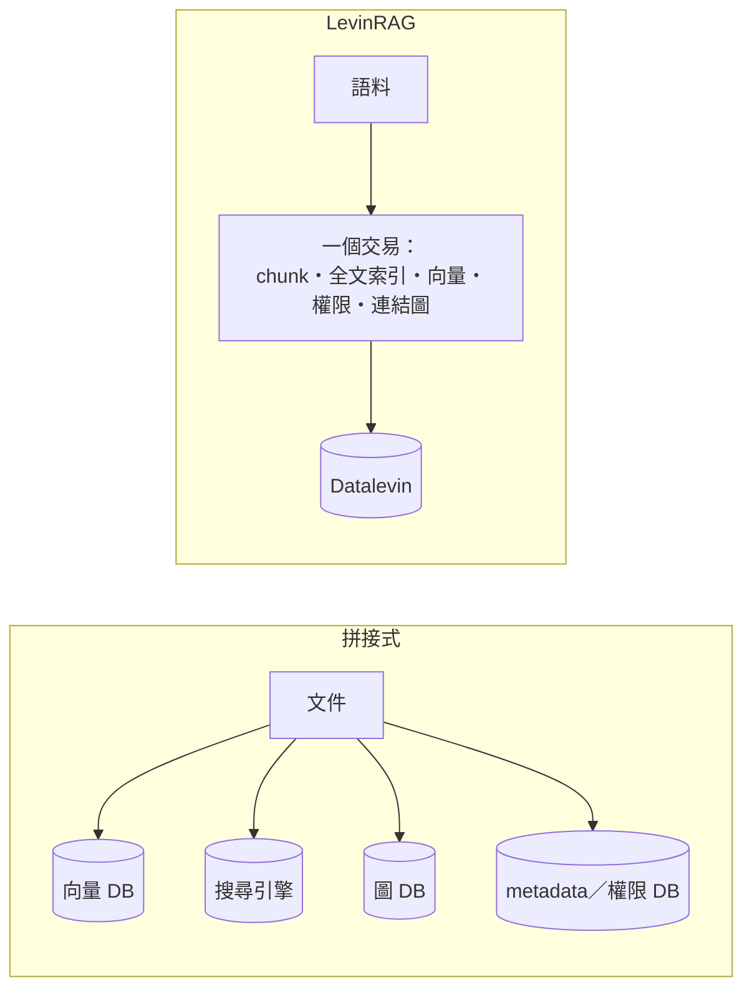

# LevinRAG

[English](README.md) | 繁體中文

> 本文為英文版的翻譯；內容不一致時，以英文版為準。

單一 JVM、嵌入式 Datalevin 的企業 RAG MVP：Markdown／純文字語料 → 詞彙＋語意＋連結圖多路召回 → RRF 融合 → cross-encoder rerank → 脈絡擴展 → 帶引用 `[n]` 的回答。內建 ACL、每次查詢的 trace 與評估框架。模型（embedding、rerank、chat）一律透過 OpenAI 相容 API 呼叫。現行規格見 [SPEC.zh-TW.md](SPEC.zh-TW.md)（含尚未完成的工作，§21）；初版規格保存在 [docs/design/2026-09-22-initial-spec.md](docs/design/2026-09-22-initial-spec.md)；每一處設計調整的理由見 [docs/decisions.md](docs/decisions.md)。

## 設計理念

常見的 RAG 系統由向量資料庫、全文搜尋引擎、圖資料庫、metadata 資料庫與框架拼接而成。每個元件都成熟，代價出在接縫：

- 同一份文件被複製到多個系統，新增與刪除沒有交易保護；
- 權限要在每個儲存各自實作，漏掉一處就是洩漏；
- 系統行為散落在設定檔、框架內部與外部服務之間，端到端驗證得先啟動一整排服務。對 AI coding agent 而言更是如此。

LevinRAG 把檢索當成一個**資料系統**來設計：語料目錄是唯一來源，chunk、全文索引、向量、權限與連結圖都是它的衍生資料。這不是新想法，而是把資料庫、資訊檢索與資料工程的既有做法，收斂成一個一致的 RAG 架構。



- **衍生資料在同一個交易中產生**；索引只是衍生資料，隨時可以丟掉重建。
- **權限是檢索的不變式**：寫入時算好，在檢索層內過濾，不靠介面把關；安全測試由索引推導出「文件 × 無權限使用者」矩陣，逐一驗證。
- **檢索可以解釋**：每個候選在每個階段的名次與分數都記入 trace，能回答「為什麼是這份、為什麼不是那份」。
- **本機即可完整執行**：一個 JVM 加三個模型端點；測試用 stub 模型。

這些主張不依賴 Datalevin，換成 PostgreSQL 加 pgvector 大多仍然成立。選 Datalevin，是因為它把全文、向量與 Datalog 放進同一個嵌入式引擎，不必另外架設服務，schema 也可以逐步演進。

代價同樣明確：規模上限約十萬個 chunk，不做水平擴展；依賴一個維護者集中的資料庫；功能廣度不及通用框架。在這個規模內，簡單與可驗證比極致的吞吐量更值得。

完整的論證（與各框架的比較、為什麼選 Datalevin、適用範圍、待驗證的問題）見 [docs/design/rationale.zh-TW.md](docs/design/rationale.zh-TW.md)。

## 使用手冊

- [維運手冊](docs/howto/ops.zh-TW.md)：部署、環境變數、health、備份、評估。
- [管理者手冊](docs/howto/admin.zh-TW.md)：使用者與群組、文件權限、匯入、trace。
- [使用者手冊](docs/howto/user.zh-TW.md)：登入、提問、引用、文件檢視、Debug 面板。

## 快速開始（本機）

1. 在同一個 shell 設定環境變數，後面每一步（包括 server）都要用到。完整清單見[維運手冊](docs/howto/ops.zh-TW.md#環境變數)。
   ```bash
   export DATA_DIR=./data CORPUS_DIR=corpus-sample VLLM_API_KEY=...
   export VLLM_EMBED_BASE_URL=... VLLM_RERANK_BASE_URL=... VLLM_CHAT_BASE_URL=... VLLM_CHAT_MODEL=...
   ```
2. 啟動三個模型端點，做法見 [VLLM_SETUP.zh-TW.md](VLLM_SETUP.zh-TW.md)，然後確認：`bb vllm:check`（全部 `[OK]` 才繼續）。
3. 匯入語料：`bb ingest`。
4. 建立使用者：`bb user:create alice --groups all,hr`，再用 `bb user:passwd alice` 設定密碼（管理者加 `--admin`）。
5. 在同一個 shell 啟動 server（指令見[維運手冊](docs/howto/ops.zh-TW.md#啟動)），開啟 http://localhost:8000 登入。server 需要同一個 `CORPUS_DIR` 才能在文件檢視頁顯示原文。

## 文件權限規則（ACL）

權限在匯入時計算並寫入索引，查詢時只比對群組：

1. **目錄**：往上找最近一個有宣告 `:read-groups` 的 `_collection.edn`（含自己）；都沒有就用 `ROOT_READ_GROUPS`。
2. **文件**：frontmatter 有 `read_groups` 時**只用它——覆寫，不是聯集**。例如目錄是 `["hr"]`、文件寫 `read_groups: ["all"]`，結果是只有 `all` 可讀，`hr` 不會被加回去。
3. 群組為空 `[]` 表示除 admin 外沒有人可讀。
4. 看不到的文件一律回 404（不回 403），不透露是否存在。

設定方式見[管理者手冊](docs/howto/admin.zh-TW.md#文件權限)。

## 開發

- nREPL、測試迴圈：見 [CLAUDE.md](CLAUDE.md)。
- 完整測試（乾淨 JVM＋coverage）：`clojure -X:jvm-opts:test`；lint：`clj-kondo --lint src test`。
- 需要真實模型的測試標記 `:vllm`，未設定 `VLLM_*` 時自動略過。
- `bb docs:check`：檢查中英文件的標題是否一致、有沒有語言切換，以及連結與錨點是否正確（`bb check` 也會執行）。
- `bb tasks` 列出所有 Babashka 指令。

### Browser check (no JS errors)

`bb browser-check` builds the CSS, starts a throwaway server on port 8765
(`dev/browser_server.clj`: sample corpus with a stub embedder, stub
rerank and chat, users `alice`/`alice-pw` and `admin`/`admin-pw`) and
drives the UI in the locally installed Google Chrome with Playwright
(`dev/browser/check.mjs`): login, ask with Debug on, open a citation and
its document, run an ingest from the admin page, open a trace. Any
console error, uncaught page error or failed asset request fails the
run. Needs Node.js; `playwright-core` is installed on first run (it uses
the local Chrome and downloads no browser). Not part of `bb test`.

## Update assets

The idea is to vendor all js-files in the project repo eliminating build step for js part.

Once you want to update the version of AlpineJS, HTMX or add a new asset, edit version in bb.edn file at `fetch-assets` and run:

```shell
bb fetch-assets
```

Your assets will be updated in `resources/public` folder.

## 部署

見[維運手冊](docs/howto/ops.zh-TW.md#部署kamal)。
