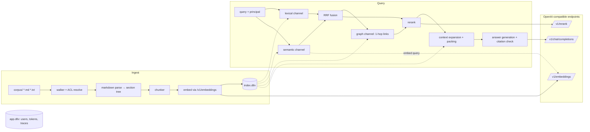

# LevinRAG — Current Spec

English | [繁體中文](SPEC.zh-TW.md)

Version v1.0 | 2026-09-25 | The system as it stands after Phases 0–5

> **This is the current spec and it is authoritative**: it describes what the system **actually** does today, and further development follows this document. A Traditional Chinese translation is in [`SPEC.zh-TW.md`](SPEC.zh-TW.md); it may lag behind, and if the two differ, SPEC.md wins.
> - Initial spec (2026-09-22, frozen): [`docs/design/2026-09-22-initial-spec.md`](docs/design/2026-09-22-initial-spec.md). This document keeps its section numbering, so "SPEC.md §n" references in the code and docs remain valid.
> - The **reasons and evidence** for every departure from the initial spec are recorded in [`docs/decisions.md`](docs/decisions.md). This document states only the conclusions, with the matching decision date in parentheses.
> - Remaining work and next steps: see [§21](#21-remaining-work-and-next-steps).

An enterprise RAG in a single JVM process with a single data directory: Markdown / plain-text corpus → multi-channel recall (lexical, semantic, link graph) → RRF fusion → cross-encoder rerank → context expansion → generation with citations, with built-in ACL, query tracing, and an evaluation framework. Models (embedding, rerank, chat) are always called through an OpenAI-compatible API; this can be vLLM, or a local LM Studio / llama.cpp.

The code's root namespace is `replware.levinrag` (renamed from `hybridrag` on 2026-09-25).

---

## 0. Development rules

1. **This document is the current spec.** When you change system behavior, update the matching section of this document (and of its translation `SPEC.zh-TW.md`) in the same commit, and record the reason in `docs/decisions.md` ("original spec / actual behavior / approach taken").
2. **Do not use the Datalevin API from memory.** It changed a lot between 0.9 → 1.0 → 1.1; verify every call you use in the nREPL against the pinned version (1.1.0) first. Usages in this document that have already been verified cite their source.
3. **Code comments are always in English**; UI copy and user-facing error messages are in Traditional Chinese.
4. **Do not expand scope.** Put improvement ideas in `docs/backlog.md`; to work on one, first promote it to §21 or to a new Phase.
5. **When a requirement is ambiguous**, pick the simplest reversible option, record it in `docs/decisions.md`, and carry on. Product-level choices (thresholds, tokenizer, permission semantics) are the user's to make: measure, report, recommend.
6. One commit per task; the message ends with a `Co-Authored-By` line. `no-commit/` is the user's private corpus: never commit it and never quote its content.
7. Any change that could let the ACL be bypassed must come with §18.3 security tests.
8. Development process: for a new subsystem, write a design doc first (`docs/superpowers/specs/`) → user approval → implementation plan (`docs/superpowers/plans/`) → TDD implementation → review of the whole phase → one round of fixes.
9. **Docs in two languages**: README, SPEC, VLLM_SETUP, `docs/howto/*` and `docs/design/rationale` each exist in English (`X.md`, authoritative) and in Traditional Chinese (`X.zh-TW.md`, translation). Change one, change the other in the same commit, and keep the headings identical (other docs link to their anchors).

---

## 1. Goals, non-goals, success criteria

### 1.1 Goals

- A "minimal but real" implementation of every layer: ingestion, lexical recall, semantic recall, graph recall, fusion, rerank, context expansion, generation, ACL, trace, eval.
- A minimal architecture: one JVM process and embedded Datalevin, plus three model endpoints. Development does not need Docker.
- Observable: for every query you can see what each channel retrieved, at what rank, and how that changed after rerank. This is the core of learning and tuning.

### 1.2 Success criteria and current status

| Item | Criterion | Status |
|---|---|---|
| ACL leaks | **= 0** in the sample-corpus eval and the security tests | ✅ Met (eval, §18.3 end-to-end suite) |
| Eval | `bb eval` outputs doc-level recall@5, recall@10, MRR@10 for 5 retrieval variants | ✅ Met |
| Latency | Retrieval + rerank (excluding generation) p50 < 800 ms, corpus ≤ 100k chunks, models on the same machine or network segment | ⚠️ **Not verified**. On a local M1 running rerank with llama.cpp, the rerank p50 alone is about 1.3–3 s; the criterion assumes a GPU deployment. The ACL query step was measured at 100k chunks (T0.5, about 2 ms). See §21 |
| Rebuildable | `bb reindex` fully rebuilds `index.dtlv` from the corpus without affecting accounts | ✅ Met |
| Scale limit | ≤ 5,000 documents / ≤ 100k chunks | ⚠️ **No end-to-end verification yet** (the sample corpus has 22 documents, 119 chunks). See §21 |

### 1.3 Non-goals

PDF / Office / OCR parsing; multi-tenancy; SSO; query rewriting and agentic multi-turn retrieval; LLM-extracted entities for a knowledge graph; answer-level LLM-as-judge evaluation; horizontal scaling; streaming output (T5.4, deferred, see §21).

---

## 2. Architecture overview



### 2.1 Key design decisions

| ID | Decision | Reason |
|---|---|---|
| D1 | Two embedded Datalevin DBs: `index.dtlv` (derived data from the corpus) and `app.dtlv` (users, tokens, traces) | The index is derived from the corpus and can be thrown away and rebuilt at any time; with the two separated, rebuilding the index does not touch accounts. |
| D2 | The corpus directory is the single source of truth | The DB can always be derived from the files. The application only reads the corpus, never writes it. |
| D3 | **ACL is materialized at write time; queries filter with the "accessible-doc-id set"** | The recursive computation of hierarchical inheritance happens at ingestion. At query time, first compute the set of accessible doc ids from the user's groups, then do `contains?` on each raw hit. The initial spec's Datalog-join approach was too slow at 100k chunks (2026-09-22, T0.5). |
| D4 | A `Retriever` protocol isolates the storage layer, and **ACL is done only inside the Retriever** | If Datalevin turns out not to fit, swapping the implementation does not require rewriting the pipeline; candidates the pipeline receives are always already filtered. |
| D5 | Three model endpoints (embed / rerank / chat), OpenAI-compatible API | Can be vLLM, or LM Studio (embed, chat) plus llama.cpp (rerank). |
| D6 | The full-text index is on `:chunk/index-text`; vectors are stored in a separate attribute `:chunk/vec`, computed by the application (Path B) | Datalevin's built-in embedding provider calls the model endpoint at transact time, so tests and builds cannot run without the model; Path B has no such dependency (2026-09-22). |
| D7 | When rerank fails, degrade to RRF ordering; the request does not fail | Availability first; the degraded state is recorded in the trace and returned to the caller. |
| D8 | Do not call the LLM when retrieval finds no valid evidence | Saves cost and rules out unsupported answers. |
| D9 | The identity source is separate from the principal | Password sessions, API tokens (and later OIDC) all produce only `{:username :groups :admin?}`; everything downstream looks only at the principal (2026-09-24). |

---

## 3. Technology choices

| Area | Choice | Notes |
|---|---|---|
| Project skeleton | Generated by Clojure Stack Lite | Integrant, Reitit / Ring / Jetty, Hiccup, Malli, HTMX 2, Alpine.js, Tailwind 4, Babashka tasks, clj-kondo, cljfmt, eftest, cloverage. SQL-related dependencies removed. |
| Database | Datalevin **1.1.0** (embedded) | Every JVM that opens it needs `--add-opens=java.base/java.nio=ALL-UNNAMED --add-opens=java.base/sun.nio.ch=ALL-UNNAMED`, provided by the `:jvm-opts` alias in `deps.edn` (2026-09-22). |
| Markdown parsing | `org.commonmark/commonmark` + gfm-tables + yaml-front-matter | Source spans give character positions. |
| HTTP client | `hato` | Pinned to HTTP/1.1: the JDK client's default h2c upgrade hangs on LM Studio until timeout (2026-09-24). |
| JSON | `metosin/jsonista` | |
| Password hashing | `buddy/buddy-hashers` | |
| Testing | clojure.test + eftest + cloverage; Playwright (local Chrome) for browser checks | |

Platform limits: Datalevin's vector features support Linux x86_64 / arm64 and macOS arm64.

---

## 4. External dependencies: model endpoints

### 4.1 The three endpoints

| Purpose | Model | Default address | Actually used in local development |
|---|---|---|---|
| Embedding | `BAAI/bge-m3` (1024 dims) | `http://localhost:8001/v1` | LM Studio `text-embedding-bge-m3` (Q8_0) |
| Rerank | `BAAI/bge-reranker-v2-m3` | `http://localhost:8002`, path `/v1/rerank` | llama.cpp `llama-server --reranking` (Q8_0) |
| Chat | Configurable | No default, required | LM Studio `qwen/qwen3-8b` |

How to start them: see `VLLM_SETUP.md`. The application does not start the models.

### 4.2 API contract

Every request carries `Authorization: Bearer <key>`.

**Embeddings**: `POST {embed-base}/embeddings`, body `{"model", "input": [str...]}`. The response's `data` must have one numeric `embedding` per input; otherwise it counts as an embed endpoint failure (including HTTP 200 with error content). At most 32 inputs per batch, batched per document.

**Rerank**: `POST {rerank-base}{rerank-path}`, body `{"model", "query", "documents", "top_n"}`, response `results[i] = {index, relevance_score}`. A missing `results`, a duplicate or out-of-range index, or a non-numeric score all count as failure. **Scores are used as the backend returns them**: llama.cpp returns raw logits (e.g. 4.6 / −6.5 / −11.0), vLLM usually returns 0–1; thresholds are not interchangeable between the two (2026-09-24).

**Chat**: `POST {chat-base}/chat/completions`, standard OpenAI format. `VLLM_CHAT_EXTRA_BODY` (a JSON object) is merged into the request body as is. For example, Qwen3 on LM Studio needs `{"reasoning_effort":"none"}`, because LM Studio ignores `chat_template_kwargs`. The response must have `choices[0].message`; a null `content` counts as an empty answer.

### 4.3 Common requirements

- Connect timeout is fixed at 2 s; read timeouts are configurable (§5), defaulting to 30 s for embed, 10 s for rerank, 120 s for chat.
- The following errors are always wrapped in `ex-info`, with `ex-data` containing `:llm/endpoint`, `:http/status`, `:llm/body-excerpt` (first 500 characters); the layer above returns 503 based on it:
  - any `IOException` (timeout, connection refused, connection dropped);
  - a non-2xx response;
  - a 2xx whose body is not JSON or has the wrong structure.
- **API keys never appear in logs, traces, health responses, or exception data.**
- `bb vllm:check` sends one request to each of the three endpoints, and probes rerank with a 1500-character document: when the reranker's context is too small, a short-string test passes but long documents fail (2026-09-25).

---

## 5. Configuration

Server configuration is in `resources/config.edn` (Integrant, aero reader, profiles `:default` / `:test` / `:prod`), with most values coming from environment variables. CLIs that do not start Integrant (`bb ingest`, `bb user:*`, `bb eval`) read the same environment variables directly, with the same defaults (`replware.levinrag.config`). For local runs, the `bb` tasks that run the app (including `bb serve`) also take variables from `.env` in the project directory (template `.env.example`); a variable already set in the shell wins, and a malformed line is an error. The JVM itself never reads `.env`. `bb doctor` checks a fresh checkout (tools, settings, corpus, `_collection.edn` files) before running `bb vllm:check`.

| Setting | Env | Default |
|---|---|---|
| Data directory | `DATA_DIR` | `data` (`data-test` in the `:test` profile). `index.dtlv`, `app.dtlv`, and `ingest-reports/` all live here. |
| Corpus directory | `CORPUS_DIR` | `./corpus` |
| Default read groups for the root directory | `ROOT_READ_GROUPS` (comma-separated) | Empty = only admins can read |
| Embedding | `VLLM_EMBED_BASE_URL` `VLLM_EMBED_MODEL` `VLLM_EMBED_DIMS` | See §4.1, `1024` |
| Rerank | `VLLM_RERANK_BASE_URL` `VLLM_RERANK_PATH` `VLLM_RERANK_MODEL` | See §4.1 |
| Chat | `VLLM_CHAT_BASE_URL` `VLLM_CHAT_MODEL` `VLLM_CHAT_EXTRA_BODY` | — / required / — |
| API keys | `VLLM_EMBED_API_KEY` `VLLM_RERANK_API_KEY` `VLLM_CHAT_API_KEY`; if unset, `VLLM_API_KEY` is used | — |
| Read timeouts (ms) | `VLLM_EMBED_TIMEOUT_MS` `VLLM_RERANK_TIMEOUT_MS` `VLLM_CHAT_TIMEOUT_MS` | `30000` `10000` `120000` |
| Rerank threshold | `VLLM_RERANK_MIN_SCORE` | `-7.0` (llama.cpp raw-logit scale; must be recalibrated when the backend changes, see `docs/spikes/rerank-threshold.md`) |
| Session encryption key | `SESSION_SECRET_KEY` | Required in `:prod` (the initial spec says `SESSION_SECRET`; the implementation kept the name the generator gave) |
| Session lifetime | `SESSION_MAX_AGE_HOURS` | `8` |

**Validation at startup**: if `VLLM_CHAT_EXTRA_BODY` is not a JSON object, or a timeout value is not an integer, the server **fails to start**, and the error message names the offending variable.

Retrieval and chunking parameters have no environment variables; they are defaults in the code and can be overridden through the search component's `:opts`:

| Parameter | Default |
|---|---|
| `:chunk/target-tokens` `max` `min` `overlap` | `350` `500` `60` `60` |
| `:channel-k` | `50` |
| `:overfetch` | `4` |
| `:rrf-k` | `60` |
| `:rerank-input` | `40` |
| `:graph-max` | `10` |
| `:final-k` | `8` |
| `:max-chars` (rerank input truncation) | `1500` |
| `:max-tokens` (context budget) | `6000` |
| `:rerank-min-score` | Library default `nil`; `config.edn` sets it to `-7.0` |
| `:chat/temperature` `:chat/max-tokens` `:chat/extra-body` | `0.2` `1024` `nil` |

---

## 6. Data model

### 6.1 `index.dtlv` schema

Full definition: `src/replware/levinrag/db/schema.clj`. Differences from the initial spec:

- `:chunk/index-text`: `:db.type/string`, `:db/fulltext true`, `:db.fulltext/autoDomain true`, **no** `:db/embedding` (Path B).
- `:chunk/vec`: `{:db/valueType :db.type/vec}`. **Do not** add `:db.vec/domains`; it triggers a bug in Datalevin 1.1.0's write path (2026-09-22, root cause found). Vector dimensions and metric are given at open time with `:vector-opts {:dimensions dims :metric-type :cosine}`.
- New `:doc/content-hash`: sha256 with the frontmatter `read_groups:` line removed. Comparing it with `:doc/hash` tells whether "only the permissions changed".
- New `:doc/raw-links`: raw link targets (EDN), so every ingest can re-resolve all links without rereading files.
- New `:chunk/hard-cut?`: marks whether the chunk was force-cut (§7.3).
- `:section/trail` is stored as the string `"A > B > C"`, not a vector.

Open options for `index.dtlv` (must be the same on every open):

```clojure
{:vector-opts    {:dimensions 1024 :metric-type :cosine}
 :search-domains {"chunk/index-text" {:analyzer <cjk-analyzer UDF descriptor>}}}
```

The full-text domain name is the attribute's `keyword->string`, **keeping the slash** (`"chunk/index-text"`); the vector domain name replaces the slash with an underscore (`"chunk_vec"`). They use different helpers; do not mix them up (2026-09-22).

### 6.2 `app.dtlv` schema

Full definition: `schema.clj`. Differences from the initial spec:

- New `:token/prefix`: the first 8 characters of the plaintext token, so `bb token:revoke <prefix>` can find it. Revocation is refused when the prefix is ambiguous (2026-09-24).
- New `:user/sessions-valid-after` (instant): web sessions issued before this point in time are all invalid (§13).
- `:trace/degraded` values include `:rerank-failed` and `:dependency-failed`.

Adding new attributes to an existing `app.dtlv` needs no migration: verified on a copy of a real DB (2026-09-25).

---

## 7. Ingestion

### 7.1 Corpus directory conventions

```
corpus/
├── _collection.edn            ; {:name "全公司" :read-groups ["all"]}
├── public/handbook.md
├── hr/
│   ├── _collection.edn        ; {:name "人資" :read-groups ["hr"]}
│   ├── leave.md
│   ├── announcements/year-end-party.md   ; frontmatter read_groups: [all]
│   └── investigations/
│       └── _collection.edn    ; {:name "申訴調查" :read-groups ["hr-lead"]}
└── finance/
    ├── _collection.edn        ; {:read-groups ["finance"]}
    └── budget-2025.md         ; frontmatter read_groups overrides
```

Accepted extensions: `.md`, `.markdown`, `.txt`. Files and directories starting with `.` or `_` are always ignored (`_collection.edn` is read separately by the walker). Frontmatter supports `title`, `tags` (list), `read_groups` (list); other fields are stored as is in `:doc/frontmatter`.

### 7.2 ACL resolution rules (materialized at write time)

1. A directory's effective groups: **the nearest ancestor with a declaration wins** (including the directory itself). If none declares any, use `ROOT_READ_GROUPS`.
2. A document's effective groups: when the frontmatter has `read_groups`, **use only that (override, not union)**; otherwise they equal the effective groups of its directory.
3. When only `_collection.edn` or the frontmatter `read_groups` changes, **embeddings are not recomputed**: the chunk text has not changed, so the stored vectors are reused. A frontmatter change shifts character offsets, so the document is still re-parsed (2026-09-25). The report counts it as `acl-updated`.
4. The empty set `[]` means no one except admins can read.
5. **A setting that cannot be applied as written fails closed** (2026-09-25): the document is not indexed (a copy indexed earlier is removed) and appears in the report's `errors`; it never falls back to the directory's groups. This covers a `_collection.edn` that cannot be parsed, is not a map, has a key other than `:name` / `:read-groups`, or whose `:read-groups` is not a list of strings — every document it would govern (up to the next valid declaration below it) is affected — and a frontmatter `read_groups` that is not a list (`read_groups: hr`), has no value on its line (including a YAML block list), or is misspelt (`read_group`, `read-groups`, `Read_Groups`, `readgroups`).

### 7.3 Markdown parsing and chunking

commonmark builds the section tree (ATX and Setext); content before the first heading goes into an implicit level-0 section. Document title precedence: frontmatter `title` → first H1 → file name. `.txt` is treated as a single section, split into paragraphs at blank lines.

Chunking rules (each section is processed independently; **a chunk never crosses a section**):

1. Accumulate blocks in order; a chunk ends when the estimated token total reaches target; if adding the next block would exceed max, cut here.
2. When a single block exceeds max, try these cut points in order, and hard-cut only as a last resort (marking `:chunk/hard-cut?`):
   - sentence boundaries (`。！？；` and `. ! ?` followed by whitespace);
   - line boundaries.
   **Fenced code blocks and tables are cut only at line boundaries.**
3. Overlap between adjacent chunks is taken at the same set of cut points, and overlap plus body never exceeds max. Every chunk (including overlap) is one contiguous range of the source file, so `char-start` / `char-end` restore the original text exactly.
4. If the last chunk of a section is < min, it is merged into the previous chunk (provided that does not exceed max); the check counts only the chunk's own content, not the inherited overlap.
5. A section with only a heading and no content produces no chunk, but its heading still appears in its child sections' trails.

(These choices: see 2026-09-24 "T1.3 chunker".)

### 7.4 Contextual header

`:chunk/index-text` = header + blank line + `:chunk/text`. The header is:

```
文件：{doc title}
章節：{section trail}
```

Level-0 content has no trail, so the `章節：` (section) line is not output.

### 7.5 Link resolution

Relative-path `.md` links are taken from the AST (ignoring `#anchor` and query), as well as `[[Page Name]]` wikilinks (matched case-insensitively against title or file name). Raw targets are stored in `:doc/raw-links`. **At the end of every ingest, the links of all documents are re-resolved**, so target documents added later also get linked. Unresolvable links are listed in the report and are not errors.

### 7.6 Incremental flow

```
walk corpus/ → set of (path, sha256)
upsert collections, resolve effective groups (§7.2)
for each file:
  unchanged hash            → skip (update effective-groups if ACL inputs changed)
  only read_groups changed  → re-parse, reuse stored vectors → acl-updated
  otherwise                 → parse → sections → chunks → embed changed chunks
                              one transaction: upsert surviving ids in place
                              (retracting dropped attrs), retractEntity removed ids
for each doc in DB not on disk: delete doc + sections + chunks
re-resolve all links (DB only)
wait-for-secondary-index → report index lag
```

- `retractEntity` followed by re-adding the same chunk id in the same transaction fails (fulltext "Document does not exist"), so entities are updated in place instead (2026-09-24).
- Embedding is done per document: when one document's embed fails, that document is not written, and the other documents proceed as usual.
- Report fields (EDN, written to `DATA_DIR/ingest-reports/<ts>.edn`): counts of new / updated / acl-updated / skipped / deleted documents, the error list, chunks written this run and in the index, the estimated tokens of the longest chunk, unresolved links, index lag, elapsed time.
- **Two entry points for ingest**: `bb ingest` (CLI) and the web ingest runner (the `/admin` button, `POST /api/v1/ingest`). The runner allows only one job at a time. It refuses to run when `CORPUS_DIR` does not exist, so this is not mistaken for "all documents were deleted". **Use the CLI only while the server is stopped**: two processes writing at the same time has not been verified (§21).
- `bb reindex`: deletes `index.dtlv` and does a full ingest; the server must be stopped first.

### 7.7 Token estimation

No tokenizer is loaded in the JVM. Estimation:
- each CJK character (including kana and Hangul) counts 1;
- each run of alphanumeric characters counts `ceil(len / 4) + 1` (including full-width and non-ASCII alphanumerics);
- punctuation and whitespace count 0.

Measured comparison: 1500 Chinese characters ≈ 1191 bge-reranker tokens.

---

## 8. Chinese analyzer (tokenization)

**Overlapping bigrams**, no dictionary-based segmentation. Bigrams, HanLP 1.x, and the two combined were measured against each other: on the sample corpus and the book corpus there was no measurable difference in retrieval quality; HanLP also needs an 8 MB dependency and a per-corpus dictionary, and domain terms missing from the dictionary degrade into single characters (2026-09-24, user decision; `docs/spikes/cjk-analyzer.md`).

The analyzer is registered as a Datalevin UDF (`index-conn/open`); it is runtime state and must be supplied every time the DB is opened; the query side reuses the index-side analyzer. **Changing the analyzer requires `bb reindex`.**

### 8.1 Index side

1. NFKC-normalize and lowercase code point by code point (full-width to half-width), with offsets pointing into the original string.
2. Split into runs:
   - CJK runs (Han characters, kana, Hangul);
   - ASCII runs (`[a-z0-9]`, with `- _ . /` allowed as inner connectors, e.g. `sku-a123`, `v2.5`);
   - all other characters are separators.
3. CJK runs output overlapping bigrams; a run of length 1 outputs the single character.
4. ASCII runs output the whole token; when it contains connectors, sub-pieces of length ≥ 2 are output as well.

Known limitation: querying a single Chinese character alone only matches places in documents where it forms a "single-character run" (§21 backlog).

### 8.2 Query side

Same as §8.1.

### 8.3 Test vectors

| Input | Expected terms (in order) |
|---|---|
| `員工請假規定` | 員工 工請 請假 假規 規定 |
| `SKU-A123 的庫存` | sku-a123 sku a123 的庫 庫存 |
| `iPhone15手機` | iphone15 手機 |
| `ＨＲ－０７表單` | hr-07 hr 07 表單 |
| `v2.5 版本` | v2.5 v2 版本 |
| `請` | 請 |

---

## 9. Retrieval pipeline

### 9.1 Flow

```
principal (username, groups, admin?) + query
 ├─ lexical  : fulltext on :chunk/index-text, top = channel-k × overfetch, ACL filter, take channel-k
 ├─ semantic : embed query, vec-neighbors on :chunk/vec, same over-fetch rule
 ├─ RRF(lexical, semantic) → top rerank-input
 ├─ graph    : 1-hop linked docs of top-5 fused docs → ≤ graph-max extra candidates
 ├─ rerank   : (fused ∪ graph) → rerank endpoint → sort by relevance_score
 ├─ select   : top final-k, dropping those below rerank-min-score
 └─ context  : neighbour expansion + merge + budget packing → numbered passages
```

Lexical and semantic are two independent DB queries; fusion, graph expansion, rerank, and context packing all happen in the application-level pipeline (`replware.levinrag.retrieval.pipeline`).

Full-text queries use only BM25 plus boolean conditions. **No phrase queries**: `:index-position? true` has no effect when used through Datalog `fulltext` (2026-09-22).

### 9.2 Retriever protocol

```clojure
(defprotocol Retriever
  (index-doc!  [this parsed-doc])
  (delete-doc! [this doc-path])
  (channel     [this principal channel-kw query opts]
    "ACL-filtered recall for :lexical or :semantic.
     Returns {:candidates [{:chunk/id :doc/path :rank :score} ...]  ; best-first, ≤ channel-k
              :extended   [...]   ; the whole ACL-filtered over-fetch (for §9.5)
              :raw-hits n :after-acl n :starved? bool}")
  (neighbors   [this principal chunk-id opts] "ACL-filtered ±1 chunks in the same section.")
  (linked-docs [this principal doc-paths] "ACL-filtered 1-hop linked doc paths, both directions.")
  (chunks      [this principal chunk-ids] "ACL-filtered fetch by id (text for rerank and context)."))
```

The pipeline never reads the DB directly; fusion, rerank, and context packing are storage-agnostic.

### 9.3 ACL (hard requirement)

- ACL filtering **must be done inside the Retriever**. Candidates, neighbors, links, and chunks leaving the Retriever are all already filtered.
- Query form: first compute `accessible-doc-ids` (the set of doc entity ids readable by any of the user's groups), then over-fetch raw hits and do `contains?` on each hit:

```clojure
(defn accessible-doc-ids [db groups]
  (set (d/q '[:find [?d ...] :in $ [?g ...] :where [?d :doc/effective-groups ?g]]
            db (vec groups))))
```

- Admins go through **separate functions** (`channel-for-admin`, `docs/lookup-admin`), not a parameter switch on the same query.
- A non-admin user with no groups: return an empty result directly, without querying the DB.
- `linked-docs` also filters the **source** documents: a user cannot learn where a document they cannot see links to.
- When fewer than `channel-k` remain after filtering the over-fetch, and the raw hit count equals the over-fetch limit, the trace is flagged `:acl-starvation`. This flag and the raw hit count are visible only to admins (§14).
- `:doc-filter` cannot be used through Datalog `fulltext`, and must not be used as an ACL pre-filter mechanism (2026-09-22).

### 9.4 RRF

Reciprocal rank fusion: `score(id) = Σ 1/(k + rank + 1)`; an absent channel contributes nothing. Ties are broken by lexical rank, then semantic rank, and finally chunk id; the ordering must be fully deterministic (do not use `(sort-by val >)`). Implementation in `retrieval/fusion.clj`, with tests for ties.

### 9.5 Graph channel

1. Take the distinct documents of the top 5 RRF results.
2. Take the documents 1-hop linked from these (both directions, ACL-filtered), excluding documents already among the candidates.
3. Each linked document contributes at most 2 chunks: preferring those that appear, with better rank, in the lexical / semantic extended lists (`:extended`); if there are none, take ordinal 0.
4. The total is capped at `graph-max`, the channel is marked `:graph`, and these **do not take part in RRF but go straight into rerank**.
5. `:graph?` (default true) can turn it off; eval compares on vs. off.

### 9.6 Rerank

- The input is the chunk's `:chunk/index-text` (including the header), truncated to `:max-chars` (1500) characters.
- On failure (timeout, non-2xx, 200 with a wrong structure): keep the RRF order (graph candidates last), flag the trace `:rerank-failed`, and the API responds with `degraded: ["rerank_failed"]`.
- `rerank-min-score` is set to `-7.0` in `config.edn`: the highest threshold that drops no answer on the sample and book corpora (2026-09-25). The score distribution is recorded in the trace for later recalibration.

### 9.7 Context expansion and packing

1. Each selected chunk gets its `ordinal ± 1` neighbors in the same section (ACL-filtered).
2. Chunks with consecutive ordinals **within the same section** are merged into one passage, with overlap removed by character offsets; a passage is exactly one contiguous range of the source file.
3. Passages are sorted by their best rerank score and added in order, with total estimated tokens ≤ `:max-tokens`. When something does not fit, neighbors are dropped first and the originally selected chunks last; a passage with only neighbors left is not output.
4. Passages are numbered `[1]..[n]`.

### 9.8 Output structure

```clojure
{:passages   [{:n 1 :doc/path "hr/leave.md" :doc/title "請假規定"
               :section/trail "請假規定 > 特休 > 天數計算"
               :chunk-ids ["hr/leave.md::3" "hr/leave.md::4"]
               :char-range [1200 2380] :text "..."}]
 :candidates [{:chunk/id "hr/leave.md::3" :doc/path "hr/leave.md"
               :channels {:lexical {:rank 2 :score 7.1} :semantic {:rank 5 :score 0.79}}
               :rrf 0.0321 :rerank 4.6 :selected? true}]
 :degraded   #{}            ; or #{:rerank-failed}
 :flags      #{}            ; :acl-starvation, :rerank-failed
 :stages     {...}}         ; §14
```

---

## 10. Generation

### 10.1 Prompt

The system prompt lives in `resources/prompts/answer.md` and is read on every call, so editing it needs no restart. Key points:
- answer only from the provided sources;
- mark every factual statement with `[n]`;
- when the data is insufficient, say so explicitly: "資料中找不到" (not found in the data);
- answer in Traditional Chinese by default; when the user asks in another language, answer in that language.

The user message format is a `<sources>` block (each passage starts with `[n] 文件標題｜章節`, i.e. document title | section) + `問題：…` (Question: …). **Any `<sources>` / `</sources>` in a passage's title, section, or body (case-insensitive, whitespace allowed inside the tag) is first converted to full-width angle brackets**, so document content cannot close the sources block and impersonate the user (indirect prompt injection).

Parameters: `temperature 0.2`, `max_tokens 1024`. `<think>…</think>` in the response is removed; with only `<think>` and no closing tag, everything after it is removed; with only `</think>` and no opening tag (the template pre-filled `<think>`), everything before it is removed.

### 10.2 Citation validation

- Accepted formats: `[n]`, `[n][m]`, `[n, m]` (`，` and `、` are accepted too), and full-width `［n］`, `【n】`, **including full-width digits** (`［１］`). All are rewritten to `[n]`. The range form `[1-3]` is not supported.
- Out-of-range numbers (including `[0]` and years such as `[2024]`) are removed and recorded in `:generate :invalid-citations`. Markdown link text `[x](..)` is not affected.
- The returned `citations` contain only the passages actually cited.
- When the answer has no citation at all and is not a "not found" style reply, it is flagged `:uncited-answer`. "Not found" is detected by regex: 找不到／查無／沒有相關／not found／no relevant／cannot find.
- When the answer is empty after removing the thinking content, the fixed message 「模型沒有產生回答，請稍後再試。」 (The model produced no answer; please try again later.) is returned, with no citations, flagged `:empty-answer`.

### 10.3 No-evidence path

When the pipeline produces no passage (no candidates, or all below the threshold), chat is not called; the response is 「在你有權限存取的資料中找不到相關內容。」 (No relevant content was found in the data you have access to.) with `no_evidence: true`.

---

## 11. HTTP API

Prefix `/api/v1`, JSON (snake_case), authenticated with `Authorization: Bearer <token>`. Error format: `{"error": {"code": "...", "message": "..."}}`. `query` length 1–1000 characters, `final_k` 1–50.

| Method | Path | Permission | Description |
|---|---|---|---|
| POST | `/search` | user | Retrieval only, no generation. Body `{query, final_k?, graph?}`; returns `passages`, `candidates` (with per-channel ranks), `degraded`, `trace_id` |
| POST | `/ask` | user | Retrieval plus generation. Body `{query, final_k?, debug?}`; returns `{answer, citations, no_evidence, degraded, trace_id}`, plus `candidates` when `debug=true` |
| GET | `/docs/{path}` | user | Document metadata and chunk list, ACL-filtered; anything not visible is always 404 |
| POST | `/ingest` | admin | Starts an ingest job, returns `job_id`; 409 when a job is already running |
| GET | `/ingest/{job_id}` | admin | Job status and report |
| GET | `/traces/{id}` | admin or trace owner | Trace content; 404 for everyone else |
| GET | `/health/live` | none | Reads one datom from each of the two DBs. For the load balancer (Kamal) |
| GET | `/health` | none | DBs, the three model endpoints, index lag. Returns 503 if any DB or model fails; the body lists each item |

Error codes:

| HTTP | code | Situation |
|---|---|---|
| 400 | `invalid_request` | Body does not match the schema |
| 401 | `unauthorized` | Missing or invalid token |
| 404 | `not_found` | Does not exist or no permission (the two are not distinguished) |
| 409 | `conflict` | An ingest job is already running |
| 503 | `dependency_unavailable` | Embed or chat endpoint failed. The body also carries `trace_id`, pointing at the trace that recorded the failure |

A rerank failure does **not** return 503; it returns 200 with `degraded: ["rerank_failed"]`.

**Health details (2026-09-25)**:
- The three model probes run concurrently, each waiting at most 5 s; a timeout means `down`.
- Results are cached for 30 s, counted from when the probe **finishes**.
- Requests arriving while a probe is in progress wait for that round's result instead of sending new requests.
- Index lag is only reported and never causes a 503.
- Response format: `{"status": "ok"|"degraded", "checks": {...}, "index_lag": n}`.

---

## 12. Web UI

Server-side rendering with HTMX plus Hiccup, styled with Tailwind v4. No DaisyUI, and the build needs no npm. Web routes authenticate with a session cookie plus CSRF and **call the same functions directly** as the API; the browser never holds an API token. CSRF applies only to web routes; `/api/v1` authenticates with a bearer token, which the browser does not attach automatically, so it needs no CSRF (2026-09-24).

| Path | Content |
|---|---|
| `/login`, `POST /login`, `POST /logout` | Username/password login. On failure it shows only 「帳號或密碼錯誤」 (Incorrect username or password). The `next` parameter accepts only same-site paths |
| `/` | Q&A page: input box, Debug toggle; `POST /ask` (HTMX) returns a result fragment |
| Result fragment | The answer (`[n]` is clickable and scrolls to the matching source), the sources panel (title, section, excerpt, 「開啟文件」 (Open document)); the Debug panel when Debug is on; plus no-evidence, degraded, and error notices (the error notice includes the trace id) |
| Debug panel | All candidates: chunk id, lexical rank, semantic rank, RRF, graph marker, rerank score, selected or not; per-stage timings, model and token counts, flags, degraded. **Values are read from the stored trace**, with a test comparing them field by field |
| `/docs/*path` | Renders the source file with commonmark (HTML escaped, URLs filtered), with cited chunks highlighted, reachable directly via `?chunk=`. Shows a notice if the file was modified after indexing. Documents the user cannot see return 404 |
| `/admin` | Admin only: run incremental ingest (status updates every 2 s while running), the latest report, index lag, the latest 50 traces with details |

When not logged in, ordinary requests get a 302 redirect to `/login?next=…`, and HTMX requests get `HX-Redirect: /login` instead. Non-admins accessing admin pages get 404. `bb browser-check` (Playwright) is the acceptance tool for "no JS errors".

---

## 13. Authentication and user management

- **Passwords**: buddy-hashers.
- **Session**: Ring encrypted cookie storing only `{:username :issued-at}`; the principal is reread from `app.dtlv` on every request, so group changes, demotion, and deletion take effect immediately.
  - Cookie attributes: `HttpOnly`, `SameSite=Lax`; `Secure` is added only in `:prod`.
  - **Lifetime**: a session expires once the login is older than `SESSION_MAX_AGE_HOURS` (8); old cookies without `:issued-at` are always invalid.
  - **Revocation**: logout and `bb user:passwd` set `:user/sessions-valid-after` to now, invalidating that user's sessions on **all devices** at once. The cookie is the whole session, so revocation is possible only per user (2026-09-25, user decision).
- **API tokens**: the CLI generates 32 random bytes, shown only once; the DB stores the sha256 and an 8-character prefix. Tokens do not expire and are not affected by logout or password changes.
- **Identity separate from principal** (D9): adding SSO later only needs a new adapter.
- User management is done with Babashka tasks; there is no UI:

```
bb user:create alice --groups all,hr [--admin]   ; no password set
bb user:groups alice all,hr,finance              ; replaces the whole group set
bb user:passwd alice                             ; prompts twice, ≥ 8 chars; revokes their web sessions
bb token:create alice --label "cli"
bb token:revoke <prefix>
```

The production container has no `bb`; use `java … -cp standalone.jar clojure.main -m replware.levinrag.auth.cli <command>` instead (see `docs/howto/ops.md`).

---

## 14. Tracing and observability

Every `/search` and `/ask` writes one trace (`app.dtlv`), including requests that return 503 because a model endpoint failed. `:trace/stages`:

```clojure
{:lexical  {:ms 12 :raw-hits 200 :after-acl 50 :top [["hr/leave.md::3" 7.1] ...]}
 :semantic {:ms 35 :raw-hits 200 :after-acl 50 :top [...]}
 :fusion   {:ms 1 :top [["hr/leave.md::3" 0.0321] ...]}
 :graph    {:ms 4 :added ["hr/payroll/bonus.md::0"]}
 :rerank   {:ms 180 :failed? false :scores [["hr/leave.md::3" 4.6] ...]}
 :context  {:ms 2 :passages 5 :tokens 3120 :dropped [...]}
 :generate {:ms 2400 :model "..." :prompt-tokens 3500 :completion-tokens 320
            :finish-reason "stop" :invalid-citations []}
 :flags    #{:acl-starvation}}
;; dependency failure:
{:error {:endpoint :chat :message "vLLM chat timed out"}}   ; degraded #{:dependency-failed}
```

- Each `:top` list keeps at most 20 entries, storing only ids and scores, not chunk text. The full answer is stored in `:trace/answer`.
- **Traces seen by non-admins mask the pre-ACL information**: when they view their own trace (`/api/v1/traces/:id`, Debug panel), they do not see each channel's `:raw-hits` or the `:acl-starvation` flag, because these would reveal that "documents they cannot see match the query". The trace itself is stored in full; admins see all the numbers in `/admin` and the API, to diagnose recall shortfalls caused by permissions (`trace/view-for`, 2026-09-25).
- When `/admin` lists recent traces, it scans `:trace/at` in reverse and reads only as many as needed; it never loads all traces.
- Logs are structured, one event per line, including `trace_id`.

---

## 15. Evaluation framework

### 15.1 Question set `eval/questions.edn`

```clojure
[{:id "leave-01" :user "alice" :query "特休天數怎麼計算？" :expected-docs ["hr/leave.md"]}
 {:id "acl-01"   :user "bob"   :query "年終獎金的發放標準" :must-not-docs ["hr/payroll/bonus.md"]}
 ;; optional section-level scoring: :expected-sections ["<path>#<n>"]
 ]
```

Eval identities come from `eval/users.edn`, so `bb eval` does not depend on `app.dtlv`. `--questions <file>` and `--users <file>` replace the two default files, for evaluating another corpus; a missing file is an error. The question set currently has 38 questions, 8 of them ACL negative questions.

### 15.2 Running

`bb eval [--variants lexical,semantic,hybrid,hybrid+rerank,hybrid+rerank+graph] [--questions <file>] [--users <file>]` calls the retrieval pipeline directly (not over HTTP) as the user each question specifies, and outputs:

- doc-level recall@5, recall@10, MRR@10 per variant (document ranking after de-duplication);
- ACL leak count: a `must-not-docs` entry appearing at any position in any variant counts 1; **when > 0, it exits with a non-zero status**;
- the number of degraded questions. When some questions ran in degraded mode it prints a warning, but the exit status does not change;
- the estimated tokens of the longest chunk, per-stage p50 / p95 timings;
- results are written to `eval/results/<ts>.edn` (gitignored), and a table is printed in the terminal.

**Known limitation**: the sample corpus is too small; every variant has recall 1.0, so variants cannot be compared; comparing variants needs a larger corpus (§21).

### 15.3 Sample corpus

`corpus-sample/`: 22 documents, 119 chunks, mostly Traditional Chinese mixed with English. It covers the directory and ACL structure of §7.1, frontmatter overrides, cross-document links, exact identifiers (`SKU-A1234`, `HR-07`), as well as long sections, tables, and code blocks. Seed users: `alice` (all, hr), `bob` (all, engineering), `carol` (all, finance), `admin`.

---

## 16. Project structure

```
levinrag/
├── SPEC.md                         ; this file (current spec)
├── README.md  CLAUDE.md  VLLM_SETUP.md
├── deps.edn  bb.edn  Dockerfile  .kamal/
├── resources/
│   ├── config.edn                  ; Integrant system, all profiles
│   └── prompts/answer.md
├── src/replware/levinrag/
│   ├── core.clj  server.clj  routes.clj  handlers.clj  health.clj  config.clj
│   ├── db/{schema,index_conn,app_conn}.clj
│   ├── ingest/{walker,acl,markdown,chunker,tokens,writer,job,runner,report,cli}.clj
│   ├── search/analyzer.clj
│   ├── retrieval/{protocol,datalevin,fusion,graph,rerank,context,pipeline,system}.clj
│   ├── llm/{http,embed,rerank_client,chat,answer,check}.clj
│   ├── auth/{users,token,middleware,cli}.clj
│   ├── api/{search,ask,docs,ingest,traces}.clj
│   ├── web/{layout,auth,ask,docs,admin}.clj
│   ├── docs.clj  trace.clj  views.clj
│   └── eval/{harness,cli}.clj
├── test/replware/levinrag/...      ; mirrors src; security_test.clj = §18.3
├── dev/                            ; REPL helpers, browser check server, spikes
├── corpus-sample/  eval/{questions.edn,users.edn,results/}
└── docs/
    ├── design/2026-09-22-initial-spec.md   ; frozen initial spec
    ├── decisions.md  backlog.md
    ├── howto/{ops,admin,user}.md
    ├── spikes/  handoff/
    └── superpowers/{specs,plans}/          ; per-phase designs and plans
```

---

## 17. Development phases and acceptance criteria

Phases 0–5 are done; at the end of each Phase a fresh reviewer reviewed the whole set of changes, followed by one round of fixes. For each Phase's detailed tasks and acceptance criteria, see §17 of the initial spec and `docs/superpowers/plans/`.

| Phase | Content | Status |
|---|---|---|
| 0 Skeleton and spikes | Project skeleton, model clients, embedding / full-text / ACL performance spikes | ✅ |
| 1 Ingestion | Walker and ACL, section tree, chunker, index writer, CLI and sample corpus | ✅ |
| 2 Retrieval and evaluation | Authentication, lexical / semantic channels + ACL, RRF + graph, rerank degradation, context packing, `/search` + trace, eval | ✅ |
| 3 Generation | Answer module, `/ask` (verified with real models) | ✅ |
| 4 Web UI | Login, Q&A page + sources + Debug panel, document viewer, admin page | ✅ |
| 5 Hardening | T5.1 health / timeouts / consistent errors ✅; T5.2 §18.3 end-to-end security tests and session lifetime ✅; T5.3 README and HowTo ✅; **T5.4 `/ask` SSE streaming: deferred** (§21) | ✅ (except T5.4) |

For later work, see §21.

---

## 18. Testing strategy

### 18.1 Unit tests

Analyzer test vectors, chunker, token estimation, ACL resolution, RRF (including ties), context packing, citation parsing, rerank response validation, session validity checks, health cache.

### 18.2 Integration tests

Each test creates Datalevin in a temporary directory and deletes it afterwards. Models are stubbed (fixed vectors: a deterministic unit vector generated from a hash of the text); the HTTP layer uses a local Jetty stub server. Tests that need real models are tagged `:vllm` and are skipped automatically when `VLLM_*` is not set. Web tests call the Ring handler directly with a cookie-keeping client.

- For the fast loop (nREPL) and the full run (`clojure -X:jvm-opts:test`, with coverage), see `CLAUDE.md`.
- There are currently 213 tests.
- `bb browser-check` additionally walks through the main flows in a real browser.

### 18.3 Security tests (ACL, mandatory)

`test/replware/levinrag/security_test.clj` runs with the sample corpus and the seed users (plus a user with no groups). The matrix is **derived from the index**, not hard-coded: every restricted document × every user without permission.

- Neither `/search` with either graph setting nor any eval variant returns a chunk of that document;
- neither `/ask` citations nor debug candidates contain it;
- **the prompt sent to the model** (system and `<sources>`) does not contain its path, title, or opening text. Strings the user can read anyway are excluded, but at least one item must be checked for every pair;
- both `/api/v1/docs/{path}` and the web `/docs/{path}` return 404;
- the graph channel does not bring restricted documents in through links (verified with `public/handbook.md` → `hr/leave.md`);
- every document appearing in any response (including neighbors from context expansion) is readable by that user;
- for a user with no groups, every query returns an empty result;
- other people's traces: 404 for anyone who is neither the owner nor an admin (API and web); one's own trace does not contain the pre-ACL hit count or `acl-starvation` (an admin viewing the same trace does see them, as a negative control).

**Negative control**: every probe query is first run as admin and must find the document, so the checks above are not passing vacuously. Two further experiments were done in the REPL (not committed): letting the ACL allow everything produces 573 failures; removing the graph ACL makes the graph test fail.

---

## 19. Risks and items to verify

| # | Item | Status |
|---|---|---|
| R1 | Compatibility of Datalevin's built-in embedding provider with vLLM | Avoided: switched to Path B (D6) |
| R2 | How to register a custom analyzer | Resolved: registered as a UDF (§8) |
| R3 | ACL over-fetch causing poor recall for users with few permissions | Monitored with `:acl-starvation`; no real impact observed yet |
| R4 | Rerank scores not calibrated | Calibrated to -7.0 (llama.cpp logit); **must be recalibrated when the backend changes**; may be tightened once the user provides real questions (§21) |
| R5 | Token estimation error | Longest chunk is 378 estimated tokens; 1500 characters ≈ 1191 reranker tokens; `vllm:check` probes the reranker's context |
| R6 | Datalevin write speed | About 8 s for the sample corpus; **large corpora not yet measured** (§21) |
| R7 | Datalevin maintainership is concentrated (bus factor) | Isolated by the Retriever protocol; the index is rebuildable |
| R8 | Known issues in Datalevin 1.1.0: the `:db.vec/domains` write bug, phrase search and `:doc-filter` unusable through Datalog, retracting and re-adding the same id in one transaction fails | All have workarounds (§6.1, §7.6, §9.1, §9.3); re-verify when upgrading Datalevin |
| R9 | Production deployment | The Kamal configuration is written, **but has never been deployed on a real machine** (§21) |

---

## 20. Backlog (after the MVP)

Directions listed in the initial spec, none of them scheduled yet:
- LLM-generated contextual summaries (full Contextual Retrieval);
- query rewriting and multi-query fusion;
- agentic multi-turn retrieval;
- LLM-extracted entities / relations to extend the graph channel;
- answer-level LLM-as-judge evaluation;
- user 👍 / 👎 feedback;
- PDF / Office parsing;
- an MCP server interface;
- streaming output;
- automatic rerank-threshold calibration.

Items accumulated during development, with their background notes: see `docs/backlog.md`.

---

## 21. Remaining work and next steps

Grouped by nature. Before starting any of these, confirm the scope first (large items follow the process in §0 item 8), and update this section when done.

### 21.1 Verify the initial success criteria (needs the user's environment)

| Item | Needs | Output |
|---|---|---|
| **One production deployment** (Kamal) | Server, domain, registry account, model endpoints | Fix the deployment section of `docs/howto/ops.md` and remove "not yet verified" |
| **Latency** (§1.2: retrieval + rerank p50 < 800 ms) | vLLM on a GPU (or an equivalent rerank backend) | Measure with `bb eval`'s per-stage p50 / p95, record in decisions |
| **Scale** (≤ 5,000 documents / 100k chunks) | A corpus near the limit (a synthetic one can be generated with `dev/spikes/gen_synthetic_corpus.clj`) | Ingest time, query latency, memory; a recommended `-Xmx` |
| **Rerank threshold** | 5–10 real questions from the user | Decide whether `rerank-min-score` can be tightened from -7 to near -4; recalibrate after switching to vLLM (R4) |

### 21.2 Deferred, can be developed independently

| Item | Description |
|---|---|
| **T5.4 `/ask` SSE streaming** | Conflicts with §10.2 citation validation: text already streamed out has been sent, so invalid citations cannot be removed afterwards. Three options: append a correction afterwards, delay rendering on the client, or buffer citations. Needs a design doc |
| `/login` rate limiting or lockout | The user decided not to include it in Phase 5 |
| Citation ranges `[1-3]` | Currently not supported by §10.2 |
| Locking for concurrent ingest from multiple processes | Currently relies on a documented rule: do not run CLI ingest while the server is running |
| Rebuilding the index without downtime | A new index can already be built in another `DATA_DIR` while the server keeps serving, then switched to with one restart (steps in `docs/howto/ops.md`; about 14 s of downtime measured locally). The goal is a hot switch: the server moves to the new directory directly (e.g. triggered by an admin action), with no restart at all; this also applies to changing the embedding model or tokenizer |
| Single-Chinese-character queries | The §8.1 limitation; the fix is to also index unigrams and run `bb reindex` |

### 21.3 The user decides first whether to do these (larger features)

| Item | Trigger or prerequisite |
|---|---|
| HyDE / doc2query | If real questions are abstract like those for the book corpus and scores are low (analysis in `docs/backlog.md`) |
| Conversation history and multi-turn follow-ups | Must be done together with query rewriting (currently a non-goal in §1.3) |
| Keycloak SSO (OIDC) | A production launch requirement; the D9 interface is already in place |
| A larger, harder eval corpus | To make variant comparison and threshold calibration meaningful (§15.2 limitation) |

### 21.4 Before publishing (GitHub)

- Confirm that the contents of `no-commit/` never entered the git history.

---

## Appendix A: Main differences from the initial spec

Many designs in the initial spec (`docs/design/2026-09-22-initial-spec.md`) were changed during implementation because of new information from spikes, measurements, or reviews. The table below is an index; for each item's evidence and full reasoning, see the matching date in `docs/decisions.md`.

| Topic | Initial | Current | Why it changed | Decision date | This document |
|---|---|---|---|---|---|
| Datalevin version | pin 1.0.x | 1.1.0 | The user asked for the actual latest version; API verified compatible | 09-22 | §3 |
| Embedding storage | `:db/embedding` on the same attribute as the full-text index, with the DB calling the model (Path A) | Vectors stored in `:chunk/vec`, with the application calling the model (Path B) | Path A calls the model at transact time, so tests and builds cannot run without the model | 09-22 | §2.1 D6, §6.1 |
| Vector domain | `:db.vec/domains` declared in the schema | Not declared; open options used instead | A bug in Datalevin 1.1.0's write path (root cause found) | 09-22 | §6.1 |
| Full-text domain name | `chunk_index-text` | `chunk/index-text` | Measured: autoDomain keeps the slash | 09-22 | §6.1 |
| Phrase search | `:index-position? true` supports phrase queries | Not used | Has no effect when used through Datalog `fulltext` | 09-22 | §9.1 |
| ACL query | Datalog join on the user's groups; fallback was `:doc-filter` | Compute the accessible-doc-id set first, then filter with `contains?` | The join had p50 about 100 ms at 100k chunks and was unstable; the set approach is 47–59× faster; `:doc-filter` cannot be used through Datalog | 09-22 | §2.1 D3, §9.3 |
| Chinese tokenization | HanLP first, Jieba as fallback | Overlapping bigrams | Measured no quality difference; HanLP costs more (user decision) | 09-24 | §8 |
| Retriever protocol | `channel` returns a candidate list | Returns a map (with the extended list and counts), and `chunks` is added | The graph channel and trace need this information; the pipeline does not read the DB directly | 09-24 | §9.2 |
| Document reindexing | Retract the old and add the new in one transaction | Update surviving ids in place and remove vanished ids in one transaction | Retracting and re-adding the same id in one transaction makes fulltext fail | 09-24 | §7.6 |
| Link resolution | Only for documents changed in this run | Re-resolve everything on every ingest | The original rule missed "target document added later"; the cost is low | 09-24 | §7.5 |
| ACL-only changes | Do not recompute embeddings (the rule already existed) | Same; the first implementation actually violated it, now fixed | The frontmatter change altered the file hash, causing the whole document to be re-embedded | 09-25 | §7.2 |
| Context merging | Consecutive chunks within the same document | Consecutive chunks within the same **section** | Each passage has exactly one accurate section trail | 09-24 | §9.7 |
| Rerank scores and threshold | No threshold by default, to be calibrated by eval | Raw scores used; threshold -7.0 | Local llama.cpp returns logits; calibrated on two corpora | 09-24, 09-25 | §4.2, §9.6 |
| Model endpoints | vLLM | Any OpenAI-compatible endpoint; LM Studio plus llama.cpp locally; HTTP/1.1 | No vLLM in the development environment; LM Studio does not respond to the h2c upgrade | 09-24 | §4 |
| CSRF | HTMX requests carry CSRF | Applied only to web routes | Applying it globally blocked every API POST; bearer tokens need no CSRF | 09-24 | §12 |
| Error codes | Only the error format defined | 400 / 401 / 404 / 409 / 503, with `trace_id` on 503 | Not defined in the spec; also added "write a trace on failure too" per §14 | 09-24, 09-25 | §11, §14 |
| Health | A single `/health` | `/health/live` (DB) and `/health` (full, parallel, cached) | A model restart should not get the whole service pulled by the load balancer | 09-25 | §11 |
| API token | Only the hash stored | An 8-character prefix stored as well | Otherwise `bb token:revoke <prefix>` cannot find the token | 09-24 | §6.2, §13 |
| Session | No mention of lifetime or revocation | 8-hour lifetime; per-user revocation | A copied cookie used to never expire (the user decided the revocation granularity) | 09-25 | §13 |
| Configuration source | `DATA_DIR` etc. provided by environment variables | Provided to the server, runner, and DB by a single key in `config.edn` | The server used to ignore `DATA_DIR` | 09-25 | §5 |
| Retrieval parameter keys | `:retrieve/channel-k` etc. | `:channel-k` etc. in the search component's `:opts` | The implementation kept the pipeline's parameter names | 09-24 | §5 |
| Session key variable | `SESSION_SECRET` | `SESSION_SECRET_KEY` | Kept the name the generator gave | 09-25 | §5 |
| Namespace | `levinrag.*` | `replware.levinrag.*` (`hybridrag.*` in between) | User request | 09-22, 09-25 | Opening |
