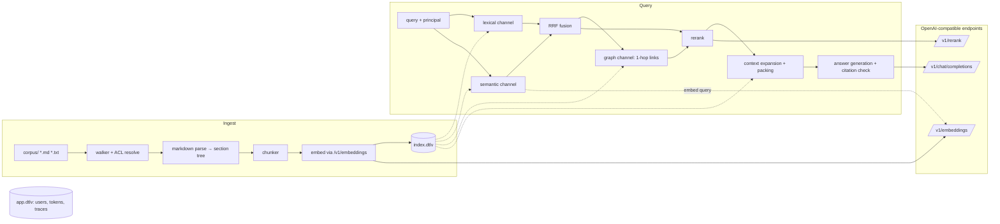

# LevinRAG — 現行規格

[English](SPEC.md) | 繁體中文

> 本文為英文版的翻譯；內容不一致時，以英文版為準。

版本 v1.0｜2026-09-25｜Phase 0–5 完成後的系統實況

> **這是現行規格的繁體中文翻譯**：描述系統**目前實際**的行為。權威版本是英文的 [`SPEC.md`](SPEC.md)，後續開發以它為準；本翻譯可能落後，兩者不一致時以英文版為準。
> - 初版規格（2026-09-22，已凍結）：[`docs/design/2026-09-22-initial-spec.md`](docs/design/2026-09-22-initial-spec.md)。本文件沿用它的章節編號，所以程式與文件中的「SPEC.md §n」引用仍然有效。
> - 每一處偏離初版的**理由與證據**記在 [`docs/decisions.md`](docs/decisions.md)，本文件只寫結論，並在括號中標出對應的決策日期。
> - 尚未完成的工作與下一步見 [§21](#21-尚未完成與下一步)。

一個單一 JVM process、單一資料目錄的企業 RAG：Markdown／純文字語料 → 多路召回（詞彙、語意、連結圖）→ RRF 融合 → cross-encoder rerank → 脈絡擴展 → 帶引用的生成，內建 ACL、查詢追蹤（trace）與評估框架。模型（embedding、rerank、chat）一律透過 OpenAI 相容 API 呼叫，可以是 vLLM，也可以是本機的 LM Studio／llama.cpp。

程式的 namespace 根為 `replware.levinrag`（2026-09-25 由 `hybridrag` 改名）。

---

## 0. 開發守則

1. **`SPEC.md`（英文）是現行規格，本文件是它的翻譯。** 改變系統行為時，要在同一個 commit 裡更新規格的對應章節（中英兩版），並在 `docs/decisions.md` 記下理由（「原規格／實際行為／採用做法」）。
2. **不要憑記憶使用 Datalevin API。** 它在 0.9 → 1.0 → 1.1 之間變動很大；每一個用到的呼叫都要先在 nREPL 對 pinned 版本（1.1.0）驗證。本文件中已經驗證過的用法，標注了出處。
3. **程式碼註解一律英文**；UI 文案與面向使用者的錯誤訊息用繁體中文。
4. **不擴張範圍。** 想到的改進寫進 `docs/backlog.md`；要做時先升格到 §21 或一個新的 Phase。
5. **需求模糊時**，選最簡單且可逆的做法，記在 `docs/decisions.md`，然後繼續。產品層面的選擇（閾值、斷詞器、權限語意）由使用者決定：量測、報告、建議。
6. 每個 task 一個 commit，訊息以 `Co-Authored-By` 行結尾。`no-commit/` 是使用者私人的語料，永遠不 commit、不引用內文。
7. 任何可能讓 ACL 被繞過的改動，都必須附帶 §18.3 的安全測試。
8. 開發流程：新子系統先寫設計稿（`docs/superpowers/specs/`）→ 使用者核准 → 實作計畫（`docs/superpowers/plans/`）→ TDD 實作 → 全段 review → 一輪修正。
9. **文件雙語**：README、SPEC、VLLM_SETUP、`docs/howto/*`、`docs/design/rationale` 各有英文版（`X.md`，為準）與繁體中文翻譯（`X.zh-TW.md`）。改一邊就要在同一個 commit 改另一邊，標題保持一致（其他文件會連到它們的錨點）。

---

## 1. 目標、非目標、成功標準

### 1.1 目標

- 每一層都有「最小但真實」的實作：ingestion、詞彙召回、語意召回、圖召回、融合、rerank、脈絡擴展、生成、ACL、trace、eval。
- 架構極簡：一個 JVM process、嵌入式 Datalevin，外加三個模型端點。開發不需要 Docker。
- 可觀察：每一次查詢都能看到每個通道各自撈到什麼、排第幾、rerank 後如何變化。這是學習與調校的核心。

### 1.2 成功標準與目前狀態

| 項目 | 標準 | 狀態 |
|---|---|---|
| ACL 洩漏 | 樣本語料 eval 與安全測試中 **= 0** | ✅ 達成（eval、§18.3 端到端套件） |
| Eval | `bb eval` 對 5 種檢索變體輸出 doc-level recall@5、recall@10、MRR@10 | ✅ 達成 |
| 延遲 | 檢索＋rerank（不含生成）p50 < 800 ms，語料 ≤ 100k chunks，模型在同機或同網段 | ⚠️ **未驗證**。本機 M1 以 llama.cpp 執行 rerank 時，單是 rerank 的 p50 約 1.3–3 秒；標準假設 GPU 部署。ACL 查詢那一段在 100k chunks 量過（T0.5，約 2 ms）。見 §21 |
| 可重建 | `bb reindex` 可從語料完整重建 `index.dtlv`，不影響帳號 | ✅ 達成 |
| 規模上限 | ≤ 5,000 份文件／≤ 100k chunks | ⚠️ **未做端到端驗證**（樣本語料 22 份文件、119 chunks）。見 §21 |

### 1.3 非目標

PDF／Office／OCR 解析；多租戶；SSO；query rewriting 與 agentic 多輪檢索；LLM 抽取 entity 建知識圖譜；答案層級的 LLM-as-judge 評估；水平擴展；串流輸出（T5.4，已延後，見 §21）。

---

## 2. 架構總覽



### 2.1 關鍵設計決策

| ID | 決策 | 理由 |
|---|---|---|
| D1 | 兩個嵌入式 Datalevin DB：`index.dtlv`（語料衍生資料）與 `app.dtlv`（使用者、token、trace） | index 是語料的衍生物，隨時可以丟棄重建；分開之後重建 index 不會動到帳號。 |
| D2 | 語料目錄是唯一的資料來源 | DB 永遠可以從檔案推導出來。應用程式只讀語料，不寫。 |
| D3 | **ACL 在寫入時物化；查詢時用「可讀文件 id 集合」過濾** | 階層繼承的遞迴計算放在 ingestion。查詢時先從使用者群組算出可讀的 doc id 集合，再對每個原始命中做 `contains?`。初版的 Datalog join 寫法在 100k chunks 下太慢（2026-09-22，T0.5）。 |
| D4 | `Retriever` protocol 隔離儲存層，**ACL 只在 Retriever 內完成** | 萬一 Datalevin 不適用，換實作不必重寫 pipeline；pipeline 層拿到的候選一定已經過濾。 |
| D5 | 三個模型端點（embed／rerank／chat），OpenAI 相容 API | 可以是 vLLM，也可以是 LM Studio（embed、chat）加 llama.cpp（rerank）。 |
| D6 | 全文索引建在 `:chunk/index-text`；向量存在另一個屬性 `:chunk/vec`，由應用程式計算（Path B） | Datalevin 內建的 embedding provider 在 transact 時就會呼叫模型端點，測試與建置都離不開模型；Path B 沒有這個依賴（2026-09-22）。 |
| D7 | Rerank 失敗時降級為 RRF 排序，請求不失敗 | 可用性優先；降級狀態記入 trace，並回傳給呼叫端。 |
| D8 | 檢索沒有有效證據時不呼叫 LLM | 省成本，也杜絕沒有依據的回答。 |
| D9 | 身分來源與 principal 分離 | 密碼 session、API token（以及日後的 OIDC）都只產出 `{:username :groups :admin?}`；下游只看 principal（2026-09-24）。 |

---

## 3. 技術選型

| 範疇 | 選擇 | 備註 |
|---|---|---|
| 專案骨架 | Clojure Stack Lite 產生 | Integrant、Reitit／Ring／Jetty、Hiccup、Malli、HTMX 2、Alpine.js、Tailwind 4、Babashka tasks、clj-kondo、cljfmt、eftest、cloverage。SQL 相關依賴已移除。 |
| 資料庫 | Datalevin **1.1.0**（嵌入式） | 每個會開啟它的 JVM 都要帶 `--add-opens=java.base/java.nio=ALL-UNNAMED --add-opens=java.base/sun.nio.ch=ALL-UNNAMED`，由 `deps.edn` 的 `:jvm-opts` alias 提供（2026-09-22）。 |
| Markdown 解析 | `org.commonmark/commonmark` ＋ gfm-tables ＋ yaml-front-matter | 用 source spans 取得字元位置。 |
| HTTP client | `hato` | 固定使用 HTTP/1.1：JDK client 預設的 h2c upgrade 在 LM Studio 上會卡住直到逾時（2026-09-24）。 |
| JSON | `metosin/jsonista` | |
| 密碼雜湊 | `buddy/buddy-hashers` | |
| 測試 | clojure.test ＋ eftest ＋ cloverage；瀏覽器檢查用 Playwright（本機 Chrome） | |

平台限制：Datalevin 向量功能支援 Linux x86_64／arm64 與 macOS arm64。

---

## 4. 外部依賴：模型端點

### 4.1 三個端點

| 用途 | 模型 | 預設位址 | 本機開發實際使用 |
|---|---|---|---|
| Embedding | `BAAI/bge-m3`（1024 維） | `http://localhost:8001/v1` | LM Studio `text-embedding-bge-m3`（Q8_0） |
| Rerank | `BAAI/bge-reranker-v2-m3` | `http://localhost:8002`，路徑 `/v1/rerank` | llama.cpp `llama-server --reranking`（Q8_0） |
| Chat | 可設定 | 無預設，必填 | LM Studio `qwen/qwen3-8b` |

啟動方式見 `VLLM_SETUP.md`。應用程式不負責啟動模型。

### 4.2 API 契約

所有請求帶 `Authorization: Bearer <key>`。

**Embeddings**：`POST {embed-base}/embeddings`，body `{"model", "input": [str...]}`。回應的 `data` 必須對每個輸入各有一個由數字組成的 `embedding`，否則視為 embed 端點失敗（HTTP 200 帶錯誤內容也算）。每批最多 32 筆，以文件為單位分批。

**Rerank**：`POST {rerank-base}{rerank-path}`，body `{"model", "query", "documents", "top_n"}`，回應 `results[i] = {index, relevance_score}`。缺少 `results`、index 重複或超出範圍、分數不是數字，都視為失敗。**分數依後端原樣使用**：llama.cpp 回傳原始 logit（例如 4.6／−6.5／−11.0），vLLM 通常回傳 0–1；兩者的門檻不能互換（2026-09-24）。

**Chat**：`POST {chat-base}/chat/completions`，標準 OpenAI 格式。`VLLM_CHAT_EXTRA_BODY`（JSON 物件）會原樣合併進 request body。例如 Qwen3 on LM Studio 要用 `{"reasoning_effort":"none"}`，因為 LM Studio 不理會 `chat_template_kwargs`。回應必須有 `choices[0].message`；`content` 為 null 視為空回答。

### 4.3 共通要求

- 連線逾時固定 2 秒；讀取逾時可設定（§5），預設 embed 30 秒、rerank 10 秒、chat 120 秒。
- 以下錯誤一律包成 `ex-info`，`ex-data` 含 `:llm/endpoint`、`:http/status`、`:llm/body-excerpt`（前 500 字元），上層據此回 503：
  - 任何 `IOException`（逾時、拒絕連線、連線中斷）；
  - 非 2xx 回應；
  - 2xx 但 body 不是 JSON，或結構不對。
- **API key 絕不出現在 log、trace、health 回應或例外資料中。**
- `bb vllm:check` 對三個端點各送一個請求，並用一份 1500 字的文件探測 rerank：reranker 的 context 太小時，短字串測試會過，但長文件會失敗（2026-09-25）。

---

## 5. 設定

伺服器的設定在 `resources/config.edn`（Integrant，aero reader，profile：`:default`／`:test`／`:prod`），值多半來自環境變數。不啟動 Integrant 的 CLI（`bb ingest`、`bb user:*`、`bb eval`）直接讀相同的環境變數，預設值也相同（`replware.levinrag.config`）。本機執行時，會執行應用程式的 `bb` 指令（包括 `bb serve`）也會從專案目錄的 `.env` 取得變數（範本 `.env.example`）；shell 裡已設定的變數優先，格式錯誤的行會報錯。JVM 本身從不讀 `.env`。`bb doctor` 檢查剛 clone 下來的環境（工具、設定、語料、`_collection.edn`），再執行 `bb vllm:check`。

| 設定 | Env | 預設 |
|---|---|---|
| 資料目錄 | `DATA_DIR` | `data`（`:test` profile 為 `data-test`）。`index.dtlv`、`app.dtlv`、`ingest-reports/` 都在這裡。 |
| 語料目錄 | `CORPUS_DIR` | `./corpus` |
| 根目錄預設讀取群組 | `ROOT_READ_GROUPS`（逗號分隔） | 空＝只有 admin 可讀 |
| Embedding | `VLLM_EMBED_BASE_URL` `VLLM_EMBED_MODEL` `VLLM_EMBED_DIMS` | 見 §4.1，`1024` |
| Rerank | `VLLM_RERANK_BASE_URL` `VLLM_RERANK_PATH` `VLLM_RERANK_MODEL` | 見 §4.1 |
| Chat | `VLLM_CHAT_BASE_URL` `VLLM_CHAT_MODEL` `VLLM_CHAT_EXTRA_BODY` | — ／ 必填 ／ — |
| API keys | `VLLM_EMBED_API_KEY` `VLLM_RERANK_API_KEY` `VLLM_CHAT_API_KEY`，未設則用 `VLLM_API_KEY` | — |
| 讀取逾時（毫秒） | `VLLM_EMBED_TIMEOUT_MS` `VLLM_RERANK_TIMEOUT_MS` `VLLM_CHAT_TIMEOUT_MS` | `30000` `10000` `120000` |
| Rerank 門檻 | `VLLM_RERANK_MIN_SCORE` | `-7.0`（llama.cpp 原始 logit 尺度；換後端必須重新校準，見 `docs/spikes/rerank-threshold.md`） |
| Session 加密金鑰 | `SESSION_SECRET_KEY` | `:prod` 必填（初版寫 `SESSION_SECRET`；實作沿用產生器給的名稱） |
| Session 有效期 | `SESSION_MAX_AGE_HOURS` | `8` |

**啟動時驗證**：`VLLM_CHAT_EXTRA_BODY` 不是 JSON 物件，或逾時值不是整數時，server **無法啟動**，錯誤訊息會指出是哪一個變數。

檢索與切塊參數沒有環境變數，而是寫在程式的預設值裡，可以透過 search component 的 `:opts` 覆寫：

| 參數 | 預設 |
|---|---|
| `:chunk/target-tokens` `max` `min` `overlap` | `350` `500` `60` `60` |
| `:channel-k` | `50` |
| `:overfetch` | `4` |
| `:rrf-k` | `60` |
| `:rerank-input` | `40` |
| `:graph-max` | `10` |
| `:final-k` | `8` |
| `:max-chars`（rerank 輸入截斷） | `1500` |
| `:max-tokens`（context 預算） | `6000` |
| `:rerank-min-score` | 函式庫預設 `nil`；`config.edn` 設為 `-7.0` |
| `:chat/temperature` `:chat/max-tokens` `:chat/extra-body` | `0.2` `1024` `nil` |

---

## 6. 資料模型

### 6.1 `index.dtlv` schema

完整定義見 `src/replware/levinrag/db/schema.clj`。與初版的差異：

- `:chunk/index-text`：`:db.type/string`，`:db/fulltext true`、`:db.fulltext/autoDomain true`，**沒有** `:db/embedding`（Path B）。
- `:chunk/vec`：`{:db/valueType :db.type/vec}`。**不可以**加 `:db.vec/domains`，這會觸發 Datalevin 1.1.0 寫入路徑的 bug（2026-09-22，已查到根因）。向量的維度與距離在開啟時用 `:vector-opts {:dimensions dims :metric-type :cosine}` 給。
- 新增 `:doc/content-hash`：去掉 frontmatter `read_groups:` 那一行之後的 sha256。與 `:doc/hash` 對照，就能判斷「只改了權限」。
- 新增 `:doc/raw-links`：原始連結目標（EDN），讓每次匯入都能重新解析所有連結，不必重讀檔案。
- 新增 `:chunk/hard-cut?`：標記這個 chunk 是否被強制切斷（§7.3）。
- `:section/trail` 存成字串 `"A > B > C"`，不是向量。

`index.dtlv` 的開啟選項（每次開啟都必須相同）：

```clojure
{:vector-opts    {:dimensions 1024 :metric-type :cosine}
 :search-domains {"chunk/index-text" {:analyzer <cjk-analyzer UDF descriptor>}}}
```

全文檢索的 domain 名稱是屬性的 `keyword->string`，**斜線保留**（`"chunk/index-text"`）；向量 domain 名稱則把斜線換成底線（`"chunk_vec"`）。兩者用不同的 helper，不要搞混（2026-09-22）。

### 6.2 `app.dtlv` schema

完整定義見 `schema.clj`。與初版的差異：

- 新增 `:token/prefix`：token 明文的前 8 個字元，讓 `bb token:revoke <prefix>` 找得到它。前綴有歧義時拒絕撤銷（2026-09-24）。
- 新增 `:user/sessions-valid-after`（instant）：這個時間點之前發出的網頁 session 一律無效（§13）。
- `:trace/degraded` 的值包含 `:rerank-failed`、`:dependency-failed`。

在既有的 `app.dtlv` 加入新屬性不需要遷移：已經在一份實際 DB 的副本上驗證過（2026-09-25）。

---

## 7. Ingestion

### 7.1 語料目錄約定

```
corpus/
├── _collection.edn            ; {:name "全公司" :read-groups ["all"]}
├── public/handbook.md
├── hr/
│   ├── _collection.edn        ; {:name "人資" :read-groups ["hr"]}
│   ├── leave.md
│   ├── announcements/year-end-party.md   ; frontmatter read_groups: [all]
│   └── investigations/
│       └── _collection.edn    ; {:name "申訴調查" :read-groups ["hr-lead"]}
└── finance/
    ├── _collection.edn        ; {:read-groups ["finance"]}
    └── budget-2025.md         ; frontmatter read_groups overrides
```

接受的副檔名：`.md`、`.markdown`、`.txt`。以 `.` 或 `_` 開頭的檔案與目錄一律忽略（`_collection.edn` 由 walker 另外讀取）。Frontmatter 支援 `title`、`tags`（list）、`read_groups`（list），其他欄位原樣存入 `:doc/frontmatter`。

### 7.2 ACL 解析規則（寫入時物化）

1. 目錄的 effective groups：**最近一個有宣告的祖先勝出**（含自身）。都沒有宣告時用 `ROOT_READ_GROUPS`。
2. 文件的 effective groups：frontmatter 有 `read_groups` 時**只用它（覆寫，不是聯集）**；否則等於所屬目錄的 effective groups。
3. 只改 `_collection.edn` 或 frontmatter 的 `read_groups` 時，**不重新計算 embedding**：chunk 的文字沒變，就沿用已存的向量。frontmatter 的變動會改變字元位移，所以文件仍然會重新解析（2026-09-25）。報告中計為 `acl-updated`。
4. 空集合 `[]` 表示除 admin 外沒有人可讀。
5. **無法照字面套用的設定一律收緊**（2026-09-25）：該文件不匯入（先前已匯入的會從索引移除），並列在報告的 `errors`；絕不退回目錄的群組。涵蓋：`_collection.edn` 無法解析、不是 map、有 `:name`／`:read-groups` 以外的 key，或 `:read-groups` 不是字串清單——它所管轄的每一份文件（直到下層下一個有效宣告為止）都受影響；以及 frontmatter 的 `read_groups` 不是清單（`read_groups: hr`）、該行沒有值（包括 YAML 多行清單）、拼錯（`read_group`、`read-groups`、`Read_Groups`、`readgroups`）、key 或清單項目加了引號、用了全形冒號、有縮排，或出現不只一次。frontmatter 區塊必須從第一行開始（允許 BOM），並以單獨一行的 `---` 或 `...` 結束；在第一個標題之前、卻不在這樣的區塊裡出現看起來像 `read_groups` 的行，也算錯誤（2026-09-25 審查）。
6. **因其他原因重新匯入失敗的文件**（例如 embedding 端點掛掉）**會從索引移除**，直到某次匯入成功為止；否則它的舊版本會以舊的、可能較寬的群組繼續被搜到。依規則 5 擋下或依規則 6 移除的每份文件，除了列在報告的 `errors`，也會記一行 `WARN` log（`[INGEST] acl fail-closed: …`／`[INGEST] removed the stale copy of …`：路徑與原因，不含內容）。

`bb acl:report [--users <檔案>] [--docs]` 顯示結果：每個群組有哪些文件、哪些使用者擁有它；每位使用者讀得到幾份文件；加 `--docs` 時列出每份文件的群組與讀得到的使用者。讀者以 `accessible-doc-ids` 計算，也就是檢索時過濾用的同一個函式。它會警告：文件用到、但沒有使用者擁有的群組；只有 admin 讀得到的文件；沒有群組的使用者；沒有文件使用的使用者群組；以及最近一次匯入的錯誤。使用者來自 `app.dtlv`，或用 `--users` 指定的使用者檔。只有路徑和群組名稱，不含文件內容。

### 7.3 Markdown 解析與切塊

用 commonmark 建立 section 樹（ATX 與 Setext）；第一個 heading 之前的內容歸入 level 0 的隱含 section。文件標題的優先序：frontmatter `title` → 第一個 H1 → 檔名。`.txt` 視為單一 section，以空行分段。

切塊規則（每個 section 獨立處理，**chunk 絕不跨 section**）：

1. 依序累加 block，累計估算 token 達到 target 就結束一個 chunk；加入下一個 block 會超過 max 時，就在這裡切。
2. 單一 block 超過 max 時，依序嘗試以下切點，最後才硬切（並標記 `:chunk/hard-cut?`）：
   - 句界（`。！？；` 與 `. ! ?` 後接空白）；
   - 行界。
   **fenced code block 與 table 只在行界切。**
3. 相鄰 chunk 之間的重疊，用同一組切點來取，而且重疊加上正文不會超過 max。每個 chunk（含重疊）都是原檔中一段連續的範圍，`char-start`／`char-end` 可以精確還原原文。
4. section 的最後一個 chunk 若 < min，就併入前一個 chunk（前提是不超過 max）；判斷時只計這段自己的內容，不計繼承來的重疊。
5. 只有 heading 沒有內容的 section 不產生 chunk，但它的 heading 仍會出現在子 section 的 trail 中。

（以上選擇見 2026-09-24「T1.3 chunker」。）

### 7.4 Contextual header

`:chunk/index-text` = header ＋ 空行 ＋ `:chunk/text`。header 為：

```
文件：{doc title}
章節：{section trail}
```

level 0 的內容沒有 trail，不輸出 `章節：` 這一行。

### 7.5 連結解析

從 AST 取出相對路徑的 `.md` 連結（忽略 `#anchor` 與 query），以及 `[[Page Name]]` wikilink（以不分大小寫的標題或檔名比對）。原始目標存在 `:doc/raw-links`。**每次匯入結束時，所有文件的連結都會重新解析**，所以晚加入的目標文件也會被連上。無法解析的連結列在報告中，不算錯誤。

### 7.6 增量流程

```
walk corpus/ → set of (path, sha256)
upsert collections, resolve effective groups (§7.2)
for each file:
  unchanged hash            → skip (update effective-groups if ACL inputs changed)
  only read_groups changed  → re-parse, reuse stored vectors → acl-updated
  otherwise                 → parse → sections → chunks → embed changed chunks
                              one transaction: upsert surviving ids in place
                              (retracting dropped attrs), retractEntity removed ids
for each doc in DB not on disk: delete doc + sections + chunks
re-resolve all links (DB only)
wait-for-secondary-index → report index lag
```

- 同一個 chunk id 在同一個交易中先 `retractEntity` 再新增會失敗（fulltext「Document does not exist」），所以改為就地更新（2026-09-24）。
- 以文件為單位 embed：一份文件的 embed 失敗時，這份文件不寫入，其他文件照常進行。
- 報告（EDN，寫入 `DATA_DIR/ingest-reports/<ts>.edn`）的欄位：新增／更新／acl-updated／略過／刪除的文件數、錯誤清單、本次寫入與索引中的 chunk 數、最長 chunk 的估算 token、未解析連結、index lag、耗時。
- **匯入的兩個入口**：`bb ingest`（CLI）與 web 的 ingest runner（`/admin` 按鈕、`POST /api/v1/ingest`）。runner 同時只允許一個 job。`CORPUS_DIR` 不存在時拒絕執行，避免被誤判為「所有文件都被刪除」。**CLI 只在 server 停止時使用**：兩個 process 同時寫入沒有驗證過（§21）。
- `bb reindex`：刪除 `index.dtlv` 後完整匯入，必須先停止 server。

### 7.7 Token 估算

不在 JVM 端載入 tokenizer。估算方式：
- 每個 CJK 字元（含假名、韓文）計 1；
- 每個由英數字元組成的 run 計 `ceil(len / 4) + 1`（包含全形與非 ASCII 字母數字）；
- 標點與空白不計。

實測對照：1500 個中文字約等於 bge-reranker 的 1191 tokens。

---

## 8. 中文 analyzer（斷詞）

**重疊 bigram**，不使用字典式斷詞。已經實測比較過 bigram、HanLP 1.x 與兩者合併：在範例語料與書籍語料上，檢索品質沒有可量測的差異；HanLP 另外需要 8 MB 依賴、要逐語料維護字典，而且字典沒收的領域詞會退化成單字（2026-09-24，使用者決定；`docs/spikes/cjk-analyzer.md`）。

analyzer 以 Datalevin UDF 註冊（`index-conn/open`），是 runtime 狀態，每次開啟 DB 都必須提供；查詢端沿用索引端的 analyzer。**更換 analyzer 必須 `bb reindex`。**

### 8.1 索引端

1. 逐 code point 做 NFKC 正規化並轉小寫（全形轉半形），offset 指向原字串位置。
2. 切成 run：
   - CJK run（漢字、假名、韓文）；
   - ASCII run（`[a-z0-9]`，內部允許 `- _ . /` 連接，如 `sku-a123`、`v2.5`）；
   - 其餘字元是分隔符。
3. CJK run 輸出重疊 bigram；長度為 1 時輸出單字。
4. ASCII run 輸出整個 token；含連接符時，另外輸出長度 ≥ 2 的子片段。

已知限制：單獨查一個中文字時，只會命中文件中「單字 run」的地方（§21 backlog）。

### 8.2 查詢端

同 §8.1。

### 8.3 測試向量

| 輸入 | 預期 terms（依序） |
|---|---|
| `員工請假規定` | 員工 工請 請假 假規 規定 |
| `SKU-A123 的庫存` | sku-a123 sku a123 的庫 庫存 |
| `iPhone15手機` | iphone15 手機 |
| `ＨＲ－０７表單` | hr-07 hr 07 表單 |
| `v2.5 版本` | v2.5 v2 版本 |
| `請` | 請 |

---

## 9. 檢索 pipeline

### 9.1 流程

```
principal (username, groups, admin?) + query
 ├─ lexical  : fulltext on :chunk/index-text, top = channel-k × overfetch, ACL filter, take channel-k
 ├─ semantic : embed query, vec-neighbors on :chunk/vec, same over-fetch rule
 ├─ RRF(lexical, semantic) → top rerank-input
 ├─ graph    : 1-hop linked docs of top-5 fused docs → ≤ graph-max extra candidates
 ├─ rerank   : (fused ∪ graph) → rerank endpoint → sort by relevance_score
 ├─ select   : top final-k, dropping those below rerank-min-score
 └─ context  : neighbour expansion + merge + budget packing → numbered passages
```

Lexical 與 semantic 是兩個獨立的 DB 查詢；融合、graph 擴展、rerank、context 打包都在應用層的 pipeline（`replware.levinrag.retrieval.pipeline`）完成。

全文查詢只用 BM25 加上布林條件。**不使用 phrase query**：`:index-position? true` 經由 Datalog `fulltext` 使用時無效（2026-09-22）。

### 9.2 Retriever protocol

```clojure
(defprotocol Retriever
  (index-doc!  [this parsed-doc])
  (delete-doc! [this doc-path])
  (channel     [this principal channel-kw query opts]
    "ACL-filtered recall for :lexical or :semantic.
     Returns {:candidates [{:chunk/id :doc/path :rank :score} ...]  ; best-first, ≤ channel-k
              :extended   [...]   ; the whole ACL-filtered over-fetch (for §9.5)
              :raw-hits n :after-acl n :starved? bool}")
  (neighbors   [this principal chunk-id opts] "ACL-filtered ±1 chunks in the same section.")
  (linked-docs [this principal doc-paths] "ACL-filtered 1-hop linked doc paths, both directions.")
  (chunks      [this principal chunk-ids] "ACL-filtered fetch by id (text for rerank and context)."))
```

pipeline 從不直接讀 DB；融合、rerank、context 打包與儲存無關。

### 9.3 ACL（硬性要求）

- ACL 過濾**必須在 Retriever 內完成**。離開 Retriever 的候選、鄰居、連結與 chunk，都已經過濾。
- 查詢形式：先算 `accessible-doc-ids`（使用者任一群組可讀的 doc entity id 集合），再多撈一些原始命中，對每個命中做 `contains?`：

```clojure
(defn accessible-doc-ids [db groups]
  (set (d/q '[:find [?d ...] :in $ [?g ...] :where [?d :doc/effective-groups ?g]]
            db (vec groups))))
```

- admin 走**獨立函式**（`channel-for-admin`、`docs/lookup-admin`），不在同一段查詢上用參數開關。
- 沒有任何群組的非 admin 使用者：直接回傳空結果，不查 DB。
- `linked-docs` 也會過濾**來源**文件：使用者看不到的文件，他也無從得知它連到哪裡。
- Over-fetch 過濾後少於 `channel-k`，且原始命中數等於 over-fetch 上限時，trace 標記 `:acl-starvation`。這個 flag 與原始命中數只有 admin 看得到（§14）。
- `:doc-filter` 無法經由 Datalog `fulltext` 使用，不可作為 ACL 預先過濾的機制（2026-09-22）。

### 9.4 RRF

依名次的倒數融合：`score(id) = Σ 1/(k + rank + 1)`，缺席的通道不貢獻分數。平手時依序比較 lexical 名次、semantic 名次，最後比較 chunk id，排序必須完全確定（不可用 `(sort-by val >)`）。實作見 `retrieval/fusion.clj`，平手情境有測試。

### 9.5 Graph 通道

1. 取 RRF 前 5 名所屬的不重複文件。
2. 取這些文件 1-hop 連結的文件（雙向，經過 ACL 過濾），排除已經在候選中的文件。
3. 每個連結文件最多貢獻 2 個 chunk：優先取在 lexical／semantic 的延伸清單（`:extended`）中出現、名次較佳者；都沒有就取 ordinal 0。
4. 總數上限 `graph-max`，channel 標記為 `:graph`，**不參與 RRF，直接進入 rerank**。
5. `:graph?`（預設 true）可以關閉；eval 會比較開關的差異。

### 9.6 Rerank

- 輸入是 chunk 的 `:chunk/index-text`（含 header），以字元數截斷到 `:max-chars`（1500）。
- 失敗（逾時、非 2xx、200 但結構錯誤）時：沿用 RRF 順序（graph 候選排在最後），trace 標記 `:rerank-failed`，API 回應 `degraded: ["rerank_failed"]`。
- `rerank-min-score` 在 `config.edn` 設為 `-7.0`：這是在範例與書籍語料上不會丟掉任何答案的最高門檻（2026-09-25）。分數分布記錄在 trace，供日後重新校準。

### 9.7 Context 擴展與打包

1. 每個選中的 chunk 加入同 section 的 `ordinal ± 1` 鄰居（ACL 過濾）。
2. **同一個 section** 內 ordinal 連續的 chunk 合併成一個 passage，依字元位移去除重疊；passage 就等於原檔中的一段連續範圍。
3. passage 依其中最佳的 rerank 分數排序，依序放入，總估算 token ≤ `:max-tokens`。放不下時先捨棄鄰居，被選中的原始 chunk 最後才捨棄；只剩鄰居的 passage 不輸出。
4. passage 編號 `[1]..[n]`。

### 9.8 輸出結構

```clojure
{:passages   [{:n 1 :doc/path "hr/leave.md" :doc/title "請假規定"
               :section/trail "請假規定 > 特休 > 天數計算"
               :chunk-ids ["hr/leave.md::3" "hr/leave.md::4"]
               :char-range [1200 2380] :text "..."}]
 :candidates [{:chunk/id "hr/leave.md::3" :doc/path "hr/leave.md"
               :channels {:lexical {:rank 2 :score 7.1} :semantic {:rank 5 :score 0.79}}
               :rrf 0.0321 :rerank 4.6 :selected? true}]
 :degraded   #{}            ; or #{:rerank-failed}
 :flags      #{}            ; :acl-starvation, :rerank-failed
 :stages     {...}}         ; §14
```

---

## 10. 生成

### 10.1 Prompt

System prompt 放在 `resources/prompts/answer.md`，每次呼叫時讀取，改了不必重啟。要點：
- 只根據提供的來源回答；
- 每個事實性陳述標註 `[n]`；
- 資料不足時明說「資料中找不到」；
- 預設以繁體中文回答，使用者用其他語言提問時用該語言回答。

User message 的格式是 `<sources>` 區塊（每個 passage 以 `[n] 文件標題｜章節` 開頭）＋ `問題：…`。**passage 的標題、章節與內文中的 `<sources>`／`</sources>`（不分大小寫、標籤內可有空白）會先轉成全形角括號**，避免文件內容結束來源區塊並冒充使用者（間接 prompt injection）。

參數：`temperature 0.2`、`max_tokens 1024`。回應中的 `<think>…</think>` 會被移除；只有 `<think>` 沒有結尾時，移除其後全部內容；只有 `</think>` 沒有開頭時（模板預先填入 `<think>` 的情況），移除其前全部內容。

### 10.2 引用驗證

- 接受的格式：`[n]`、`[n][m]`、`[n, m]`（也接受 `，`、`、`），以及全形的 `［n］`、`【n】`，**含全形數字**（`［１］`）。一律改寫為 `[n]`。範圍寫法 `[1-3]` 不支援。
- 超出範圍的編號（含 `[0]`、`[2024]` 這類年份）會被移除，並記入 `:generate :invalid-citations`。Markdown 連結文字 `[x](..)` 不受影響。
- 回傳的 `citations` 只包含實際被引用的 passage。
- 回答沒有任何引用、又不是「找不到」類的回覆時，標記 `:uncited-answer`。「找不到」用 regex 判斷：找不到／查無／沒有相關／not found／no relevant／cannot find。
- 移除思考內容後回答為空時，回傳固定訊息「模型沒有產生回答，請稍後再試。」，不附引用，標記 `:empty-answer`。

### 10.3 無證據路徑

pipeline 沒有產生任何 passage（沒有候選，或全部低於門檻）時，不呼叫 chat，直接回傳「在你有權限存取的資料中找不到相關內容。」與 `no_evidence: true`。

---

## 11. HTTP API

前綴 `/api/v1`，JSON（snake_case），以 `Authorization: Bearer <token>` 認證。錯誤格式：`{"error": {"code": "...", "message": "..."}}`。`query` 長度 1–1000 字元，`final_k` 1–50。

| Method | Path | 權限 | 說明 |
|---|---|---|---|
| POST | `/search` | user | 只檢索，不生成。body `{query, final_k?, graph?}`；回傳 `passages`、`candidates`（含各通道名次）、`degraded`、`trace_id` |
| POST | `/ask` | user | 檢索加生成。body `{query, final_k?, debug?}`；回傳 `{answer, citations, no_evidence, degraded, trace_id}`，`debug=true` 時附上 `candidates` |
| GET | `/docs/{path}` | user | 文件 metadata 與 chunk 清單，經過 ACL 過濾；看不到的一律 404 |
| POST | `/ingest` | admin | 啟動匯入 job，回傳 `job_id`；已有 job 在跑時回 409 |
| GET | `/ingest/{job_id}` | admin | job 狀態與報告 |
| GET | `/traces/{id}` | admin 或 trace 擁有者 | trace 內容；其他人一律 404 |
| GET | `/health/live` | 無 | 兩個 DB 各讀取一筆 datom。給負載平衡器（Kamal）使用 |
| GET | `/health` | 無 | DB、三個模型端點、index lag。任一 DB 或模型失敗回 503，body 列出每一項 |

錯誤碼：

| HTTP | code | 情況 |
|---|---|---|
| 400 | `invalid_request` | body 不符 schema |
| 401 | `unauthorized` | 沒有或無效的 token |
| 404 | `not_found` | 不存在或無權限（不區分兩者） |
| 409 | `conflict` | 已有 ingest job 在執行 |
| 503 | `dependency_unavailable` | embed 或 chat 端點失敗。body 另外帶 `trace_id`，指向記錄失敗的那筆 trace |

rerank 失敗**不會**回 503，而是回 200 並帶上 `degraded: ["rerank_failed"]`。

**Health 的細節（2026-09-25）**：
- 三個模型探測同時進行，每個最多等 5 秒，逾時即為 `down`。
- 結果快取 30 秒，從探測**結束**時起算。
- 探測進行中收到的請求，會等待同一輪的結果，不另外發請求。
- index lag 只回報，不會造成 503。
- 回應格式：`{"status": "ok"|"degraded", "checks": {...}, "index_lag": n}`。

---

## 12. Web UI

HTMX 加 Hiccup 的伺服器端渲染，樣式用 Tailwind v4。沒有 DaisyUI，建置流程也不需要 npm。網頁路由用 session cookie 加 CSRF 認證，並**直接呼叫**與 API 相同的函式，瀏覽器不會持有 API token。CSRF 只套用在網頁路由；`/api/v1` 以 bearer token 認證，瀏覽器不會自動附帶，所以不需要 CSRF（2026-09-24）。

| 路徑 | 內容 |
|---|---|
| `/login`、`POST /login`、`POST /logout` | 帳密登入。失敗時只顯示「帳號或密碼錯誤」。`next` 參數只接受同站路徑 |
| `/` | 問答頁：輸入框、Debug 開關；`POST /ask`（HTMX）回傳結果片段 |
| 結果片段 | 回答（`[n]` 可點擊，捲動到對應來源）、來源面板（標題、章節、摘錄、「開啟文件」）；Debug 開啟時附 Debug 面板；另有無證據、降級、錯誤等提示（錯誤提示含 trace id） |
| Debug 面板 | 所有候選：chunk id、lexical 名次、semantic 名次、RRF、graph 標記、rerank 分數、是否選中；各階段耗時、模型與 token 數、flags、degraded。**數值讀自已儲存的 trace**，有測試逐欄比對 |
| `/docs/*path` | 以 commonmark 渲染原檔（escape HTML、過濾 URL），被引用的 chunk 以底色標出，可用 `?chunk=` 直達。檔案在建立索引後被改過時（hash 不同），非 admin 只看到提示、看不到檔案的任何文字，因為索引裡的權限不涵蓋新內容，而新內容可能帶著更窄的 `read_groups`（2026-09-25 審查）；admin 會看到目前的檔案並附提示。看不到的文件回 404 |
| `/admin` | admin 限定：執行增量匯入（執行中每 2 秒更新狀態）、最近一次報告、index lag、最近 50 筆 trace 與明細 |

未登入時，一般請求 302 導向 `/login?next=…`，HTMX 請求改回 `HX-Redirect: /login`。非 admin 存取 admin 頁面時回 404。`bb browser-check`（Playwright）是「沒有 JS 錯誤」的驗收工具。

---

## 13. 認證與使用者管理

- **密碼**：buddy-hashers。
- **Session**：Ring 加密 cookie，只存 `{:username :issued-at}`；principal 每個請求都重新從 `app.dtlv` 讀取，所以群組變更、降權、刪除立即生效。
  - Cookie 屬性：`HttpOnly`、`SameSite=Lax`；只有 `:prod` 加上 `Secure`。
  - **時效**：登入超過 `SESSION_MAX_AGE_HOURS`（8）即失效；沒有 `:issued-at` 的舊 cookie 一律失效。
  - **撤銷**：登出與 `bb user:passwd` 會把 `:user/sessions-valid-after` 設為現在，該使用者**所有裝置**的 session 一起失效。cookie 本身就是 session 的全部，所以只能以使用者為單位撤銷（2026-09-25，使用者決定）。
- **API token**：CLI 產生 32 bytes 隨機值，只顯示一次；DB 存 sha256 與 8 字元前綴。token 沒有期限，不受登出或改密碼影響。
- **身分與 principal 分離**（D9），日後加入 SSO 只需要新增一個 adapter。
- 使用者管理用 Babashka tasks，沒有 UI：

```
bb user:create alice --groups all,hr [--admin]   ; 不設密碼
bb user:groups alice all,hr,finance              ; 取代整組群組
bb user:passwd alice                             ; 互動輸入兩次，≥ 8 字元；撤銷其網頁 session
bb token:create alice --label "cli"
bb token:revoke <prefix>
bb user:import users.edn [--dry-run]              ; 檔案列出的使用者以檔案為準
```

`bb user:import` 讀 `eval/users.edn` 的格式（`{"alice" {:groups #{"all" "hr"} :admin? false}}`），所以 eval 和 server 可以共用同一份檔案。它在一個交易裡：建立檔案列出但還不存在的使用者（各產生一組隨機密碼，只印一次），並把已存在者的群組與 admin 設成和檔案一致（密碼不動）。不在檔案裡的使用者只會被列出，絕不刪除。檔案有任何問題（不認得的 key、群組不是字串、使用者名稱含空白）時整個檔案拒絕匯入，並指出每個有問題的使用者。密碼從不由檔案讀取。

正式環境的容器裡沒有 `bb`，改用 `java … -cp standalone.jar clojure.main -m replware.levinrag.auth.cli <command>`（見 `docs/howto/ops.md`）。

---

## 14. Trace 與可觀察性

每一次 `/search` 與 `/ask` 都寫入一筆 trace（`app.dtlv`），包括因模型端點失敗而回 503 的請求。`:trace/stages`：

```clojure
{:lexical  {:ms 12 :raw-hits 200 :after-acl 50 :top [["hr/leave.md::3" 7.1] ...]}
 :semantic {:ms 35 :raw-hits 200 :after-acl 50 :top [...]}
 :fusion   {:ms 1 :top [["hr/leave.md::3" 0.0321] ...]}
 :graph    {:ms 4 :added ["hr/payroll/bonus.md::0"]}
 :rerank   {:ms 180 :failed? false :scores [["hr/leave.md::3" 4.6] ...]}
 :context  {:ms 2 :passages 5 :tokens 3120 :dropped [...]}
 :generate {:ms 2400 :model "..." :prompt-tokens 3500 :completion-tokens 320
            :finish-reason "stop" :invalid-citations []}
 :flags    #{:acl-starvation}}
;; dependency failure:
{:error {:endpoint :chat :message "vLLM chat timed out"}}   ; degraded #{:dependency-failed}
```

- 每個 `:top` 清單最多保留 20 筆，而且只存 id 與分數，不存 chunk 內文。回答全文存在 `:trace/answer`。
- **非 admin 看到的 trace 會遮蔽 ACL 過濾前的資訊**：他查看自己的 trace（`/api/v1/traces/:id`、Debug 面板）時，看不到各通道的 `:raw-hits` 與 `:acl-starvation` flag，因為這些會透露「有他看不到的文件符合查詢」。trace 本身完整儲存，admin 在 `/admin` 與 API 都看得到全部數字，用來診斷權限造成的召回不足（`trace/view-for`，2026-09-25）。
- `/admin` 列出最近的 trace 時，是沿 `:trace/at` 反向掃描、只讀取需要的筆數，不會載入全部 trace。
- log 採結構化輸出，一行一個事件，含 `trace_id`。

---

## 15. 評估框架

### 15.1 題庫 `eval/questions.edn`

```clojure
[{:id "leave-01" :user "alice" :query "特休天數怎麼計算？" :expected-docs ["hr/leave.md"]}
 {:id "acl-01"   :user "bob"   :query "年終獎金的發放標準" :must-not-docs ["hr/payroll/bonus.md"]}
 ;; optional section-level scoring: :expected-sections ["<path>#<n>"]
 ]
```

eval 的身分來自 `eval/users.edn`，所以 `bb eval` 不依賴 `app.dtlv`。`--questions <檔案>` 與 `--users <檔案>` 取代這兩個預設檔，用於評估其他語料；檔案不存在時報錯。目前題庫有 38 題，其中 8 題是 ACL 負向題。

### 15.2 執行

`bb eval [--variants lexical,semantic,hybrid,hybrid+rerank,hybrid+rerank+graph] [--questions <檔案>] [--users <檔案>]` 以各題指定的使用者身分，直接呼叫檢索 pipeline（不經 HTTP），輸出：

- 每個變體的 doc-level recall@5、recall@10、MRR@10（去重後的文件排名）；
- ACL 洩漏數：`must-not-docs` 出現在任何變體的任何位置就計 1；**> 0 時以非零狀態碼結束**；
- degraded 題數。有題目在降級狀態下執行時會印出警告，但狀態碼不變；
- 最長 chunk 的估算 token、各階段 p50／p95 耗時；
- 結果寫入 `eval/results/<ts>.edn`（gitignored），並在終端機印出表格。

**已知限制**：範例語料太小，所有變體的 recall 都是 1.0，無法比較變體的優劣；變體比較要用較大的語料（§21）。

### 15.3 樣本語料

`corpus-sample/`：22 份文件、119 chunks，以繁體中文為主、夾雜英文。內容涵蓋 §7.1 的目錄與 ACL 結構、frontmatter 覆寫、文件互相連結、精確識別碼（`SKU-A1234`、`HR-07`），以及長 section、表格與程式碼區塊。種子使用者：`alice`（all, hr）、`bob`（all, engineering）、`carol`（all, finance）、`admin`。

---

## 16. 專案結構

```
levinrag/
├── SPEC.md                         ; this file (current spec)
├── README.md  CLAUDE.md  VLLM_SETUP.md
├── deps.edn  bb.edn  Dockerfile  .kamal/
├── resources/
│   ├── config.edn                  ; Integrant system, all profiles
│   └── prompts/answer.md
├── src/replware/levinrag/
│   ├── core.clj  server.clj  routes.clj  handlers.clj  health.clj  config.clj
│   ├── db/{schema,index_conn,app_conn}.clj
│   ├── ingest/{walker,acl,markdown,chunker,tokens,writer,job,runner,report,cli}.clj
│   ├── search/analyzer.clj
│   ├── retrieval/{protocol,datalevin,fusion,graph,rerank,context,pipeline,system}.clj
│   ├── llm/{http,embed,rerank_client,chat,answer,check}.clj
│   ├── auth/{users,token,middleware,cli}.clj
│   ├── api/{search,ask,docs,ingest,traces}.clj
│   ├── web/{layout,auth,ask,docs,admin}.clj
│   ├── docs.clj  trace.clj  views.clj
│   └── eval/{harness,cli}.clj
├── test/replware/levinrag/...      ; mirrors src; security_test.clj = §18.3
├── dev/                            ; REPL helpers, browser check server, spikes
├── corpus-sample/  eval/{questions.edn,users.edn,results/}
└── docs/
    ├── design/2026-09-22-initial-spec.md   ; frozen initial spec
    ├── decisions.md  backlog.md
    ├── howto/{ops,admin,user}.md
    ├── spikes/  handoff/
    └── superpowers/{specs,plans}/          ; per-phase designs and plans
```

---

## 17. 開發階段與驗收條件

Phase 0–5 已完成，每個 Phase 結束時都由一位新的 reviewer 審查整段變更，並做過一輪修正。各 Phase 的詳細 task 與驗收條件見初版規格 §17，以及 `docs/superpowers/plans/`。

| Phase | 內容 | 狀態 |
|---|---|---|
| 0 骨架與 spike | 專案骨架、模型 client、embedding／全文／ACL 效能 spike | ✅ |
| 1 Ingestion | walker 與 ACL、section 樹、chunker、index writer、CLI 與樣本語料 | ✅ |
| 2 檢索與評估 | 認證、lexical／semantic 通道＋ACL、RRF＋graph、rerank 降級、context 打包、`/search`＋trace、eval | ✅ |
| 3 生成 | answer 模組、`/ask`（以真實模型驗證） | ✅ |
| 4 Web UI | 登入、問答頁＋來源＋Debug 面板、文件檢視、admin 頁 | ✅ |
| 5 強化 | T5.1 health／逾時／錯誤一致化 ✅；T5.2 §18.3 端到端安全測試與 session 時效 ✅；T5.3 README 與 HowTo ✅；**T5.4 `/ask` SSE 串流：延後**（§21） | ✅（T5.4 除外） |

之後的工作見 §21。

---

## 18. 測試策略

### 18.1 單元測試

analyzer 測試向量、chunker、token 估算、ACL 解析、RRF（含平手）、context 打包、引用解析、rerank 回應驗證、session 有效性判斷、health 快取。

### 18.2 整合測試

每個測試都用暫存目錄建立 Datalevin，結束後刪除。模型以 stub 模擬（固定向量：用文字的 hash 產生確定的單位向量）；HTTP 層用本機 Jetty stub server。需要真實模型的測試標上 `:vllm`，沒有設定 `VLLM_*` 時自動略過。網頁測試用保存 cookie 的 client 直接呼叫 Ring handler。

- 快速迴圈（nREPL）與完整執行（`clojure -X:jvm-opts:test`，含 coverage）的方式見 `CLAUDE.md`。
- 目前共 213 個測試。
- `bb browser-check` 另外在真瀏覽器中走過主要流程。

### 18.3 安全測試（ACL，不可省略）

`test/replware/levinrag/security_test.clj` 以樣本語料與種子使用者（外加一位沒有群組的使用者）執行。矩陣**由索引推導**，不是寫死的：每一份受限文件 × 每一位無權限的使用者。

- `/search` 的每種 graph 開關，以及 eval 的每種變體，都不會出現該文件的 chunk；
- `/ask` 的 citations 與 debug candidates 都沒有它；
- **送給模型的 prompt**（system 與 `<sources>`）不含它的路徑、標題與開頭內文。使用者本來就能讀到的字串除外，但每一組都至少要檢查一項；
- `/api/v1/docs/{path}` 與網頁 `/docs/{path}` 都回 404；
- graph 通道不會經由連結把受限文件帶進來（以 `public/handbook.md` → `hr/leave.md` 驗證）；
- 每個回應中出現的所有文件（含 context 擴展的鄰居）都是該使用者可讀的；
- 沒有群組的使用者，任何查詢都是空結果；
- 別人的 trace：非擁有者、非 admin 一律 404（API 與網頁）；自己的 trace 不含 ACL 過濾前的命中數與 `acl-starvation`（admin 看同一筆 trace 則有，作為反向對照）。

**反向對照（negative control）**：每個探測 query 都先以 admin 身分執行，必須能找到該文件，確保上面的檢查不是空過。另外在 REPL 做過兩個實驗（未 commit）：讓 ACL 全部放行時，會出現 573 個失敗；拿掉 graph 的 ACL 時，graph 測試會失敗。

---

## 19. 風險與待驗證清單

| # | 項目 | 狀態 |
|---|---|---|
| R1 | Datalevin 內建 embedding provider 與 vLLM 的相容性 | 已迴避：改用 Path B（D6） |
| R2 | 自訂 analyzer 的註冊方式 | 已解決：以 UDF 註冊（§8） |
| R3 | ACL over-fetch 造成權限少的使用者召回不足 | 以 `:acl-starvation` 監控；尚未觀察到實際影響 |
| R4 | Rerank 分數未校準 | 已校準到 -7.0（llama.cpp logit）；**換後端就要重新校準**；可能收緊，要等使用者提供真實問題（§21） |
| R5 | Token 估算偏差 | 最長 chunk 378 估算 token；1500 字 ≈ 1191 reranker tokens；`vllm:check` 會探測 reranker 的 context |
| R6 | Datalevin 寫入速度 | 樣本語料約 8 秒；**大語料尚未量測**（§21） |
| R7 | Datalevin 維護者集中（bus factor） | 以 Retriever protocol 隔離；index 可重建 |
| R8 | Datalevin 1.1.0 的已知問題：`:db.vec/domains` 寫入 bug、phrase search 與 `:doc-filter` 無法經由 Datalog 使用、同一交易中 retract 後再新增同 id 會失敗 | 都已有迴避方式（§6.1、§7.6、§9.1、§9.3）；升級 Datalevin 時要重新驗證 |
| R9 | 正式部署 | Kamal 設定已經寫好，**但從未在實機部署過**（§21） |

---

## 20. Backlog（MVP 之後）

初版列出的方向，都還沒有排進時程：
- LLM 生成的 contextual summary（完整版 Contextual Retrieval）；
- query rewriting 與多查詢融合；
- agentic 多輪檢索；
- 用 LLM 抽 entity／relation 擴充 graph 通道；
- 答案層級的 LLM-as-judge 評估；
- 使用者 👍／👎 回饋；
- PDF／Office 解析；
- MCP server 介面；
- 串流輸出；
- rerank 門檻自動校準。

開發過程中累積的項目與它們的背景說明，見 `docs/backlog.md`。

---

## 21. 尚未完成與下一步

依性質分類。要開始其中任何一項，先確認範圍（大項走 §0 第 8 點的流程），完成後更新本節。

### 21.1 驗證初版的成功標準（需要使用者的環境）

| 項目 | 需要 | 產出 |
|---|---|---|
| **正式部署一次**（Kamal） | 伺服器、網域、registry 帳號、模型端點 | 修正 `docs/howto/ops.md` 的部署章節，拿掉「尚未驗證」 |
| **延遲**（§1.2：檢索＋rerank p50 < 800 ms） | GPU 上的 vLLM（或同等的 rerank 後端） | 以 `bb eval` 的各階段 p50／p95 量測，寫入 decisions |
| **規模**（≤ 5,000 份文件／100k chunks） | 接近上限的語料（可參考 `dev/spikes/gen_synthetic_corpus.clj` 產生合成語料） | 匯入耗時、查詢延遲、記憶體；`-Xmx` 建議值 |
| **Rerank 門檻** | 使用者提供 5–10 題真實問題 | 決定 `rerank-min-score` 能否從 -7 收緊到接近 -4；換成 vLLM 後重新校準（R4） |

### 21.2 已延後、可以獨立開發

| 項目 | 說明 |
|---|---|
| **T5.4 `/ask` SSE 串流** | 與 §10.2 引用驗證有衝突：串流出去的文字已經送出，無法事後刪除無效引用。可選做法有三：事後補一段修正、client 端延後渲染、緩衝引用。需要設計稿 |
| `/login` 限速或鎖定 | 使用者決定不放進 Phase 5 |
| 引用範圍 `[1-3]` | §10.2 目前不支援 |
| 多 process 同時 ingest 的鎖定 | 目前靠文件規定：server 執行中不跑 CLI ingest |
| 不停機重建索引 | 現在可以在另一個 `DATA_DIR` 建好新索引，server 照常服務，再重啟一次切換過去（步驟見 `docs/howto/ops.zh-TW.md`，本機實測停機約 14 秒）。目標是熱切換：讓 server 直接換用新目錄（例如以 admin 操作觸發），連重啟都不用；也適用於換 embedding 模型或斷詞器 |
| 單一中文字的查詢 | §8.1 的限制；修法是額外索引 unigram，並執行 `bb reindex` |

### 21.3 要先由使用者決定做不做（較大的功能）

| 項目 | 觸發條件或前提 |
|---|---|
| HyDE／doc2query | 真實問題若像書籍語料那種抽象問題、而且分數偏低（`docs/backlog.md` 有分析） |
| 對話歷史與多輪追問 | 要和 query rewriting 一起做（§1.3 目前列為非目標） |
| Keycloak SSO（OIDC） | 正式上線的需求；D9 的接口已經預留 |
| 較大、較難的 eval 語料 | 讓變體比較與門檻校準有意義（§15.2 限制） |

### 21.4 發布前（GitHub）

- 確認 `no-commit/` 的內容從未進入 git 歷史。

---

## 附錄 A：與初版規格的主要差異

初版（`docs/design/2026-09-22-initial-spec.md`）的許多設計，在實作過程中因為 spike、實測或 review 得到的新資訊而修改。下表是索引；每一項的證據與完整理由見 `docs/decisions.md` 的對應日期。

| 主題 | 初版 | 現行 | 為什麼改 | 決策日期 | 本文件 |
|---|---|---|---|---|---|
| Datalevin 版本 | pin 1.0.x | 1.1.0 | 使用者要求用實際最新版；API 已驗證相容 | 09-22 | §3 |
| Embedding 儲存 | `:db/embedding` 與全文索引放在同一屬性，由 DB 呼叫模型（Path A） | 向量存在 `:chunk/vec`，由應用程式呼叫模型（Path B） | Path A 在 transact 時就要呼叫模型，測試與建置都離不開模型 | 09-22 | §2.1 D6、§6.1 |
| 向量 domain | schema 上宣告 `:db.vec/domains` | 不宣告，改用開啟選項 | Datalevin 1.1.0 寫入路徑的 bug（已查到根因） | 09-22 | §6.1 |
| 全文 domain 名稱 | `chunk_index-text` | `chunk/index-text` | 實測 autoDomain 保留斜線 | 09-22 | §6.1 |
| Phrase search | `:index-position? true` 支援片語查詢 | 不使用 | 經由 Datalog `fulltext` 使用時無效 | 09-22 | §9.1 |
| ACL 查詢 | Datalog join 使用者群組；備援方案是 `:doc-filter` | 先算可讀 doc id 集合，再用 `contains?` 過濾 | join 在 100k chunks 下 p50 約 100 ms、不穩定；集合做法快 47–59 倍；`:doc-filter` 無法經由 Datalog 使用 | 09-22 | §2.1 D3、§9.3 |
| 中文斷詞 | HanLP 優先、Jieba 備援 | 重疊 bigram | 實測品質沒有差異，HanLP 的成本較高（使用者決定） | 09-24 | §8 |
| Retriever protocol | `channel` 回傳候選清單 | 回傳 map（含延伸清單與計數），並新增 `chunks` | graph 通道與 trace 需要這些資訊；pipeline 不直接讀 DB | 09-24 | §9.2 |
| 文件重新索引 | 一個交易內 retract 舊的、加入新的 | 一個交易內就地更新存在的 id，移除消失的 id | 同一交易內 retract 後再新增同一 id，會讓 fulltext 失敗 | 09-24 | §7.6 |
| 連結解析 | 只處理本次改動的文件 | 每次匯入都重新解析全部 | 原規則漏掉「目標文件較晚才加入」的情況；成本很低 | 09-24 | §7.5 |
| ACL-only 變更 | 不重新計算 embedding（規則已有） | 同左；第一版實作其實違反了它，已修正 | frontmatter 的變動改變檔案 hash，導致整份文件重新 embed | 09-25 | §7.2 |
| Context 合併 | 同一文件內連續的 chunk | 同一 **section** 內連續的 chunk | 每個 passage 只有一條準確的章節路徑 | 09-24 | §9.7 |
| Rerank 分數與門檻 | 預設不設門檻，等 eval 校準 | 使用原始分數；門檻 -7.0 | 本機 llama.cpp 回傳 logit；以兩份語料校準 | 09-24、09-25 | §4.2、§9.6 |
| 模型端點 | vLLM | 任何 OpenAI 相容端點；本機用 LM Studio 加 llama.cpp；HTTP/1.1 | 開發環境沒有 vLLM；LM Studio 不回應 h2c upgrade | 09-24 | §4 |
| CSRF | HTMX 請求帶 CSRF | 只套用在網頁路由 | 全域套用會擋掉所有 API POST；bearer token 不需要 CSRF | 09-24 | §12 |
| 錯誤碼 | 只定義錯誤格式 | 400／401／404／409／503，且 503 帶 `trace_id` | 規格沒有定義；另外依 §14 補上「失敗時也寫 trace」 | 09-24、09-25 | §11、§14 |
| Health | 單一 `/health` | `/health/live`（DB）與 `/health`（完整、平行、快取） | 模型重啟不應該讓整個服務被負載平衡器摘除 | 09-25 | §11 |
| API token | 只存 hash | 另外存 8 字元前綴 | 否則 `bb token:revoke <prefix>` 找不到 token | 09-24 | §6.2、§13 |
| Session | 沒有提到時效與撤銷 | 8 小時時效；以使用者為單位撤銷 | 被複製的 cookie 原本永不失效（使用者決定撤銷粒度） | 09-25 | §13 |
| 設定來源 | `DATA_DIR` 等由環境變數提供 | 由 `config.edn` 的單一 key 提供給 server、runner 與 DB | server 原本不理會 `DATA_DIR` | 09-25 | §5 |
| 檢索參數的 key | `:retrieve/channel-k` 等 | search component `:opts` 裡的 `:channel-k` 等 | 實作沿用 pipeline 的參數名稱 | 09-24 | §5 |
| Session 金鑰變數 | `SESSION_SECRET` | `SESSION_SECRET_KEY` | 沿用產生器給的名稱 | 09-25 | §5 |
| Namespace | `levinrag.*` | `replware.levinrag.*`（中間曾是 `hybridrag.*`） | 使用者要求 | 09-22、09-25 | 開頭 |
