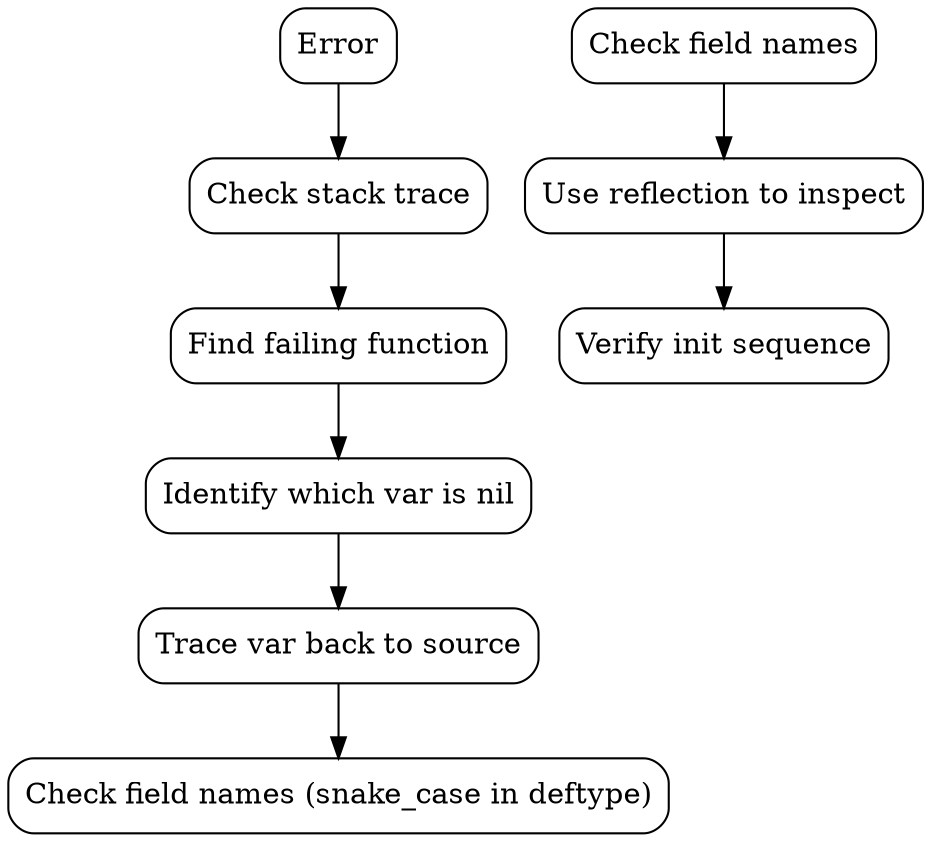

# Datalevin Debug Notes

> Created: 2026-09-22 | Updated: 2026-09-22
> Project: hybridrag (levinrag)

---

## 1. `:db.vec/domains` 是正確關鍵字

**不是 bug。** 在 schema 中使用 `:db.vec/domains ["similarity"]` 是正確的寫法。

Datalevin source (`storage.clj:3537`) 在 `init-vector-domains` 中這樣解構：

```clojure
(fn [dms attr {:keys [db/valueType db.vec/domains]}]
  ...)
```

這等價於 `{:db.vec/domains db.vec/domains}`，即從 attribute props 中取 `:db.vec/domains` key。

**驗證：** 在 REPL 中 inspect schema，確認 `:chunk/vec` 的 props 包含：
```
:db/valueType → :db.type/vec
:db.vec/domains → [similarity]
```

## 2. Vector Index 初始化流程正常

當 `d/create-conn` 被呼叫時：

1. `init-schema` → 載入 schema（包含 `:chunk/vec`）
2. `init-vector-domains` → 遍歷 schema，找到 `:db.type/vec` 屬性，取出 `:db.vec/domains`，建立 domain map
3. `init-indices` → 對每個 domain 呼叫 `v/new-vector-index` 建立實際 index

**REPL 驗證結果：**
```clojure
;; vector_indices 確實有 "similarity" domain
{"similarity" #object[datalevin.vector.VectorIndex ...]}
```

## 3. Schema 字段名稱：snake_case

Datalevin 的 `deftype Store [...]` 使用 **snake_case** 字段名：

```clojure
(deftype Store [lmdb
                search_engines       ; 不是 search-engines
                vector_indices       ; 不是 vector-indices
                embedding_indices
                ...])
```

Java reflection 時要用 snake_case：
```clojure
(.getDeclaredField (class store) "vector_indices")  ; ✅
(.getDeclaredField (class store) "vector-indices")  ; ❌ NoSuchFieldException
```

Clojure 的 `.-vector-indices` accessor 會自動轉換，但 Java reflection 不行。

## 4. `transact!` 會失敗 — 未解決的 Bug

### 現象
```
Execution error (IllegalArgumentException) at datalevin.interface/eval26315$fn$G (interface.clj:326).
No implementation of method: :add-vec of protocol: #'datalevin.interface/IVectorIndex found for class: nil
```

### 追蹤路徑
```
transact!
→ direct-local-transact!
→ with-isolated-tx-cache → db/transact-tx-data
→ local-transact-tx-data → commit-prepared-tx-data!
→ s/load-datoms-with-plan!
→ commit-datoms-kv-plan!  ;; 這裡傳入 (.-vector-indices store)
→ vector-index
→ apply-vector-op!        ;; ← 這裡 index 是 nil
```

在 `apply-vector-op!` (storage.clj:1692):
```clojure
(doseq [domain (nth res 0)
        :let   [index (vector-indices domain)]]
  (case (nth op 0)
    :a (add-vec index d (peek d))  ;; ← index 是 nil
    ...))
```

### 矛盾點
- `init-vector-domains` 成功建立 `{"similarity" VectorIndex}` ✅
- REPL inspect `vector_indices` 欄位也確認有 "similarity" ✅
- 但 `transact!` 時 `vector-indices` map 中找不到 domain → `nil` ❌

### 可能的原因（待驗證）
1. **Classloader 問題**：`require '[datalevin.storage :as s] :reload` 後，新的 Store class 和舊的 instance 不兼容（REPL 驗證時看到 `class cast exception`）
2. **Store reference 不一致**：transact 路徑中的 store 和初始化時的 store 不是同一個 instance
3. **Datalevin 1.1.0 的已知 bug**

###  workaround
暫時使用 **application-side embedding**：自己產生 vectors，但 vector search 仍透過 Datalevin Datalog query 完成。需要確認 `vec-neighbors` query 語法是否可用（spike 已驗證基礎語法正確）。

## 5. 除錯方法論

### 正確的 REPL 探索流程


### 常用 REPL 技巧

**Inspect Store 欄位：**
```clojure
(let [store (:store @conn)]
  (let [vi-field (.getDeclaredField (class store) "vector_indices")]
    (.setAccessible vi-field true)
    (.get vi-field store)))  ;; → {"similarity" #object[VectorIndex ...]}
```

**Inspect Schema：**
```clojure
(let [store (:store @conn)
      schema-f (.getDeclaredField (class store) "schema")]
  (.setAccessible schema-f true)
  (let [schema (.get schema-f store)]
    (schema :chunk/vec)))  ;; → {:db/aid 7 :db/valueType :db.type/vec :db.vec/domains ["similarity"]}
```

**檢查 namespace：**
```clojure
(find-ns 'datalevin.storage)  ;; → #namespace[datalevin.storage]
```

## 6. 已知限制與注意事项

### JDK Module Opens
- Datalevin 1.1.0 需要 `--add-opens=java.base/java.nio=ALL-UNNAMED` 和 `--add-opens=java.base/sun.nio.ch=ALL-UNNAMED`
- 必須放在 alias 中（如 `:jvm-opts`），不能放 top-level `deps.edn`
- 如果 JVM 24+ 還需要 `--enable-native-access=ALL-UNNAMED`

### `vec-neighbors` Query 語法
已驗證可用的格式：
```clojure
;; 基礎語法（假設 300 dimensions）
'[:find ?id ?score
  :in $ ?qvec ?dims
  :where
  [(vec-neighbors $ ?qvec ?dims {:top 5}) [[?e _ ?score]]]
  [?e :chunk/id ?id]]
```

### Vector Index 初始化
- `:vector-opts` 提供預設的 `:dimensions` 和 `:metric-type`
- `:db.vec/domains` 定義在 schema attribute 中
- `init-indices` 會自動為每個 domain 呼叫 `v/new-vector-index`
- Vector index 建立後存在 `vector_indices` map 中，key 是 domain name string

### nREPL Session
- 用 `clojure_find_nrepl_port` 動態取得 port
- 重啟前用 `tmux kill-session -t drepl` 清理
- `require :reload` 會造成 classloader 問題，不建議在 debugging 時使用