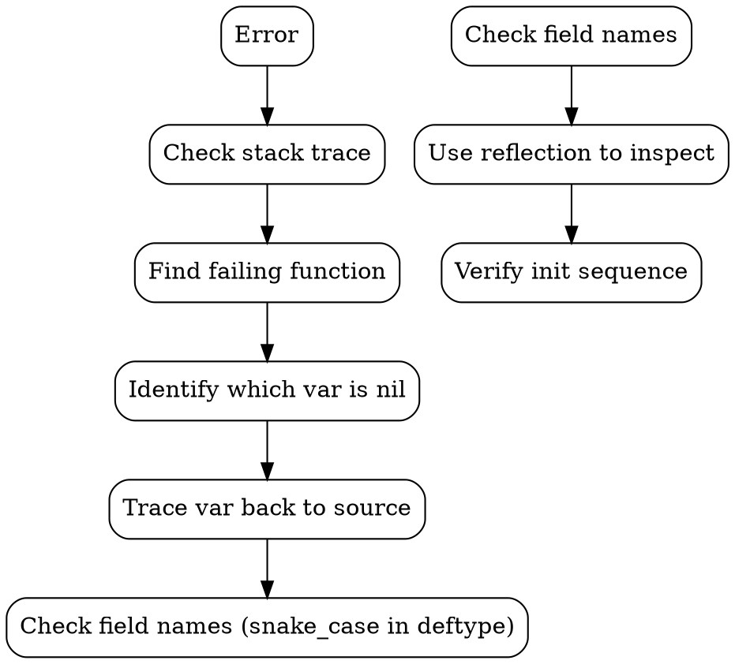

# Datalevin Debug Notes

> Created: 2026-09-22 | Updated: 2026-09-22
> Project: hybridrag (levinrag)

---

## 1. `:db.vec/domains` 是正確的 schema 關鍵字（拼字沒錯），但目前不要用

`:db.vec/domains` 這個 **key 名稱**本身沒有拼錯 —— Datalevin source
(`storage.clj:3537`) 在 `init-vector-domains` 中確實這樣解構：

```clojure
(fn [dms attr {:keys [db/valueType db.vec/domains]}]
  ...)
```

這等價於 `{:db.vec/domains db.vec/domains}`，即從 attribute props 中取 `:db.vec/domains` key。schema 中設定它，Datalevin 也確實會讀到、並在
`init-vector-domains` 建出對應的 `VectorIndex`（下方 §2 的驗證仍然成立）。

**但** §4 已確認：只要設了 `:db.vec/domains`，`transact!` 就會因為 init 路徑
與 write 路徑對「目標 domain」計算不一致而崩潰 —— 這是一個真實的 Datalevin
1.1.0 bug，不是誤用。**目前的建議寫法是完全不要在 schema attribute 上設
`:db.vec/domains`**，讓 domain 名稱用 attribute 的 auto-derived 名稱即可。
詳見 §4「確認可行的寫法」與 `docs/spikes/embedding.md`。

**驗證：** 在 REPL 中 inspect schema，確認 `:chunk/vec` 的 props 包含：
```
:db/valueType → :db.type/vec
:db.vec/domains → [similarity]
```

## 2. Vector Index 初始化流程正常

當 `d/create-conn` 被呼叫時：

1. `init-schema` → 載入 schema（包含 `:chunk/vec`）
2. `init-vector-domains` → 遍歷 schema，找到 `:db.type/vec` 屬性，取出 `:db.vec/domains`，建立 domain map
3. `init-indices` → 對每個 domain 呼叫 `v/new-vector-index` 建立實際 index

**REPL 驗證結果：**
```clojure
;; vector_indices 確實有 "similarity" domain
{"similarity" #object[datalevin.vector.VectorIndex ...]}
```

## 3. Schema 字段名稱：snake_case

Datalevin 的 `deftype Store [...]` 使用 **snake_case** 字段名：

```clojure
(deftype Store [lmdb
                search_engines       ; 不是 search-engines
                vector_indices       ; 不是 vector-indices
                embedding_indices
                ...])
```

Java reflection 時要用 snake_case：
```clojure
(.getDeclaredField (class store) "vector_indices")  ; ✅
(.getDeclaredField (class store) "vector-indices")  ; ❌ NoSuchFieldException
```

Clojure 的 `.-vector-indices` accessor 會自動轉換，但 Java reflection 不行。

## 4. `transact!` 會失敗 — 已確認為真實 Bug，已找到根因與可用寫法

> **2026-09-22 更新**：本節原先列出三個「待驗證」的可能原因（含 classloader/
> `:reload` 假說）。已在全新、未經任何 `:reload` 的 JVM process 中
> （`clojure -M:jvm-opts -e '...'`，一次性 process、一次性 temp dir）重現此
> 錯誤 — **確認不是 classloader/REPL 假象，是 Datalevin 1.1.0 的真實 bug**，
> 且已從原始碼找到精確根因與一個確認可行的寫法（不需要用到這個 bug 的路徑）。
> 詳見下方「根因」與「可行寫法」。`docs/decisions.md` 有對應的 decision 條目。

### 現象
```
Execution error (IllegalArgumentException) at datalevin.interface/eval26315$fn$G (interface.clj:326).
No implementation of method: :add-vec of protocol: #'datalevin.interface/IVectorIndex found for class: nil
```

### 追蹤路徑
```
transact!
→ direct-local-transact!
→ with-isolated-tx-cache → db/transact-tx-data
→ local-transact-tx-data → commit-prepared-tx-data!
→ s/load-datoms-with-plan!
→ commit-datoms-kv-plan!  ;; 這裡傳入 (.-vector-indices store)
→ vector-index
→ apply-vector-op!        ;; ← 這裡 index 是 nil
```

在 `apply-vector-op!` (storage.clj:1692):
```clojure
(doseq [domain (nth res 0)
        :let   [index (vector-indices domain)]]
  (case (nth op 0)
    :a (add-vec index d (peek d))  ;; ← index 是 nil
    ...))
```

### 根因（已從 datalevin-1.1.0.jar 原始碼確認）

問題出在「schema 上顯式設定 `:db.vec/domains`」這個寫法時，**init 路徑**與
**write 路徑**對「這個 attribute 該寫進哪些 domain」的計算方式不一致：

- **init 路徑**（`init-vector-domains`, storage.clj ~3534-3545）：當 schema
  attribute 有 `:db.vec/domains`（`(seq domains)` 為真）時，**只**初始化
  該清單列出的 domain，不會額外初始化 attribute 自己的 auto-derived domain
  名稱。
- **write 路徑**（`prepare-datoms-kv-plan` 內的 add/delete helper,
  storage.clj ~2946、~3053）：**永遠**用
  `(conjv (props :db.vec/domains) (v/attr-domain attr))` 計算目標
  domain 清單 —— 也就是說，不管 schema 有沒有設 `:db.vec/domains`，
  write 路徑永遠都會**額外**把 attribute 的 auto-derived domain 名稱
  （`v/attr-domain` = `keyword->string` 後把 `/` 換成 `_`，例如
  `:chunk/vec` → `"chunk_vec"`）也加進去。

結果：一旦 schema 設了 `:db.vec/domains`（例如 `["similarity"]`），
write 路徑會試著把 vector 寫進 `"chunk_vec"`（auto-derived domain），
但這個 domain 從未在 `vector-indices` map 中被初始化過 →
`(vector-indices "chunk_vec")` 回傳 `nil` → `apply-vector-op!` 對 `nil`
呼叫 `add-vec` → 上述 crash。

### 確認可行的寫法（已於全新 JVM process 驗證 transact! + vec-neighbors 皆成功）

**不要**在 schema attribute 上設定 `:db.vec/domains`。只要省略它，
init 路徑與 write 路徑對「目標 domain」的計算就會一致（兩邊都只用
attribute 的 auto-derived domain 名稱），`transact!` 與
`vec-neighbors` 查詢都能正常運作：

```clojure
(def schema
  {:chunk/vec {:db/valueType :db.type/vec}})   ;; 沒有 :db.vec/domains

(def conn
  (d/create-conn dir schema {:vector-opts {:dimensions 4 :metric-type :cosine}}))

(d/transact! conn [{:chunk/id "c1" :chunk/vec (float-array [1.0 0.0 0.0 0.0])}])
;; => 成功

(d/q '[:find ?id ?a ?v
       :in $ ?qv
       :where
       [(vec-neighbors $ :chunk/vec ?qv {:top 2}) [[?e ?a ?v]]]
       [?e :chunk/id ?id]]
     (d/db conn) (float-array [1.0 0.0 0.0 0.0]))
;; => 正確回傳最近鄰
```

若需要針對該 domain 客製化選項（例如跟全域 `:vector-opts` 不同的
`:dimensions`/`:metric-type`），用頂層的 `:vector-domains` map，key 用同一個
auto-derived domain 名稱（`"chunk_vec"`），而不是在 schema attribute 上設
`:db.vec/domains`：

```clojure
{:vector-domains {"chunk_vec" {:dimensions 4 :metric-type :cosine}}}
```

同樣已驗證可行。詳見 `docs/spikes/embedding.md`「Known bug」一節與
`docs/decisions.md` 的對應條目 —— Phase 1 T1.1/T1.4 的 `:chunk/vec` 定義
必須遵循「不設 `:db.vec/domains`」這個寫法。

### 矛盾點（歷史記錄 — 已解開）
- `init-vector-domains` 成功建立 `{"similarity" VectorIndex}` ✅（但這只是
  schema 顯式列出的 domain，不含 auto-derived domain）
- REPL inspect `vector_indices` 欄位也確認有 "similarity" ✅
- 但 `transact!` 時目標 domain 其實是 `"chunk_vec"`（write 路徑額外加的
  auto-derived domain），`vector-indices` map 中沒有這個 key → `nil` ❌
  —— 如上「根因」所述，這不是 REPL/classloader 問題，是兩條路徑對
  domain 清單計算方式不一致的真實 bug。

## 5. 除錯方法論

### 正確的 REPL 探索流程


### 常用 REPL 技巧

**Inspect Store 欄位：**
```clojure
(let [store (:store @conn)]
  (let [vi-field (.getDeclaredField (class store) "vector_indices")]
    (.setAccessible vi-field true)
    (.get vi-field store)))  ;; → {"similarity" #object[VectorIndex ...]}
```

**Inspect Schema：**
```clojure
(let [store (:store @conn)
      schema-f (.getDeclaredField (class store) "schema")]
  (.setAccessible schema-f true)
  (let [schema (.get schema-f store)]
    (schema :chunk/vec)))  ;; → {:db/aid 7 :db/valueType :db.type/vec :db.vec/domains ["similarity"]}
```

**檢查 namespace：**
```clojure
(find-ns 'datalevin.storage)  ;; → #namespace[datalevin.storage]
```

## 6. 已知限制與注意事项

### JDK Module Opens
- Datalevin 1.1.0 需要 `--add-opens=java.base/java.nio=ALL-UNNAMED` 和 `--add-opens=java.base/sun.nio.ch=ALL-UNNAMED`
- 必須放在 alias 中（如 `:jvm-opts`），不能放 top-level `deps.edn`
- 如果 JVM 24+ 還需要 `--enable-native-access=ALL-UNNAMED`

### `vec-neighbors` Query 語法

> **2026-09-22 修正**：下方原本寫的 `?qvec ?dims` 兩參數形式是錯的 ——
> `vec-neighbors` 沒有「dimensions」這個 positional 參數。已對照
> `datalevin.core/vec-neighbors` 的 docstring 與 `datalevin/built_ins.clj`
> 原始碼、並在全新 JVM process 中實際跑過查詢，確認正確語法如下。

已驗證可用的格式（attribute-keyword 形式，回傳 `[e a v]` 三元組，
或加 `:display :refs+dists` 時回傳 `[e a v dist]`）：
```clojure
'[:find ?id ?a ?v
  :in $ ?qvec
  :where
  [(vec-neighbors $ :chunk/vec ?qvec {:top 5}) [[?e ?a ?v]]]
  [?e :chunk/id ?id]]
```

或不指定 attribute、改用 `:domains` 選項的形式：
```clojure
'[:find ?id
  :in $ ?qvec
  :where
  [(vec-neighbors $ ?qvec {:domains ["chunk_vec"]}) [[?e ?a ?v]]]
  [?e :chunk/id ?id]]
```

### Vector Index 初始化
- `:vector-opts` 提供預設的 `:dimensions` 和 `:metric-type`
- `:db.vec/domains` 可定義在 schema attribute 中，**但目前不要用**（見 §1、§4
  的 write-path bug）——省略它，讓 domain 使用 attribute 的 auto-derived
  名稱
- `init-indices` 會自動為每個 domain 呼叫 `v/new-vector-index`
- Vector index 建立後存在 `vector_indices` map 中，key 是 domain name string

### nREPL Session
- 用 `clojure_find_nrepl_port` 動態取得 port
- 重啟前用 `tmux kill-session -t drepl` 清理
- `require :reload` 會造成 classloader 問題，不建議在 debugging 時使用