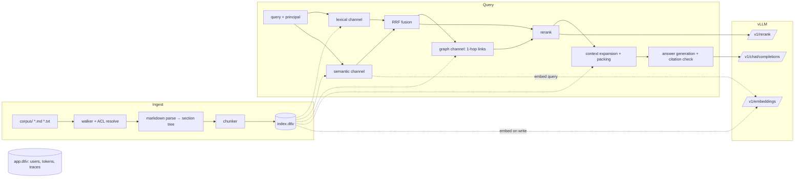

# levinrag — Datalevin 企業 RAG MVP 規格書

> **這是 2026-09-22 的初版規格，已凍結，僅供歷史參考。**
> 現行規格見根目錄的 [`SPEC.md`](../../SPEC.md)（沿用本文件的章節編號）；
> 實作時偏離本文件之處與理由，記在 [`docs/decisions.md`](../decisions.md)。
> 本文件中的套件名稱、預設值與做法可能已經不適用。

版本 v0.1｜2026-09-22｜交付對象：Claude Code

一個單一 JVM process、單一資料目錄的企業 RAG MVP：Markdown／純文字語料 → 多路召回（詞彙、語意、連結圖）→ RRF 融合 → cross-encoder rerank → 脈絡擴展 → 帶引用的生成，並內建 ACL、查詢追蹤（trace）與評估框架。所有模型透過本地 vLLM 的 OpenAI-compatible API 提供。

---

## 0. 給 Claude Code 的工作守則（先讀）

1. **依 §17 的 Phase 順序執行。** 每個 task 的驗收條件（AC）全數通過才進下一個 task。
2. **Phase 0 的 spike 是強制的。** 本規格中標示 `⚠️ VERIFY` 的地方，是規格作者依官方文件推斷、但未實測的行為。以 pinned 版本的 Datalevin cljdoc 與原始碼為準；結論寫進 `docs/spikes/<topic>.md`。若 spike 結論與本規格衝突，依 spike 結論實作，並在 `docs/decisions.md` 記錄「原規格／實際行為／採用做法」。
3. **不要憑記憶使用 Datalevin API。** 它的 API 在 0.9 → 1.0 間變動很大，訓練資料中的範例很可能過期。
4. **程式碼註解一律英文**；UI 文案與錯誤訊息（面向使用者者）用繁體中文。
5. **不擴張範圍。** 想到的改進寫進 `docs/backlog.md`，不要順手實作。
6. **需求模糊時**，選最簡單且可逆的做法，記錄在 `docs/decisions.md`，然後繼續，不要停下來等待。
7. 每個 task 一個 commit，訊息格式：`T1.3: chunker with sentence-level overlap`。
8. 任何會讓 ACL 可能被繞過的改動，都必須附帶 §18.3 的安全測試。

---

## 1. 目標、非目標、成功標準

### 1.1 目標

- 每一層都有「最小但真實」的實作：ingestion、詞彙召回、語意召回、圖召回、融合、rerank、脈絡擴展、生成、ACL、trace、eval。
- 架構極簡：一個 JVM process、嵌入式 Datalevin、外加 vLLM 服務。不需要 Docker 才能開發。
- 可觀察：每一次查詢都能看到每個通道各自撈到什麼、排第幾、rerank 後如何變化。這是學習與調校的核心。

### 1.2 成功標準（可量測）

| 項目 | 標準 |
|---|---|
| ACL 洩漏 | 樣本語料 eval 與安全測試中 **= 0**（硬性，任何一次洩漏即不通過） |
| Eval | `bb eval` 可對 5 種檢索變體輸出 doc-level recall@5、recall@10、MRR@10 |
| 延遲 | 檢索＋rerank（不含 LLM 生成）p50 < 800 ms，語料 ≤ 100k chunks，vLLM 於同機或同網段 |
| 可重建 | `bb reindex` 可從語料目錄完整重建 `index.dtlv`，不影響使用者帳號 |
| 規模上限 | ≤ 5,000 份文件／≤ 100k chunks（超過不在 MVP 保證範圍） |

### 1.3 非目標（MVP 不做）

PDF／Office／OCR 解析；多租戶；SSO；query rewriting 與 agentic 多輪檢索；LLM 抽取 entity 建知識圖譜；答案層級的 LLM-as-judge 評估；水平擴展；串流輸出（列為 Phase 5 stretch）。

---

## 2. 架構總覽



### 2.1 關鍵設計決策

| ID | 決策 | 理由 |
|---|---|---|
| D1 | 兩個嵌入式 Datalevin DB：`index.dtlv`（語料衍生資料）與 `app.dtlv`（使用者、token、trace） | index 是語料的衍生物，隨時可丟棄重建；Datalevin 對已有資料的 embedding attribute 改 schema 會被拒絕，必須重建。分開後重建 index 不會動到帳號。 |
| D2 | 語料目錄是 source of truth | 簡化一致性：DB 永遠可從檔案推導。 |
| D3 | **ACL 在寫入時物化，查詢時只做一個 join** | 查詢路徑越短越不容易出錯；階層繼承的遞迴計算放在 ingestion。群組以字串表示，查詢時由 app.dtlv 取出使用者群組，作為 input 傳進 index.dtlv 查詢，不需要跨 DB join。 |
| D4 | `Retriever` protocol 隔離儲存層 | 萬一 Datalevin 不適用，換實作不必重寫 pipeline。 |
| D5 | 所有模型走 vLLM OpenAI-compatible API，三個 endpoint（embed／rerank／chat） | vLLM 一個 process 服務一個模型。 |
| D6 | 全文索引與 embedding 建在同一 attribute `:chunk/index-text` | Datalevin 允許 `:db/fulltext` 與 `:db/embedding` 共存；來源只有一份，免同步問題。 |
| D7 | Rerank 失敗時降級為 RRF 排序，不讓整個請求失敗 | 可用性優先；降級狀態記入 trace 並回傳給呼叫端。 |
| D8 | 檢索無有效證據時不呼叫 LLM | 省成本、杜絕無依據的回答。 |

---

## 3. 技術選型

| 範疇 | 選擇 | 備註 |
|---|---|---|
| 專案骨架 | [Clojure Stack Lite](https://stack.bogoyavlensky.com/) | Integrant、Reitit／Ring／Jetty、Hiccup、Malli、HTMX 2、Alpine.js、Tailwind 4、Babashka tasks、clj-kondo、cljfmt、eftest。**產生時選 SQLite、不選 `:auth`**，之後移除 SQL 相關依賴（見 T0.1）。 |
| 資料庫 | Datalevin，pin 最新 1.0.x | 嵌入式模式。依官方 `doc/install.md` 設定所需 JVM options。 |
| Markdown 解析 | `org.commonmark/commonmark` ＋ `commonmark-ext-gfm-tables` ＋ `commonmark-ext-yaml-front-matter` | 需要 source spans 取得字元位置。 |
| YAML | `clj-commons/clj-yaml` | frontmatter 值解析（若 commonmark 擴充已足夠則可省略）。 |
| HTTP client | `hato` | vLLM 呼叫，JDK HttpClient 包裝，支援逾時。 |
| JSON | `metosin/jsonista` | |
| 密碼雜湊 | `buddy/buddy-hashers` | |
| 測試 | Stack Lite 內建（eftest／cloverage） | |

平台限制：Datalevin 向量功能支援 Linux x86_64／arm64 與 macOS arm64，Windows 為實驗性。

---

## 4. 外部依賴：vLLM

### 4.1 三個 endpoint

| 用途 | 預設模型 | 預設位址 |
|---|---|---|
| Embedding | `BAAI/bge-m3`（1024 維，多語、中文佳） | `http://localhost:8001/v1` |
| Rerank | `BAAI/bge-reranker-v2-m3`（多語 cross-encoder） | `http://localhost:8002`，路徑 `/v1/rerank` |
| Chat | 可設定（例如 Qwen 系列 instruct 模型） | `http://localhost:8003/v1` |

啟動範例寫在 `docs/vllm.md`（pooling 模型的啟動旗標依 vLLM 版本不同，以使用者環境為準，應用程式不負責啟動 vLLM）：

```bash
vllm serve BAAI/bge-m3              --port 8001 --api-key "$VLLM_API_KEY"
vllm serve BAAI/bge-reranker-v2-m3  --port 8002 --api-key "$VLLM_API_KEY"
vllm serve <chat-model>             --port 8003 --api-key "$VLLM_API_KEY"
```

### 4.2 API 契約

所有請求帶 `Authorization: Bearer <key>`。

**Embeddings**：`POST {embed-base}/embeddings`，body `{"model": ..., "input": [str...]}`，回應 `data[i].embedding`。批次上限可設定（預設 32）。

**Rerank**：`POST {rerank-base}{rerank-path}`，body `{"model": ..., "query": str, "documents": [str...], "top_n": n}`，回應 `results[i] = {index, relevance_score}`。實作需：路徑可設定（有些部署是 `/rerank`）；**vLLM 可能以 HTTP 200 回傳錯誤 payload**，必須驗證回應結構，缺 `results` 即視為失敗。

**Chat**：`POST {chat-base}/chat/completions`，標準 OpenAI 格式。支援設定 `:chat/extra-body`（原樣合併進 request body，例如 `{"chat_template_kwargs": {"enable_thinking": false}}`）。回應若含 `<think>…</think>` 區塊須剝除。

### 4.3 共通要求

每個呼叫有連線逾時（2s）與讀取逾時（embed 30s／rerank 10s／chat 120s，皆可設定）；錯誤包成 `ex-info`，`ex-data` 含 `:llm/endpoint`、`:http/status`、`:llm/body-excerpt`（前 500 字元）；**API key 絕不寫入 log 或 trace**。

---

## 5. 設定

全部從環境變數讀取，`resources/config.edn` 提供預設值。

| Key | Env | 預設 |
|---|---|---|
| `:data/dir` | `DATA_DIR` | `./data` |
| `:corpus/dir` | `CORPUS_DIR` | `./corpus` |
| `:corpus/root-read-groups` | `ROOT_READ_GROUPS` | `[]`（根目錄預設無人可讀，除 admin） |
| `:embed/base-url` `:embed/model` `:embed/dims` | `VLLM_EMBED_BASE_URL` `VLLM_EMBED_MODEL` `VLLM_EMBED_DIMS` | 見 §4.1，`1024` |
| `:rerank/base-url` `:rerank/path` `:rerank/model` | `VLLM_RERANK_BASE_URL` `VLLM_RERANK_PATH` `VLLM_RERANK_MODEL` | 見 §4.1 |
| `:chat/base-url` `:chat/model` | `VLLM_CHAT_BASE_URL` `VLLM_CHAT_MODEL` | — / 必填 |
| API keys | `VLLM_EMBED_API_KEY` `VLLM_RERANK_API_KEY` `VLLM_CHAT_API_KEY`，未設則 fallback 至 `VLLM_API_KEY` | — |
| `:chunk/target-tokens` `:chunk/max-tokens` `:chunk/min-tokens` `:chunk/overlap-tokens` | — | `350` `500` `60` `60` |
| `:retrieve/channel-k` | — | `50` |
| `:retrieve/acl-overfetch` | — | `4` |
| `:retrieve/rrf-k` | — | `60` |
| `:retrieve/rerank-input` | — | `40` |
| `:retrieve/graph-max` | — | `10` |
| `:retrieve/final-k` | — | `8` |
| `:retrieve/rerank-min-score` | — | `nil`（停用；由 eval 校準後再設） |
| `:context/max-tokens` | — | `6000` |
| `:session/secret` | `SESSION_SECRET` | 必填（非 dev） |

---

## 6. 資料模型

### 6.1 `index.dtlv` schema

```clojure
(def index-schema
  {;; --- collection: one per directory under corpus/ ---
   :collection/path            {:db/valueType :db.type/string
                                :db/unique    :db.unique/identity}   ; "" for root, "hr/policies"
   :collection/name            {:db/valueType :db.type/string}
   :collection/parent          {:db/valueType :db.type/ref}
   :collection/declared-groups {:db/valueType   :db.type/string
                                :db/cardinality :db.cardinality/many} ; from _collection.edn, if any
   :collection/effective-groups {:db/valueType   :db.type/string
                                 :db/cardinality :db.cardinality/many} ; materialized, see §7.2

   ;; --- doc ---
   :doc/path             {:db/valueType :db.type/string
                          :db/unique    :db.unique/identity}          ; relative to corpus/
   :doc/title            {:db/valueType :db.type/string}
   :doc/collection       {:db/valueType :db.type/ref}
   :doc/hash             {:db/valueType :db.type/string}              ; sha256 of raw bytes
   :doc/tags             {:db/valueType   :db.type/string
                          :db/cardinality :db.cardinality/many}
   :doc/declared-groups  {:db/valueType   :db.type/string
                          :db/cardinality :db.cardinality/many}       ; frontmatter override
   :doc/effective-groups {:db/valueType   :db.type/string
                          :db/cardinality :db.cardinality/many}       ; the ONLY attr used by query-time ACL
   :doc/links-to         {:db/valueType   :db.type/ref
                          :db/cardinality :db.cardinality/many}
   :doc/frontmatter      {}                                           ; EDN blob
   :doc/ingested-at      {:db/valueType :db.type/instant}

   ;; --- section: heading tree ---
   :section/id      {:db/valueType :db.type/string
                     :db/unique    :db.unique/identity}               ; "<doc-path>#<ordinal>"
   :section/doc     {:db/valueType :db.type/ref}
   :section/parent  {:db/valueType :db.type/ref}
   :section/heading {:db/valueType :db.type/string}
   :section/level   {:db/valueType :db.type/long}
   :section/trail   {:db/valueType :db.type/string}                   ; "請假規定 > 特休 > 計算方式"

   ;; --- chunk ---
   :chunk/id          {:db/valueType :db.type/string
                       :db/unique    :db.unique/identity}             ; "<doc-path>::<ordinal>"
   :chunk/doc         {:db/valueType :db.type/ref}
   :chunk/section     {:db/valueType :db.type/ref}
   :chunk/ordinal     {:db/valueType :db.type/long}                   ; 0-based within doc
   :chunk/text        {:db/valueType :db.type/string}                 ; display text
   :chunk/index-text  {:db/valueType            :db.type/string       ; header + text; see §7.4
                       :db/fulltext             true
                       :db.fulltext/autoDomain  true
                       :db/embedding            true
                       :db.embedding/autoDomain true}
   :chunk/tokens      {:db/valueType :db.type/long}
   :chunk/char-start  {:db/valueType :db.type/long}
   :chunk/char-end    {:db/valueType :db.type/long}})
```

Store options 草稿（`⚠️ VERIFY` 於 T0.3／T0.4）：

```clojure
{:search-domains  {"chunk_index-text" {:index-position? true          ; phrase + proximity
                                       :indexing-mode   :async
                                       :analyzer        cjk-analyzer
                                       :query-analyzer  cjk-query-analyzer}}
 :embedding-opts  {:provider           :openai-compatible
                   :model              "BAAI/bge-m3"
                   :base-url           "http://localhost:8001/v1"
                   :api-key-env        "VLLM_EMBED_API_KEY"
                   :request-dimensions 1024
                   :metric-type        :cosine
                   :indexing-mode      :async}}
```

### 6.2 `app.dtlv` schema

```clojure
(def app-schema
  {:user/username      {:db/valueType :db.type/string :db/unique :db.unique/identity}
   :user/display-name  {:db/valueType :db.type/string}
   :user/password-hash {:db/valueType :db.type/string}
   :user/groups        {:db/valueType :db.type/string :db/cardinality :db.cardinality/many}
   :user/admin?        {:db/valueType :db.type/boolean}

   :token/hash         {:db/valueType :db.type/string :db/unique :db.unique/identity} ; sha256 hex
   :token/user         {:db/valueType :db.type/ref}
   :token/label        {:db/valueType :db.type/string}
   :token/created-at   {:db/valueType :db.type/instant}

   :trace/id           {:db/valueType :db.type/uuid :db/unique :db.unique/identity}
   :trace/username     {:db/valueType :db.type/string}
   :trace/kind         {:db/valueType :db.type/keyword}  ; :search | :ask
   :trace/query        {:db/valueType :db.type/string}
   :trace/at           {:db/valueType :db.type/instant}
   :trace/stages       {}                                ; EDN blob, see §14
   :trace/answer       {:db/valueType :db.type/string}
   :trace/degraded     {:db/valueType :db.type/keyword :db/cardinality :db.cardinality/many}})
```

---

## 7. Ingestion

### 7.1 語料目錄約定

```
corpus/
├── _collection.edn            ; {:name "全公司" :read-groups ["all"]}
├── public/
│   └── handbook.md
├── hr/
│   ├── _collection.edn        ; {:name "人資" :read-groups ["hr"]}
│   ├── leave.md
│   └── payroll/
│       └── bonus.md           ; inherits ["hr"]
└── finance/
    ├── _collection.edn        ; {:name "財務" :read-groups ["finance"]}
    └── budget.md              ; frontmatter read_groups: ["finance-lead"] overrides
```

接受副檔名：`.md`、`.markdown`、`.txt`。以 `.` 或 `_` 開頭的檔案與目錄一律忽略（`_collection.edn` 由 walker 特別讀取）。

Frontmatter 支援欄位：`title`、`tags`（list）、`read_groups`（list）。其他欄位原樣存入 `:doc/frontmatter`。

### 7.2 ACL 解析規則（寫入時物化）

1. 集合的 effective groups：**最近一個有宣告的祖先勝出**（含自身）。自身有 `_collection.edn` 且含 `:read-groups` → 使用之；否則沿用父集合的 effective groups；根目錄若無宣告 → 使用 `:corpus/root-read-groups`。
2. 文件的 effective groups：frontmatter 有 `read_groups` → **只用它**（覆寫，不是聯集）；否則等於所屬集合的 effective groups。
3. `_collection.edn` 或 frontmatter 的 ACL 變更時，只需重算受影響集合與文件的 `effective-groups`，不需重新切塊或重新 embedding。
4. 空集合 `[]` 的語意是「除 admin 外無人可讀」。

這個語意（覆寫而非聯集）必須寫進 README，並有對應單元測試。

### 7.3 Markdown 解析與切塊

**解析**：用 commonmark-java 產生 AST，開啟 source spans。依 heading（ATX 與 Setext）建立 section 樹；第一個 heading 之前的內容歸入一個 `level 0` 的隱含 section（heading 為文件標題）。文件標題優先序：frontmatter `title` → 第一個 H1 → 檔名。

**切塊演算法**（每個 section 獨立處理，**chunk 絕不跨 section**）：

1. 取該 section 直屬的 block 序列（paragraph、list、fenced code、table、blockquote、thematic break 略過）。
2. 依序累加 block，累計估算 token 達 `target` 時結束一個 chunk；若加入下一個 block 會超過 `max`，則在此處切。
3. 單一 block 超過 `max`：依句界切（`。！？；` 與 `. ! ?` 後接空白），仍超過則硬切。**fenced code block 與 table 只在行界切，不在句界切。**
4. 同一 section 內相鄰 chunk 之間保留重疊：前一個 chunk 的最後若干完整句子，總量 ≤ `overlap-tokens`。
5. section 產出的最後一個 chunk 若 < `min-tokens`，併入前一個 chunk（即使超過 target，但不得超過 max；超過則保留原樣）。
6. `.txt` 檔：視為單一 section，以空行分段當作 block。

每個 chunk 記錄在原始檔中的 `char-start`／`char-end`（供文件檢視頁高亮）。

### 7.4 Contextual header（便宜版 Contextual Retrieval）

`:chunk/index-text` = header ＋ 空行 ＋ `:chunk/text`，header 格式：

```
文件：{doc title}
章節：{section trail}
```

目的：讓脫離上下文的 chunk（例如「上述天數依年資計算」）在詞彙與語意索引中都帶有所屬脈絡。LLM 生成的 contextual summary 列入 backlog。

### 7.5 連結解析

從 AST 取出 link 節點：相對路徑的 `.md` 連結（忽略 `#anchor` 與 query）、以及 `[[Page Name]]` wikilink（以不分大小寫的標題或檔名比對）。解析成功者寫入 `:doc/links-to`。**連結解析在所有文件寫入後的第二輪進行**，因為目標文件可能晚於來源文件被處理。無法解析的連結記入 ingestion 報告，不報錯。

### 7.6 增量流程

```
walk corpus/ → set of (path, sha256)
for each collection dir: upsert collection, resolve effective groups (§7.2)
for each file:
  if doc exists and hash unchanged:
      update effective-groups only if ACL inputs changed; skip
  else:
      parse → sections → chunks
      in ONE transaction: retract old sections/chunks of this doc, upsert doc, add new ones
for each doc in DB not on disk: retract doc + its sections + chunks
second pass: resolve links for docs touched in this run (and docs linking to deleted docs)
wait-for-secondary-index (fulltext + embedding) with timeout, report lag
```

ingestion 報告（EDN，同時寫入 `data/ingest-reports/<ts>.edn`）：新增／更新／略過／刪除文件數、chunk 數、未解析連結、耗時、index lag。

`bb reindex`：刪除 `data/index.dtlv` 後完整 ingest。

### 7.7 Token 估算

不在 JVM 端載入 tokenizer。估算函式：每個 CJK 字元（含假名、韓文）計 1；每個 ASCII 英數 run 計 `ceil(len / 4) + 1`；標點與空白不計。這是保守近似，所有上限都已預留空間；T2.6 的 eval 報告需附上「最長 chunk 的估算值」以便日後校正。

---

## 8. 中文 analyzer

Datalevin 預設 analyzer 對中文幾乎無效，必須自訂。`⚠️ VERIFY`：Clojure 端如何為 Datalog search domain 註冊 analyzer（直接傳 fn，或需透過 UDF registry）；analyzer 是 runtime 狀態，每次開啟 DB 都必須提供。

### 8.1 索引端 `cjk-analyzer`

輸入字串，輸出 `[term position offset]` 序列：

1. 逐 code point 做 NFKC 正規化與小寫化（全形轉半形），**offset 指向原字串位置**。
2. 切成 run：CJK run（漢字、假名、韓文）；ASCII run（`[a-z0-9]`，內部允許 `- _ . /` 連接，如 `sku-a123`、`v2.5`、`hr-07`）；其餘字元為分隔符。
3. CJK run：輸出重疊 bigram；run 長度為 1 時輸出單字。
4. ASCII run：輸出整個 token；若含連接符，另外輸出各子片段（長度 ≥ 2）。
5. position 依輸出順序遞增。

### 8.2 查詢端 `cjk-query-analyzer`

同 8.1。T-Wand 的分層機制會優先回傳「包含所有 bigram」的文件，天然偏好完整詞組匹配，不需要額外處理。

### 8.3 測試向量（必須全部通過）

| 輸入 | 預期 terms（依序） |
|---|---|
| `員工請假規定` | 員工 工請 請假 假規 規定 |
| `SKU-A123 的庫存` | sku-a123 sku a123 的庫 庫存 |
| `iPhone15手機` | iphone15 手機 |
| `ＨＲ－０７表單` | hr-07 hr 07 表單 |
| `v2.5 版本` | v2.5 v2 版本（子片段 `5` 長度 < 2，不輸出） |
| `請` | 請 |

---

## 9. 檢索 pipeline

### 9.1 流程

```
principal (username, groups, admin?) + query
 ├─ lexical  : fulltext on :chunk/index-text, top = channel-k × acl-overfetch, ACL join, take channel-k
 ├─ semantic : embedding-neighbors on :chunk/index-text, same over-fetch rule
 ├─ RRF(lexical, semantic) → top rerank-input
 ├─ graph    : 1-hop linked docs of top-5 fused docs → ≤ graph-max extra candidates
 ├─ rerank   : (fused ∪ graph) → vLLM rerank → sort by relevance_score
 ├─ select   : top final-k (optionally ≥ rerank-min-score)
 └─ context  : neighbor expansion + merge + budget packing → numbered passages
```

### 9.2 Retriever protocol

```clojure
(defprotocol Retriever
  (index-doc!  [this parsed-doc] "Upsert one parsed doc with its sections and chunks.")
  (delete-doc! [this doc-path]   "Remove a doc and all its sections and chunks.")
  (channel     [this principal channel-kw query opts]
    "Return ACL-filtered candidates for one recall channel, ordered best-first.
     Each candidate: {:chunk/id .. :doc/path .. :rank n :score x}")
  (neighbors   [this principal chunk-id opts] "ACL-filtered adjacent chunks in the same section.")
  (linked-docs [this principal doc-paths] "ACL-filtered 1-hop linked doc paths, both directions."))
```

融合、rerank、context packing 屬於與儲存無關的 pipeline 層，不放在 protocol 內。

### 9.3 ACL（硬性要求）

- ACL 過濾**必須在 Retriever 內完成**，任何離開 Retriever 的候選都已經過濾。pipeline 層不得自行補做 ACL。
- 查詢形式（lexical 為例）：

```clojure
(d/q '[:find ?cid ?score
       :in $ ?q [?g ...]
       :where
       [(fulltext $ :chunk/index-text ?q {:top 200 :display :refs+scores})
        [[?e _ _ ?score]]]
       [?e :chunk/doc ?d]
       [?d :doc/effective-groups ?g]
       [?e :chunk/id ?cid]]
     index-db query-text user-groups)
```

- admin 走不含 ACL clause 的查詢，**必須是獨立函式**，不能用參數開關同一段查詢（降低誤用風險）。
- 群組為空的非 admin 使用者：直接回傳空結果，不查 DB。
- Over-fetch 後過濾結果少於 `channel-k`，且原始命中數等於 over-fetch 上限時，trace 標記 `:acl-starvation`。
- `⚠️ VERIFY`（T0.4）：`fulltext` 的 `:doc-filter` 是在 top-k 之前還是之後套用；若為之前，可作為後續優化，但 MVP 以 over-fetch ＋ Datalog join 為正確性基準。

### 9.4 RRF

```clojure
(defn rrf
  "Fuse best-first lists of chunk ids by reciprocal rank. Missing = no contribution."
  [k & ranked-lists]
  (->> ranked-lists
       (mapcat (fn [ids] (map-indexed (fn [i id] [id (/ 1.0 (+ k i 1))]) ids)))
       (reduce (fn [m [id s]] (update m id (fnil + 0.0) s)) {})
       (sort-by val >)))
```

平手時以 lexical rank 較佳者優先（穩定排序，測試需覆蓋）。

### 9.5 Graph 通道（MVP 版）

1. 取 RRF 結果前 5 名所屬的不重複文件。
2. 取這些文件 1-hop 連結的文件（雙向，ACL 過濾），排除已在候選中的文件。
3. 每個連結文件最多貢獻 2 個 chunk：優先取在 lexical 或 semantic 延伸清單（over-fetch 後、截斷前的完整結果）中出現者，依較佳 rank；都沒有則取 `ordinal 0`。
4. 總數上限 `graph-max`，標記 channel `:graph`，**不參與 RRF，直接進 rerank**，由 reranker 決定是否有用。
5. 設定 `:retrieve/graph-channel?`（預設 true），eval 會比較開關差異。

### 9.6 Rerank

- 輸入：chunk 的 `:chunk/index-text`（含 header），每筆以字元數截斷至 `:rerank/max-chars`（預設 1500）。
- 失敗（逾時、非 2xx、200 但結構錯誤）：沿用 RRF 順序（graph 候選排在最後），trace 標記 `:rerank-failed`，API 回應 `degraded: ["rerank_failed"]`。
- `rerank-min-score` 預設停用。分數分佈會記錄在 trace，供日後校準。

### 9.7 Context 擴展與打包

1. 對每個選中的 chunk，加入同 section 的 `ordinal ± 1` 鄰居（ACL 過濾）。
2. 同一文件中 ordinal 連續的 chunk 合併為一個 passage（去除 overlap 重複的句子）。
3. passage 依其中最佳 rerank 分數排序，依序放入，總估算 token ≤ `:context/max-tokens`；放不下的鄰居先捨棄，被選中的原始 chunk 最後才捨棄。
4. 為每個 passage 編號 `[1]..[n]`。

### 9.8 輸出結構

```clojure
{:passages   [{:n 1 :doc/path "hr/leave.md" :doc/title "請假規定"
               :section/trail "特休 > 計算方式" :chunk-ids ["hr/leave.md::3" "hr/leave.md::4"]
               :char-range [1200 2380] :text "..."}]
 :candidates [{:chunk/id "hr/leave.md::3"
               :channels {:lexical {:rank 2 :score 7.1} :semantic {:rank 5 :score 0.79}}
               :rrf 0.0321 :rerank 0.87 :selected? true}]
 :degraded   #{}}
```

---

## 10. 生成

### 10.1 Prompt（存放於 `resources/prompts/answer.md`，可不改程式調整）

System 要點：

- 只能根據提供的資料來源回答；不使用資料來源以外的知識補充事實。
- 每個事實性陳述後標註來源編號，格式 `[n]`，可多個 `[1][3]`。
- 資料不足時明確說明「資料中找不到」哪一部分，不要猜測。
- 預設以繁體中文回答；使用者以其他語言提問時用該語言回答。

User message：`<sources>` 區塊（每個 passage 以 `[n] 文件標題｜章節` 開頭）＋ 使用者問題。

參數：`temperature 0.2`、`max_tokens 1024`，皆可設定。

### 10.2 引用驗證

- 解析回答中所有 `[n]`；不存在的編號移除並記入 trace `:invalid-citations`。
- 回傳 `citations` 只包含實際被引用的 passage。
- 回答完全沒有引用、且不是「找不到」類回覆時，trace 標記 `:uncited-answer`（不阻擋回傳，供 eval 追蹤）。

### 10.3 無證據路徑

rerank 後沒有任何候選（或全部低於門檻）→ 不呼叫 chat，直接回傳固定訊息：「在你有權限存取的資料中找不到相關內容。」並回傳 `no_evidence: true`。

---

## 11. HTTP API

前綴 `/api/v1`，JSON（snake_case），`Authorization: Bearer <token>`。錯誤格式：`{"error": {"code": "...", "message": "..."}}`。

| Method | Path | 權限 | 說明 |
|---|---|---|---|
| POST | `/search` | user | 只檢索不生成。body `{query, final_k?, graph?}`；回傳 passages ＋ candidates（含各通道 rank）＋ `trace_id` |
| POST | `/ask` | user | 檢索＋生成。body `{query, final_k?, debug?}`；回傳 `{answer, citations, no_evidence, degraded, trace_id}`，`debug=true` 時附 candidates |
| GET | `/docs/{path}` | user | 文件 metadata 與 chunk 清單，ACL 過濾，無權限回 404（不回 403，避免洩漏存在性） |
| POST | `/ingest` | admin | 觸發 ingestion job，回傳 `job_id`；同時只允許一個 job，衝突回 409 |
| GET | `/ingest/{job_id}` | admin | job 狀態與報告 |
| GET | `/traces/{id}` | admin 或 trace 擁有者 | trace 內容 |
| GET | `/health` | 無 | DB 狀態、三個 vLLM endpoint 可達性、index lag；任一依賴失敗回 503 並列出 |

Request 與 response 以 Malli schema 定義並驗證（Reitit coercion）。`query` 長度上限 1000 字元。

---

## 12. Web UI

HTMX ＋ Hiccup SSR，Tailwind（可用 DaisyUI）。

| 路徑 | 內容 |
|---|---|
| `/login` | 帳密登入 |
| `/` | 問答頁：輸入框、回答（`[n]` 可點擊捲動到來源）、來源面板（文件標題、章節、摘錄、「開啟文件」連結）、**Debug 開關** |
| Debug 面板 | 表格列出所有候選：chunk id、lexical rank、semantic rank、RRF 分數、graph 標記、rerank 分數、是否選中；各階段耗時；degraded 旗標。這是本 MVP 最重要的學習介面。 |
| `/docs/*path` | 以 commonmark 渲染文件（關閉 raw HTML），被引用的 chunk 範圍以背景色高亮並可用 anchor 直達 |
| `/admin` | 觸發 ingest、查看最近一次報告、index lag、最近 50 筆 trace 清單 |

HTMX 請求需帶 CSRF token（沿用 Stack Lite 的機制；若需調整記入 decisions.md）。

---

## 13. 認證與使用者管理

- 密碼：buddy-hashers。Session：Ring 加密 cookie，`HttpOnly`、`SameSite=Lax`、正式環境 `Secure`。
- API token：CLI 產生 32 bytes 隨機值，**只顯示一次**，DB 只存 sha256。
- MVP 不做註冊與使用者管理 UI，以 Babashka tasks 處理：

```
bb user:create alice --groups all,hr [--admin]
bb user:groups alice all,hr,finance
bb user:passwd alice
bb token:create alice --label "cli"
bb token:revoke <prefix>
```

---

## 14. Trace 與可觀察性

每次 `/search` 與 `/ask` 寫入一筆 trace（`app.dtlv`）。`:trace/stages` 內容：

```clojure
{:lexical  {:ms 12 :raw-hits 200 :after-acl 50 :top [["hr/leave.md::3" 7.1] ...]}
 :semantic {:ms 35 :raw-hits 200 :after-acl 50 :top [...]}
 :fusion   {:ms 1 :top [["hr/leave.md::3" 0.0321] ...]}
 :graph    {:ms 4 :added ["hr/payroll/bonus.md::0"]}
 :rerank   {:ms 180 :scores [["hr/leave.md::3" 0.87] ...] :failed? false}
 :context  {:passages 5 :tokens 3120 :dropped ["..."]}
 :generate {:ms 2400 :model "..." :prompt-tokens 3500 :completion-tokens 320}
 :flags    #{:acl-starvation}}
```

`top` 清單只存 id 與分數，不存 chunk 內文（避免 trace 膨脹與敏感內容複製）。Log 使用結構化輸出，一行一事件，含 `trace_id`。

---

## 15. 評估框架

### 15.1 題庫格式 `eval/questions.edn`

```clojure
[{:id "leave-01"
  :user "alice"
  :query "特休天數怎麼計算？"
  :expected-docs ["hr/leave.md"]}
 {:id "acl-01"
  :user "bob"                                 ; not in hr
  :query "年終獎金的發放標準"
  :must-not-docs ["hr/payroll/bonus.md"]}]     ; ACL negative case
```

### 15.2 執行

`bb eval [--variants lexical,semantic,hybrid,hybrid+rerank,hybrid+rerank+graph]`，對每題以題目指定的使用者身分執行 `/search` pipeline（直接呼叫函式，不經 HTTP），輸出：

- 每個變體的 doc-level recall@5、recall@10、MRR@10（去重後的文件排名）。
- ACL 洩漏數（`must-not-docs` 出現在任何變體的任何位置即計 1）。**> 0 時指令以非零狀態碼結束。**
- 最長 chunk 的估算 token、各階段 p50／p95 耗時。
- 結果寫入 `eval/results/<ts>.edn` 並在終端機印表格。

### 15.3 樣本語料

Claude Code 需建立 `corpus-sample/`：約 20 份文件，繁中為主、夾雜英文；包含 §7.1 的目錄與 ACL 結構、至少一份 frontmatter 覆寫、文件間互相連結、含料號與表單編號這類精確識別碼（如 `SKU-A1234`、`HR-07`）、含一份超長 section 與一份含表格與程式碼區塊的文件。題庫至少 30 題，其中 ≥ 6 題為 ACL 負向題、≥ 5 題需精確識別碼、≥ 5 題需跨文件（連結）資訊。種子使用者：`alice`（all, hr）、`bob`（all, engineering）、`carol`（all, finance）、`admin`。

---

## 16. 專案結構

```
levinrag/
├── SPEC.md                      ; this file
├── CLAUDE.md                    ; §0 rules + commands cheat sheet
├── deps.edn  bb.edn
├── resources/
│   ├── config.edn
│   └── prompts/answer.md
├── src/levinrag/
│   ├── system.clj               ; Integrant config & init
│   ├── config.clj
│   ├── db/{schema,index_conn,app_conn}.clj
│   ├── ingest/{walker,acl,markdown,chunker,tokens,links,job,report}.clj
│   ├── search/analyzer.clj
│   ├── retrieval/{protocol,datalevin,fusion,graph,rerank,context,pipeline}.clj
│   ├── llm/{http,embed,rerank_client,chat,answer}.clj
│   ├── auth/{password,token,session,middleware}.clj
│   ├── trace.clj
│   ├── api/{routes,handlers,schemas}.clj
│   ├── web/{routes,layout,ask,docs,admin,login}.clj
│   └── eval/harness.clj
├── test/levinrag/...            ; mirrors src
├── corpus-sample/
├── eval/{questions.edn,results/}
└── docs/{vllm.md,decisions.md,backlog.md,spikes/}
```

---

## 17. 開發階段與驗收條件

### Phase 0：骨架與 spike

**T0.1 專案骨架**：以 Clojure Stack Lite 產生專案（SQLite、無 auth）；移除 next.jdbc、HoneySQL、Ragtime、SQLite driver 與 migrations；加入 Datalevin 與兩個 Integrant component（`index-conn`、`app-conn`，haltkey 時正確關閉）。
AC：`bb test`、`bb lint` 通過；`/api/v1/health` 回報兩個 DB 已開啟。

**T0.2 vLLM clients**：embed、rerank、chat 三個 client 與 `bb vllm:check`。
AC：三個 endpoint 皆回傳合理結果；錯誤 key 時訊息明確指出是哪個 endpoint 認證失敗；log 中搜尋不到 key 字串。

**T0.3 Spike：embedding 路徑**
- 路徑 A（優先）：`:db/embedding` ＋ `:openai-compatible` provider 指向 vLLM。
- 路徑 B（備援）：應用程式批次呼叫 `/v1/embeddings`，存成 `:db.type/vec`，查詢時自行 embed 後用 `vec-neighbors`。
- 驗證：認證是否正常、`:request-dimensions` 是否被送成 `dimensions` 參數而被 vLLM 拒絕、500 個 chunk 的 ingestion 吞吐、async 模式下 `wait-for-secondary-index` 行為。
AC：`docs/spikes/embedding.md` 寫明採用 A 或 B 與數據。Retriever 實作依結論進行，protocol 不變。

**T0.4 Spike：全文檢索**
- 自訂 analyzer 在 Datalog search domain 的註冊方式；同一 attribute 同時 fulltext＋embedding；`:display :refs+scores` 的 tuple 形狀；`:doc-filter` 套用時機；phrase search 需要 `:index-position? true`。
AC：`docs/spikes/fulltext.md`，含可執行的最小範例。

**T0.5 Spike：ACL 查詢效能**：合成 10k 文件／100k chunks、50 個群組，量測 §9.3 查詢（over-fetch 200）的延遲。
AC：p50 < 100 ms，否則在 decisions.md 提出替代方案（例如 `:doc-filter` 預先過濾）。

### Phase 1：Ingestion

**T1.1 walker 與 ACL 物化**：AC：§7.2 四條規則各有單元測試；覆寫語意測試通過。
**T1.2 Markdown → section 樹**：AC：Setext／ATX 混用、無 heading、只有 frontmatter、深層巢狀等案例測試。
**T1.3 chunker 與 token 估算**：AC：chunk 不跨 section；無 chunk 超過 max（硬切除外，需標記）；code block 與 table 不在句中切；overlap 正確；char range 可還原原文。
**T1.4 index writer**：`index-doc!`、`delete-doc!`、hash 增量、連結第二輪。AC：修改一份文件只重寫該文件；刪檔後其 chunk 完全消失；ACL-only 變更不觸發重新 embedding。
**T1.5 CLI 與樣本語料**：`bb ingest`、`bb reindex`、樣本語料與題庫。AC：樣本語料完整 ingest，報告無錯誤，index lag 最終為 0。

### Phase 2：檢索與評估

**T2.0 最小認證**：app.dtlv、`bb user:*`／`bb token:*`、bearer middleware。
**T2.1 lexical／semantic 通道＋ACL**。AC：§18.3 安全測試（通道層）通過。
**T2.2 RRF＋graph 通道**。AC：RRF 單元測試（含平手）；graph 候選不重複、受 ACL 約束。
**T2.3 rerank 與降級**。AC：模擬 rerank 逾時、500、200-with-error 三種情況皆降級且標記。
**T2.4 context 打包**。AC：預算不超出；合併後無重複句；編號連續。
**T2.5 `POST /search`＋trace**。
**T2.6 eval harness**。AC：五個變體報告產出；ACL 洩漏 = 0；結果檔寫入。

### Phase 3：生成

**T3.1 answer 模組**：prompt 載入、chat 呼叫、`<think>` 剝除、引用驗證、無證據路徑。AC：以 stub chat 回應測試各種引用格式與無效編號。
**T3.2 `POST /ask`**。AC：真實 vLLM 下樣本題可得到帶引用的回答（`:vllm` 標籤測試）。

### Phase 4：Web UI

**T4.1 登入／登出／session**。**T4.2 問答頁＋來源面板＋Debug 面板**。**T4.3 文件檢視與高亮**。**T4.4 admin 頁**。
AC：無 JS 錯誤；未登入導向 `/login`；Debug 面板數值與 trace 一致；無權限文件頁回 404。

### Phase 5：強化

**T5.1** health、逾時、錯誤處理一致化。**T5.2** 端到端安全測試套件（§18.3 全部）。**T5.3** README 與維運手冊（啟動、vLLM 設定、ingest、eval、備份 `data/app.dtlv`）。**T5.4（stretch）** `/ask` SSE 串流。

---

## 18. 測試策略

### 18.1 單元測試
analyzer 測試向量、chunker、token 估算、ACL 解析、RRF、context 打包、引用解析、rerank 回應驗證。

### 18.2 整合測試
每個測試使用暫存目錄建立 Datalevin，結束後刪除。vLLM 以 stub HTTP server 模擬（固定向量：以文字 hash 產生 deterministic 單位向量即可）。需要真實 vLLM 的測試標上 `:vllm`，未設定 `VLLM_*` 環境變數時自動略過。

### 18.3 安全測試（ACL，不可省略）
以樣本語料與種子使用者，對每個受限文件驗證無權限使用者：
- `/search` 任何通道、任何變體都不出現該文件的 chunk；
- `/ask` 的 citations 與 debug candidates 都不出現；
- `/docs/{path}` 回 404；
- graph 通道不會經由連結把受限文件帶進來；
- context 擴展的鄰居不會越權（同 section 鄰居理論上同文件，但仍需測）；
- 無群組的使用者任何查詢皆為空結果；
- trace 查詢：非擁有者非 admin 回 404。

---

## 19. 風險與待驗證清單

| # | 項目 | 影響 | 處理 |
|---|---|---|---|
| R1 | Datalevin `:openai-compatible` provider 與 vLLM 的相容性（`dimensions` 參數、認證） | 語意通道無法運作 | T0.3，備援路徑 B |
| R2 | Clojure 端自訂 analyzer 的註冊方式 | 中文詞彙檢索失效 | T0.4 |
| R3 | ACL over-fetch 導致權限少的使用者召回不足 | 回答品質對不同使用者不一致 | trace `:acl-starvation` 監控；T0.4／T0.5 評估預先過濾 |
| R4 | Rerank 分數未校準 | 門檻設錯會過濾掉正確答案 | 預設不設門檻，以 eval 分佈校準 |
| R5 | Token 估算偏差 | chunk 超過 reranker 有效長度被截斷 | 保守上限＋字元截斷＋eval 報告最長 chunk |
| R6 | Datalevin 寫入速度慢於 Lucene | 大量 ingestion 耗時 | async indexing；報告吞吐；上限 100k chunks |
| R7 | Datalevin 維護者集中（bus factor） | 長期維護風險 | D4 的 Retriever protocol；index 可重建 |

---

## 20. Backlog（MVP 之後）

LLM 生成的 contextual summary（完整版 Contextual Retrieval）；query rewriting 與多查詢融合；agentic 多輪檢索迴圈；LLM 抽取 entity／relation 建立知識圖譜並加入 graph 通道；答案層級 LLM-as-judge eval；使用者回饋（👍／👎）寫入 trace 並納入 eval；PDF 與 Office 解析；MCP server 介面（Datalevin 內建 MCP 可作為起點）；串流輸出；rerank 門檻自動校準。
