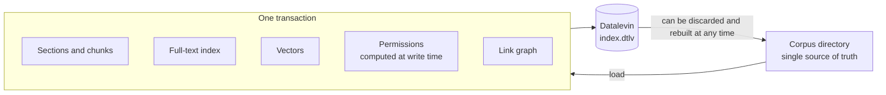

# Design rationale (full version)

English | [繁體中文](rationale.zh-TW.md)

> The short version is in the [README](../../README.md#design-rationale).

## The problem is in the seams, not the components

A typical RAG system is assembled from a vector database, a full-text search engine, a graph database, a metadata database and a framework. Each component is mature, but the same document is split into several pieces, each stored in a different system, so what actually has to be maintained are **invariants that span systems**:

- When a document is deleted, does its derived data disappear from every system?
- When permissions change, is every store updated?
- Can any user, through some subsystem, see a document they are not allowed to read?

No transaction protects these properties; they hold only if the ingest process gets everything right every time. System behavior is also scattered across configuration files, framework internals and external services: to verify it end to end even once, you first have to start a whole row of services. This is true for people, and even more so for an AI coding agent, which cannot see the full picture from within a single repo and gets no fast feedback.

## Choosing a different center

RAG frameworks differ in what they choose as their center:

| Center | Example | Main concern |
|---|---|---|
| Vector store | Early RAG | Semantic similarity |
| Component composition | LangChain | How to put an LLM application together |
| Retrieval pipeline | Haystack | How a retrieval pipeline is composed, swapped out and evaluated |
| Index | LlamaIndex | How heterogeneous data becomes a queryable index |
| **Data state** | **LevinRAG** | **The state, consistency, permissions and provenance of retrieval** |

Each framework can do what the others do; the difference is only the center. LevinRAG chooses data as its center: **it treats retrieval as a data system**. This is not a new idea; it brings established practice from databases, information retrieval and data engineering together into one consistent RAG architecture.

## The corpus is the single source of truth; everything else is derived data

Chunks, the full-text index, vectors, permissions and the link graph are all derived data computed from the corpus, much like "load, then transform" in ELT for a data warehouse. They are produced in the same embedded database, in the same transaction, so there is never an intermediate state such as "vectors updated, permissions not yet". The index can be fully rebuilt from the corpus at any time; accounts are stored separately and are not affected by a rebuild.

**Why an embedded database fits here**: the usual concerns about embedded databases (backups, high availability, operational maturity) mostly apply when the database holds the single source of truth. In LevinRAG, `index.dtlv` is only derived data and can be discarded as a whole and rebuilt at any time: the index needs no backup; changing the embedding model, the tokenizer or the schema means one rebuild; tests build a fresh index in a temporary directory and delete it afterwards; the same corpus can be built into indexes with different settings and compared side by side. This also lowers the risk of choosing a relatively niche database: the data cannot get trapped in it.

There are three limits: accounts, tokens and traces (`app.dtlv`) are not derived data and still need backups; the cost of a rebuild lies mainly in recomputing embeddings, which may take hours for a large corpus (not yet measured); the rebuild can run in another directory while the server keeps serving, and switching to the new index currently takes one restart (about a dozen seconds measured locally); switching without a restart is on the to-do list.

## Three invariants

1. **Consistency**: all derived data of a document is written together and deleted together.
2. **Permissions**: permissions are part of the retrieval data model, not a filter in the UI.
   - Filtering happens inside the retrieval layer; every candidate that leaves the retrieval layer has already been filtered.
   - More candidates are fetched than needed and then filtered, so recall may fall short for users with few permissions; when that happens, it is flagged in the trace.
   - The security tests derive the complete "document × user without permission" matrix from the index and check every cell: the document must not appear in search, in Q&A, in the prompt sent to the model, or in the document viewer.
   - Observability must not become a side channel either: traces are stored in full, but when a regular user views their own trace, they do not see the pre-ACL hit count; admins keep all the numbers, to diagnose recall shortfalls caused by permissions.
3. **Explainability**: the rank and score of every candidate at every stage are recorded in the trace and shown in the Debug panel. This is the equivalent of a database's execution plan and provenance, and it can answer "why this document, and why not that one". It is the core tool for understanding and tuning RAG.

## Why Datalevin

Most of the claims above do not depend on Datalevin; they would still hold with PostgreSQL plus pgvector and full-text search. The reasons for choosing Datalevin are specific:

- **Embedded, single process**: full-text, vector and Datalog queries run in the same engine, with no separate services to set up and operate. Local development, tests and AI agents can all run the complete system directly.
- **Schema defined per attribute, evolving incrementally**: data is stored as "entity + attribute" facts. Adding an attribute or a relationship needs no table change and no migration; a relationship is just a ref attribute, queries in both directions use the existing indexes, and no dedicated structure for a "graph" has to be designed in advance. Five attributes were added during this project's development, and existing databases kept working as they were. PostgreSQL can do this too (ADD COLUMN, join tables, JSONB); the difference is that every step requires designing tables and a migration. The limits: an attribute that already holds data cannot change its type; changes to the full-text, vector or analyzer settings still require rebuilding the index.
- **Clojure/JVM and the REPL**: every database call can be verified directly against the running system.

It is not Datomic and has no history queries; its graph capabilities are not the point here either. For a typical enterprise, PostgreSQL's operational maturity may be more attractive. This is a trade-off, not a question of better or worse.

## Scope and costs

- **Good fit**: internal enterprise knowledge bases with up to a few thousand documents (about 100,000 chunks), moderate query volume, and a need for strict permissions and auditability.
- **Poor fit**: chunk counts on the order of a hundred million, large-scale vector search at high QPS, horizontal scaling. These cases are better served by dedicated retrieval infrastructure.
- **Other costs**: dependence on a database whose maintenance is concentrated in few maintainers (isolated behind the Retriever interface, and the index can be rebuilt); less breadth of features than general-purpose frameworks: no agents, no multi-turn conversation, no streaming.

## Open questions

LevinRAG does not claim to have invented a new RAG algorithm, nor does it claim that Datalevin is the best choice. It sets out to test two things:

- Does centering on data make RAG easier to understand, verify, debug and evolve?
- At what scale and load is this simplicity enough to offset the advantages of dedicated retrieval infrastructure?

Current measurements and open work are listed in [SPEC.md §21](../../SPEC.md#21-remaining-work-and-next-steps).
