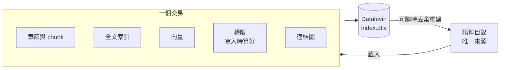

# 設計理念（完整版）

> 精簡版在 [README](../../README.md#設計理念)。

## 問題在接縫，不在元件

常見的 RAG 系統由向量資料庫、全文搜尋引擎、圖資料庫、metadata 資料庫與框架拼接而成。每個元件都成熟，但同一份文件被拆成好幾份，分別存在不同系統裡，於是真正要維護的是**跨系統的不變式**：

- 文件刪除後，每個系統裡的衍生資料都一起消失了嗎？
- 權限改了以後，每個儲存都同步了嗎？
- 有沒有使用者能經由某個子系統，看到他無權閱讀的文件？

這些問題沒有交易可以保護，只能靠匯入流程每一次都做對。系統行為也散落在設定檔、框架內部與外部服務之間：要端到端驗證一次，得先啟動一整排服務。人如此，AI coding agent 更是如此，它在一個 repo 裡看不清全貌，也得不到快速的回饋。

## 選擇不同的中心

各種 RAG 框架的差別，在於它們選了什麼當作中心：

| 中心 | 代表 | 關心的問題 |
|---|---|---|
| 向量庫 | 早期的 RAG | 語意相似度 |
| 元件組合 | LangChain | 怎麼把 LLM 應用拼起來 |
| 檢索 pipeline | Haystack | 檢索流程怎麼組成、替換、評估 |
| 索引 | LlamaIndex | 異質資料怎麼變成可查詢的索引 |
| **資料狀態** | **LevinRAG** | **檢索的狀態、一致性、權限與來源追溯** |

各框架都能做到彼此的事，差別只在中心。LevinRAG 選擇以資料為中心：**把檢索當成一個資料系統**。這不是新想法，而是把資料庫、資訊檢索與資料工程的既有做法，收斂成一個一致的 RAG 架構。

## 語料是唯一來源，其餘都是衍生資料

chunk、全文索引、向量、權限與連結圖，都是從語料推導出來的衍生資料，類似 ELT 在資料倉儲裡「載入後再轉換」。它們在同一個嵌入式資料庫、同一個交易中產生，所以不會出現「向量更新了、權限還沒更新」的中間狀態。索引隨時可以從語料完整重建，帳號則另外存放，不受重建影響。

## 三個不變式

1. **一致性**：一份文件的所有衍生資料，一起寫入、一起刪除。
2. **權限**：權限是檢索資料模型的一部分，不是介面上的篩選。
   - 過濾發生在檢索層內，任何離開檢索層的候選都已經過濾。
   - 候選先多撈一些再過濾，所以權限少的使用者召回可能不足；這種情況會在 trace 中標記。
   - 安全測試由索引推導出「文件 × 無權限使用者」的完整矩陣，並逐一驗證：搜尋、問答、送進模型的 prompt、文件頁都不能出現。
   - 可觀察性也不能成為旁路：trace 完整儲存，但一般使用者看自己的 trace 時，看不到權限過濾前的命中數；admin 則保有全部數字，用來診斷權限造成的召回不足。
3. **可解釋**：每個候選在每個階段的名次與分數都記入 trace，並顯示在 Debug 面板上。這相當於資料庫的執行計畫與來源追溯，可以回答「為什麼是這份文件、為什麼不是那份」。它是理解與調校 RAG 的核心工具。

## 為什麼是 Datalevin

以上主張大多不依賴 Datalevin，換成 PostgreSQL 加 pgvector 與全文檢索，仍然可以成立。選 Datalevin 的理由很具體：

- **嵌入式、單一 process**：全文、向量與 Datalog 查詢在同一個引擎裡，不必另外架設與維運服務。本機、測試與 AI agent 都能直接完整執行。
- **Schema 以屬性為單位，逐步演進**：資料是「實體＋屬性」的事實。新增屬性或關係不必改表、不必 migration；關係只是一個 ref 屬性，雙向查詢都走既有索引，不必事先為「圖」設計專用結構。本專案開發期間陸續加了 5 個屬性，既有資料庫都直接沿用。PostgreSQL 也做得到（ADD COLUMN、關聯表、JSONB），差別在於每一步都要設計表與 migration。限制是：已有資料的屬性不能改型別；全文、向量與 analyzer 的設定改了，仍然要重建索引。
- **Clojure／JVM 與 REPL**：可以在執行中的系統上直接驗證每一個資料庫呼叫。

它不是 Datomic，沒有歷史查詢；它的圖能力也不是這裡的重點。對一般企業而言，PostgreSQL 的維運成熟度可能更有吸引力。這是取捨，不是優劣。

## 適用範圍與代價

- **適合**：企業內部知識庫、文件量在數千份（約十萬個 chunk）以內、查詢量中等、需要嚴格權限與可稽核性的場合。
- **不適合**：億級 chunk、高 QPS 的大規模向量搜尋、水平擴展。這些情況更適合專用的檢索基礎設施。
- **其他代價**：依賴一個維護者集中的資料庫（以 Retriever 介面隔離，索引也可重建）；功能廣度不及通用框架，沒有 agent、多輪對話與串流。

## 還待驗證的問題

LevinRAG 不宣稱發明了新的 RAG 演算法，也不宣稱 Datalevin 是最好的選擇。它想驗證的是兩件事：

- 以資料為中心，能不能讓 RAG 更容易理解、驗證、除錯與演進？
- 在什麼規模與負載下，這種簡單足以抵銷專用檢索基礎設施的優勢？

目前的量測與待辦見 [SPEC.md §21](../../SPEC.md#21-尚未完成與下一步)。
