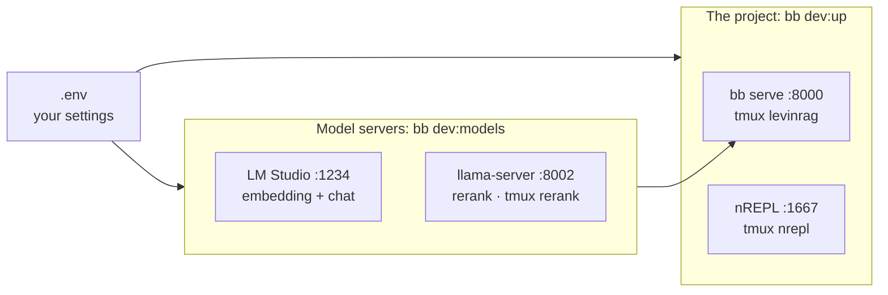

# Developer guide

English | [繁體中文](dev.zh-TW.md)

Audience: people developing LevinRAG, mainly on a Mac. To evaluate LevinRAG on your own corpus instead, follow the [Quick start](quick-start.md). Project rules for AI agents (nREPL, tests, bilingual docs) are in [CLAUDE.md](../../CLAUDE.md).

## What runs where



- **Your settings live in `.env`** (gitignored; the template is `.env.example`). Which model server, which model names and ports: all of it. Nothing about your machine is in the repo.
- The model servers are the documented Mac recipe of [VLLM_SETUP.md](../../VLLM_SETUP.md). With a GPU vLLM or a shared endpoint instead, point the `VLLM_*_BASE_URL` values at it; `bb dev:models` then has nothing to start and says so.

## First-time setup

1. Tools: `mise trust && mise install` in the project directory (Java, Clojure, Babashka, Tailwind, cljfmt, clj-kondo), plus `brew install tmux llama.cpp`.
2. LM Studio: install it from https://lmstudio.ai and open it once (this installs `~/.lmstudio/bin/lms`). Download the embedding model as in [VLLM_SETUP.md](../../VLLM_SETUP.md#local-alternative-lm-studio-embedding-and-chat) (`lms get https://huggingface.co/ggml-org/bge-m3-Q8_0-GGUF`), and Qwen3 8B from LM Studio's model search (this machine's setup uses the 4-bit MLX build). The reranker downloads itself on its first start (about 636 MB).
3. Settings: `cp .env.example .env`, then fill in the LM Studio + llama.cpp values from VLLM_SETUP.md (the block at the end of `.env.example`).
4. Start everything (next section), then load data once:

   ```bash
   bb ingest                           # the sample corpus, or your CORPUS_DIR
   bb user:import eval/users.edn       # alice, bob, carol, admin; prints their passwords once
   ```

## Every day, or after a reboot

```bash
bb dev:models   # LM Studio server + embedding + chat model, llama-server reranker
bb dev:up       # bb serve (http://localhost:8000) and the nREPL (port 1667), then bb doctor
```

- Each step checks first and starts only what is not running, so running either command again is harmless.
- Order matters on a 16 GB Mac: `bb dev:models` loads embedding, then chat, then the reranker; start the models before `bb dev:up`.
- `bb dev:up` ends with `bb doctor`; everything should be `[OK]`.
- Measured on an M1 16 GB after a simulated reboot: `bb dev:models` about 13 s, `bb dev:up` about 28 s.

To look at a process: `tmux attach -t levinrag` (or `nrepl`, `rerank`); leave with Ctrl-b d.

## Stopping

```bash
bb dev:down                              # stops the levinrag, nrepl and rerank tmux sessions
lms server stop && lms unload --all      # only if you also want LM Studio's memory back
```

After changing `.env`, restart the server so it reads the new values: `tmux kill-session -t levinrag && bb dev:up`.

## Settings

- `bb` tasks read `.env`; a variable exported in your shell wins over it. The tmux sessions do not see your shell's exports, so put settings for `bb dev:up` in `.env`.
- Running `clojure` or `java` directly (not through `bb`) does not read `.env`: export the variables yourself.
- `LOCAL_CHAT_CONTEXT` (default 8192) and `LOCAL_RERANK_HF` (default `gpustack/bge-reranker-v2-m3-GGUF:Q8_0`) are read only by `bb dev:models`.
- The full list with defaults is in the [Operations guide](ops.md#environment-variables).

## Daily development commands

| Command | Use |
|---|---|
| nREPL test loop | See [CLAUDE.md](../../CLAUDE.md#tests) |
| `bb check` | What CI runs: format check, lint, bilingual docs check, full test suite; changes no files |
| `bb fmt` | Format the code (cljfmt) |
| `bb css-watch` | Rebuild the CSS while you edit Tailwind classes; `bb serve` only builds it when it is missing |
| `bb browser-check` | Drive the web UI in Chrome and fail on any JS error |
| `bb docs:check` | English and Traditional Chinese docs in sync |

## When something goes wrong

| Symptom | Fix |
|---|---|
| `找不到 lms` (lms not found) | Open the LM Studio app once; it installs `~/.lmstudio/bin/lms` |
| `lms load … 失敗` (failed) | The model name in `.env` must match LM Studio's (`lms ls`) |
| `reranker 沒有回應` (not responding) | `tmux attach -t rerank`; the first start downloads the model; port 8002 may be taken |
| `server 沒有回應` (not responding) | `tmux attach -t levinrag` for the error, often a malformed `.env` |
| Swapping, very slow answers | 16 GB is tight for three models: close other apps, or unload what you do not need |
| `bb doctor` shows chat `down` right after start | LM Studio's first request after loading is slow; run it again |
