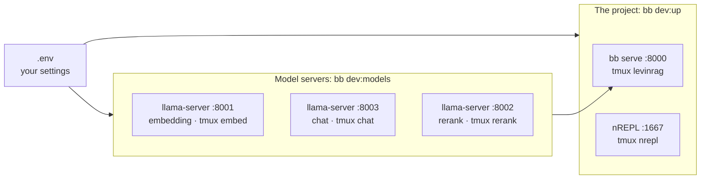

# Developer guide

English | [繁體中文](dev.zh-TW.md)

Audience: people developing LevinRAG, mainly on a Mac. To evaluate LevinRAG on your own corpus instead, follow the [Quick start](quick-start.md). Project rules for AI agents (nREPL, tests, bilingual docs) are in [CLAUDE.md](../../CLAUDE.md).

## What runs where



- **Your settings live in `.env`** (gitignored; the template is `.env.example`): which endpoints, model names and ports. Nothing about your machine is in the repo.
- The model servers are the documented Mac recipe of [VLLM_SETUP.md](../../VLLM_SETUP.md#local-alternative-llamacpp-embedding-chat-and-rerank): three llama.cpp `llama-server` processes whose flags are tuned per role and built into `bb dev:models`. With a GPU vLLM or a shared endpoint instead, point the `VLLM_*_BASE_URL` values at it; `bb dev:models` then has nothing to start and says so.

## First-time setup

1. Tools: `mise trust && mise install` in the project directory (Java, Clojure, Babashka, Tailwind, cljfmt, clj-kondo), plus `brew install tmux llama.cpp`.
2. Settings: `cp .env.example .env`, then fill in the llama.cpp values from [VLLM_SETUP.md](../../VLLM_SETUP.md#local-alternative-llamacpp-embedding-chat-and-rerank) (the block at the end of `.env.example`).
3. Start everything (next section). The first `bb dev:models` downloads the three models into `~/.cache/huggingface` (about 6 GB in total; the 5 GB chat model can take half an hour on a slow connection).
4. Load data once:

   ```bash
   bb ingest                           # the sample corpus, or your CORPUS_DIR
   bb user:import eval/users.edn       # alice, bob, carol, admin; prints their passwords once
   ```

## Every day, or after a reboot

```bash
bb dev:models   # the three llama-servers: embedding, chat, rerank
bb dev:up       # bb serve (http://localhost:8000) and the nREPL (port 1667), then bb doctor
```

- Each step checks first and starts only what is not running, so running either command again is harmless.
- `bb dev:models` starts the servers one at a time (embedding, chat, rerank), waiting for each; start the models before `bb dev:up`.
- `bb dev:up` ends with `bb doctor`; everything should be `[OK]`.
- Measured on an M1 16 GB after a simulated reboot: `bb dev:models` about 10 s, `bb dev:up` about 22 s.

To look at a process: `tmux attach -t levinrag` (or `nrepl`, `embed`, `chat`, `rerank`); leave with Ctrl-b d.

## Stopping

```bash
bb dev:down     # stops all five tmux sessions: levinrag, nrepl, embed, chat, rerank
```

After changing `.env`, restart what reads it: the server with `tmux kill-session -t levinrag && bb dev:up`; after changing a model or `LOCAL_*`, `bb dev:down`, then both start commands.

## Settings

- `bb` tasks read `.env`; a variable exported in your shell wins over it. The tmux sessions do not see your shell's exports, so put settings for `bb dev:up` in `.env`.
- Running `clojure` or `java` directly (not through `bb`) does not read `.env`: export the variables yourself.
- `LOCAL_EMBED_HF`, `LOCAL_CHAT_HF`, `LOCAL_RERANK_HF` (Hugging Face `repo:quant`) and `LOCAL_CHAT_CONTEXT` (default 8192) are read only by `bb dev:models`; the defaults and each flag's reason are in [VLLM_SETUP.md](../../VLLM_SETUP.md#local-alternative-llamacpp-embedding-chat-and-rerank).
- The full list with defaults is in the [Operations guide](ops.md#environment-variables).

## Daily development commands

| Command | Use |
|---|---|
| nREPL test loop | See [CLAUDE.md](../../CLAUDE.md#tests) |
| `bb check` | What CI runs: format check, lint, bilingual docs check, full test suite; changes no files |
| `bb fmt` | Format the code (cljfmt) |
| `bb css-watch` | Rebuild the CSS while you edit Tailwind classes; `bb serve` only builds it when it is missing |
| `bb browser-check` | Drive the web UI in Chrome and fail on any JS error |
| `bb docs:check` | English and Traditional Chinese docs in sync |

## When something goes wrong

| Symptom | Fix |
|---|---|
| `找不到 llama-server` (not found) | `brew install llama.cpp` |
| `… 沒有回應` (not responding) for embed / chat / rerank | `tmux attach -t <name>`: a first download still running, a port already taken, or a wrong `LOCAL_*_HF` |
| `server 沒有回應` (not responding) | `tmux attach -t levinrag` for the error, often a malformed `.env` |
| `每個端點要用不同的 port` (distinct ports) | Two `VLLM_*_BASE_URL` values in `.env` use the same port |
| Swapping, very slow answers | The three models use about 10 GB: close other apps |
