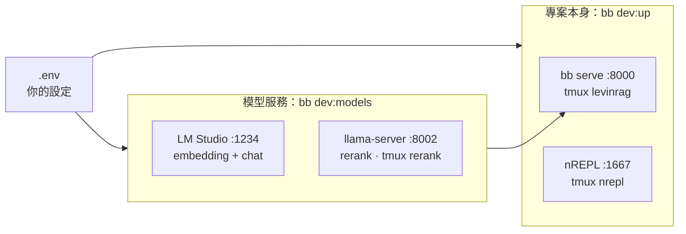

# 開發者指南

[English](dev.md) | 繁體中文
> 本文為英文版的翻譯；內容不一致時，以英文版為準。

對象：開發 LevinRAG 的人，主要使用 Mac。如果是要用自己的語料評估 LevinRAG，請看[快速上手](quick-start.zh-TW.md)。給 AI agent 的專案規則（nREPL、測試、雙語文件）在 [CLAUDE.md](../../CLAUDE.md)。

## 各個程序跑在哪裡



- **你的設定都在 `.env`**（已 gitignore；範本是 `.env.example`）：用哪個模型服務、模型名稱、port，全部在這裡。repo 裡沒有任何和你的機器有關的設定。
- 模型服務採用 [VLLM_SETUP.zh-TW.md](../../VLLM_SETUP.zh-TW.md) 裡寫好的 Mac 方案。如果改用 GPU 上的 vLLM 或共用端點，把 `VLLM_*_BASE_URL` 指過去即可；這時 `bb dev:models` 沒有東西要啟動，會直接說明。

## 第一次設定

1. 工具：在專案目錄執行 `mise trust && mise install`（Java、Clojure、Babashka、Tailwind、cljfmt、clj-kondo），另外 `brew install tmux llama.cpp`。
2. LM Studio：從 https://lmstudio.ai 安裝並開啟一次（會安裝 `~/.lmstudio/bin/lms`）。embedding 模型照 [VLLM_SETUP.zh-TW.md](../../VLLM_SETUP.zh-TW.md#本機替代lm-studioembedding-與-chat) 下載（`lms get https://huggingface.co/ggml-org/bge-m3-Q8_0-GGUF`），Qwen3 8B 則從 LM Studio 的模型搜尋下載（這台機器用的是 4-bit MLX 版）。reranker 會在第一次啟動時自己下載（約 636 MB）。
3. 設定：`cp .env.example .env`，再依 VLLM_SETUP 填入 LM Studio ＋ llama.cpp 的值（`.env.example` 最後那一段）。
4. 啟動所有服務（見下一節），然後匯入一次資料：

   ```bash
   bb ingest                           # 範例語料，或你的 CORPUS_DIR
   bb user:import eval/users.edn       # alice、bob、carol、admin；密碼只印一次
   ```

## 每天開工，或重開機後

```bash
bb dev:models   # LM Studio server ＋ embedding、chat 模型，以及 llama-server reranker
bb dev:up       # bb serve（http://localhost:8000）與 nREPL（port 1667），最後執行 bb doctor
```

- 每一步都會先檢查，只啟動還沒在跑的部分，所以重複執行也沒關係。
- 在 16 GB 的 Mac 上順序很重要：`bb dev:models` 依序載入 embedding、chat、reranker；要先開模型，再執行 `bb dev:up`。
- `bb dev:up` 最後會執行 `bb doctor`，應該全部是 `[OK]`。
- M1 16 GB 模擬重開機後的實測：`bb dev:models` 約 13 秒，`bb dev:up` 約 28 秒。

要看某個程序的輸出：`tmux attach -t levinrag`（或 `nrepl`、`rerank`），按 Ctrl-b d 離開。

## 停止

```bash
bb dev:down                              # 停止 levinrag、nrepl、rerank 三個 tmux session
lms server stop && lms unload --all      # 只有想把 LM Studio 的記憶體也釋放時才需要
```

改了 `.env` 之後，要重啟 server 才會讀到新值：`tmux kill-session -t levinrag && bb dev:up`。

## 設定

- `bb` 指令會讀 `.env`；shell 裡 export 的變數優先。tmux session 看不到你 shell 裡的 export，所以 `bb dev:up` 要用的設定請寫在 `.env`。
- 直接執行 `clojure` 或 `java`（不經過 `bb`）時不會讀 `.env`，要自己 export。
- `LOCAL_CHAT_CONTEXT`（預設 8192）與 `LOCAL_RERANK_HF`（預設 `gpustack/bge-reranker-v2-m3-GGUF:Q8_0`）只有 `bb dev:models` 會讀。
- 完整清單與預設值見[維運手冊](ops.zh-TW.md#環境變數)。

## 日常開發指令

| 指令 | 用途 |
|---|---|
| nREPL 測試流程 | 見 [CLAUDE.md](../../CLAUDE.md#tests) |
| `bb check` | CI 執行的內容：格式檢查、lint、雙語文件檢查、完整測試；不會改動檔案 |
| `bb fmt` | 排版程式碼（cljfmt） |
| `bb css-watch` | 編輯 Tailwind class 時自動重建 CSS；`bb serve` 只會在 CSS 不存在時建置 |
| `bb browser-check` | 在 Chrome 裡操作網頁 UI，任何 JS 錯誤都算失敗 |
| `bb docs:check` | 中英文件保持同步 |

## 出問題時

| 症狀 | 處理 |
|---|---|
| `找不到 lms` | 開啟一次 LM Studio app，它會安裝 `~/.lmstudio/bin/lms` |
| `lms load … 失敗` | `.env` 裡的模型名稱要和 LM Studio 裡的一致（`lms ls`） |
| `reranker 沒有回應` | `tmux attach -t rerank`；第一次啟動要下載模型；port 8002 可能被占用 |
| `server 沒有回應` | `tmux attach -t levinrag` 看錯誤，常見原因是 `.env` 格式錯誤 |
| 記憶體不足、回答非常慢 | 三個模型在 16 GB 上很吃緊：關掉其他 app，或卸載用不到的模型 |
| 剛啟動時 `bb doctor` 顯示 chat `down` | LM Studio 載入後的第一個請求比較慢；再執行一次 |
