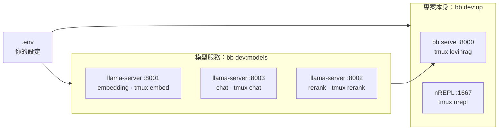

# 開發者指南

[English](dev.md) | 繁體中文
> 本文為英文版的翻譯；內容不一致時，以英文版為準。

對象：開發 LevinRAG 的人，主要使用 Mac。如果是要用自己的語料評估 LevinRAG，請看[快速上手](quick-start.zh-TW.md)。給 AI agent 的專案規則（nREPL、測試、雙語文件）在 [CLAUDE.md](../../CLAUDE.md)。

## 各個程序跑在哪裡



- **你的設定都在 `.env`**（已 gitignore；範本是 `.env.example`）：用哪些端點、模型名稱、port，全部在這裡。repo 裡沒有任何和你的機器有關的設定。
- 模型服務採用 [VLLM_SETUP.zh-TW.md](../../VLLM_SETUP.zh-TW.md#本機替代llamacppembeddingchat-與-rerank) 寫好的 Mac 方案：三個 llama.cpp `llama-server`，每個角色的參數都已調好並寫進 `bb dev:models`。如果改用 GPU 上的 vLLM 或共用端點，把 `VLLM_*_BASE_URL` 指過去即可；這時 `bb dev:models` 沒有東西要啟動，會直接說明。

## 第一次設定

1. 工具：在專案目錄執行 `mise trust && mise install`（Java、Clojure、Babashka、Tailwind、cljfmt、clj-kondo），另外 `brew install tmux llama.cpp`。
2. 設定：`cp .env.example .env`，再依 [VLLM_SETUP.zh-TW.md](../../VLLM_SETUP.zh-TW.md#本機替代llamacppembeddingchat-與-rerank) 填入 llama.cpp 的值（`.env.example` 最後那一段）。
3. 啟動所有服務（見下一節）。第一次執行 `bb dev:models` 時，會把三個模型下載到 `~/.cache/huggingface`（合計約 6 GB；5 GB 的 chat 模型在網路慢時可能要半小時）。
4. 匯入一次資料：

   ```bash
   bb ingest                           # 範例語料，或你的 CORPUS_DIR
   bb user:import eval/users.edn       # alice、bob、carol、admin；密碼只印一次
   ```

## 每天開工，或重開機後

```bash
bb dev:models   # 三個 llama-server：embedding、chat、rerank
bb dev:up       # bb serve（http://localhost:8000）與 nREPL（port 1667），最後執行 bb doctor
```

- 每一步都會先檢查，只啟動還沒在跑的部分，所以重複執行也沒關係。
- `bb dev:models` 會依序啟動（embedding、chat、rerank），每一個就緒後才啟動下一個；要先開模型，再執行 `bb dev:up`。
- `bb dev:up` 最後會執行 `bb doctor`，應該全部是 `[OK]`。
- M1 16 GB 模擬重開機後的實測：`bb dev:models` 約 10 秒，`bb dev:up` 約 22 秒。

要看某個程序的輸出：`tmux attach -t levinrag`（或 `nrepl`、`embed`、`chat`、`rerank`），按 Ctrl-b d 離開。

## 停止

```bash
bb dev:down     # 停止全部五個 tmux session：levinrag、nrepl、embed、chat、rerank
```

改了 `.env` 之後，要重啟會讀它的程序：server 用 `tmux kill-session -t levinrag && bb dev:up`；換了模型或 `LOCAL_*`，就先 `bb dev:down`，再執行兩個啟動指令。

## 設定

- `bb` 指令會讀 `.env`；shell 裡 export 的變數優先。tmux session 看不到你 shell 裡的 export，所以 `bb dev:up` 要用的設定請寫在 `.env`。
- 直接執行 `clojure` 或 `java`（不經過 `bb`）時不會讀 `.env`，要自己 export。
- `LOCAL_EMBED_HF`、`LOCAL_CHAT_HF`、`LOCAL_RERANK_HF`（Hugging Face 的 `repo:量化`）與 `LOCAL_CHAT_CONTEXT`（預設 8192）只有 `bb dev:models` 會讀；預設值與每個參數的理由見 [VLLM_SETUP.zh-TW.md](../../VLLM_SETUP.zh-TW.md#本機替代llamacppembeddingchat-與-rerank)。
- 完整清單與預設值見[維運手冊](ops.zh-TW.md#環境變數)。

## 日常開發指令

| 指令 | 用途 |
|---|---|
| nREPL 測試流程 | 見 [CLAUDE.md](../../CLAUDE.md#tests) |
| `bb check` | CI 執行的內容：格式檢查、lint、雙語文件檢查、完整測試；不會改動檔案 |
| `bb test` | 在乾淨的 JVM 裡跑完整測試，附 coverage 報告（`clojure -X:jvm-opts:test`）。需要真實模型的測試標記 `:vllm`，未設定 `VLLM_*` 時自動略過 |
| `bb lint` | 用 clj-kondo 檢查 `src`、`test` 與 `bb` |
| `bb fmt` | 排版程式碼（cljfmt） |
| `bb css-watch` | 編輯 Tailwind class 時自動重建 CSS；`bb serve` 只會在 CSS 不存在時建置 |
| `bb browser-check` | 在 Chrome 裡操作網頁 UI，任何 JS 錯誤都算失敗（[見下方](#browser-check)） |
| `bb docs:check` | 中英文件保持同步 |
| `bb tasks` | 列出所有 Babashka 指令 |

## Browser check

`bb browser-check` 會建置 CSS，在 port 8765 啟動一個用完即丟的 server（`dev/browser_server.clj`：範例語料、stub embedder、stub rerank 與 chat，使用者 `alice`/`alice-pw` 與 `admin`/`admin-pw`），再用 Playwright 操作本機安裝的 Google Chrome（`dev/browser/check.mjs`）：登入、開 Debug 提問、打開引用與它的文件、在管理頁執行匯入、打開一筆 trace。任何 console 錯誤、未捕捉的頁面錯誤或載入失敗的資源，都會讓這次檢查失敗。

需要 Node.js；第一次執行時會安裝 `playwright-core`（使用本機的 Chrome，不另外下載瀏覽器）。它不包含在 `bb test` 或 `bb check` 裡。

## 前端資源

JavaScript 函式庫（htmx、Alpine.js）直接放在 `resources/public/js`，所以沒有 JavaScript 的建置步驟。要換版本或新增檔案，就修改 `bb.edn` 裡 `fetch-assets` 任務的 URL 清單，執行 `bb fetch-assets`，再 commit 更新後的檔案。

## 出問題時

| 症狀 | 處理 |
|---|---|
| `找不到 llama-server` | `brew install llama.cpp` |
| embed／chat／rerank `… 沒有回應` | `tmux attach -t <名稱>`：可能是第一次下載還沒完成、port 已被占用，或 `LOCAL_*_HF` 寫錯 |
| `server 沒有回應` | `tmux attach -t levinrag` 看錯誤，常見原因是 `.env` 格式錯誤 |
| `每個端點要用不同的 port` | `.env` 裡有兩個 `VLLM_*_BASE_URL` 用了同一個 port |
| 記憶體不足、回答非常慢 | 三個模型約占 10 GB：關掉其他 app |
